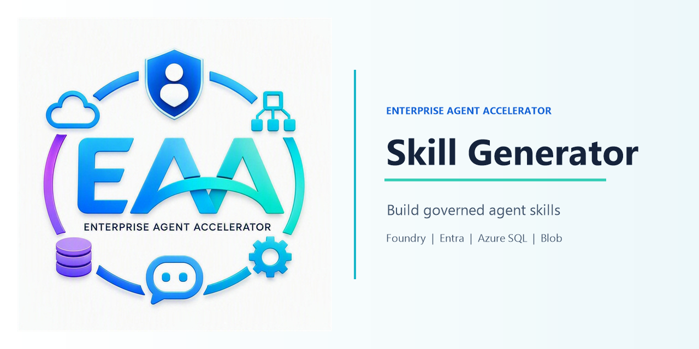

# Foundry Skill Generator Using Chat

對話式 Skill 產生器（FastAPI + 原生 JavaScript），最終產出物為一份 `SKILL.md`。
本專案為**本機執行**的解決方案，串接 Microsoft Foundry、Microsoft Entra、Azure SQL 與 Azure Blob。

## 文件導覽

完整說明拆成四份文件，建議依序閱讀：

| 文件 | 內容 |
| --- | --- |
| [docs/01-overview.md](docs/01-overview.md) | **專案介紹**：這個專案在做什麼、使用者是誰、有什麼需求、核心功能、使用者流程圖。 |
| [docs/02-setup.md](docs/02-setup.md) | **啟動與設定**：需要哪些服務、環境變數完整清單、SQL / Blob / Entra 設定、啟動與登入步驟。 |
| [docs/03-architecture.md](docs/03-architecture.md) | **程式碼與架構**：整體架構圖、資料流、前端 / 後端 / 資料庫細節、每個檔案的職責，以及登入與 Token 流程。 |
| [docs/04-agent-mechanism.md](docs/04-agent-mechanism.md) | **Agent 機制**：五個 state 的 Input / Prompt / Output、品質關卡 checklist、state 轉換、Agent 工具清單、提示詞對照、素材（Materials）三層可信度合約與 Agent Graph 使用方式。 |

## 快速啟動

詳細設定請見 [docs/02-setup.md](docs/02-setup.md)。最短路徑：

```powershell
# 1. 準備環境變數
Copy-Item .env.example .env   # 填入 Foundry / Entra / Azure SQL / Azure Blob 設定

# 2. 安裝 Python 與前端執行期套件（Agent Graph 需要 Cytoscape）
#    公司網路若擋住公開 PyPI，見 docs/02-setup.md 的「疑難排解」章節
uv sync
npm ci

# 3. 登入 Blob 本機驗證使用的個人帳號
az login

# 4. 啟動（SQL 使用 .env 中的 App Registration 服務主體）
uv run python -m uvicorn backend.main:app --reload --host 127.0.0.1 --port 6274
```

開啟 <http://localhost:6274/>，再造訪 `/api/auth/login` 完成 Microsoft 登入即可使用。
