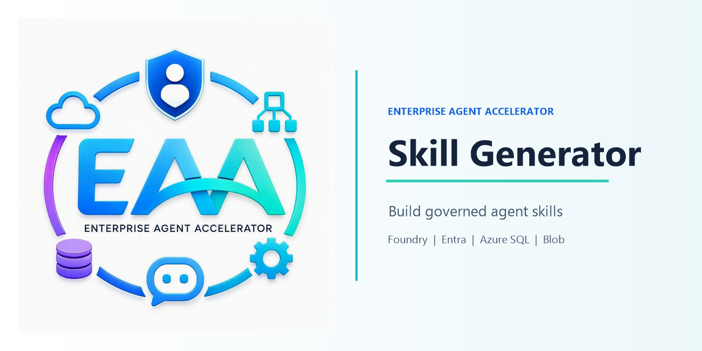

# Foundry Skill Generator Using Chat

對話式 Skill 產生器（FastAPI + 原生 JavaScript），最終產出物為一份 `SKILL.md`（script 型另附一支 `scripts/<name>.py`；也可附帶使用者上傳的 `assets/`、`references/` 檔案）。
本專案為**本機執行**的解決方案，串接 Microsoft Foundry、Microsoft Entra、Azure SQL 與 Azure Blob。

## 重大變更 (What's New) 2026-10

### Skill 資產

在 Materials 分頁的 Skill assets 區塊上傳 UTF-8 文字檔，存檔時原封不動寫到 `skills/<name>/assets/` 或 `references/`；scenario 與 script 型 skill 不可附資產。檢查規則與資料流見 [04-agent-mechanism.md 第 7.6 節](docs/04-agent-mechanism.md#76-skill-資產assetsreferences)。

> ⚠️ **存檔條件**：附有資產的 skill，`SKILL.md` 必須以完整路徑（例如 `` `assets/style.css` ``）列出每個檔案，且不得提到未附加的路徑；否則無法儲存。MODIFY 時若 Blob 上有不合規的檔案（二進位檔、子目錄、超過上限），會拒絕建立 session 並列出原因。

### Script 型 skill

使用者附上**唯一一份** Python `code` 素材、確認它涵蓋所有操作，且目標 EAA 已開啟 script 執行時，產出物改為 `SKILL.md` 加上**原樣**出貨的 `scripts/<name>.py`；其他情況維持原本的 inline 形式。

> ⚠️ **使用前提**：目標 EAA 的 `DYNAMIC_SKILLS_ENABLED` 與 `SKILL_SCRIPTS_ENABLED` 皆為 `true`，且 `lint_skill_package` 的 ruleset ≥ 1.1；否則只會產出 inline 型。

| 項目 | 變更 | 詳細說明 |
| --- | --- | --- |
| **產出形式** | 依素材與 EAA 旗標自動判斷，進 DRAFT 後鎖定，不支援 inline ↔ script 互轉。Generator 不修改 script；要換 script，請更換 `code` 素材。 | [04-agent-mechanism.md](docs/04-agent-mechanism.md#75-code-素材與-script-形式) |
| **檢查** | script 須通過專屬 lint（S 系列：stdout 只輸出 JSON、`[NEEDS_INFO]` 以 exit 0 結束等），並與 `SKILL.md` 一起送 EAA lint。 | [04-agent-mechanism.md](docs/04-agent-mechanism.md#75-code-素材與-script-形式) |
| **儲存** | script 型每次儲存都重新確認 EAA 旗標。**所有 skill** 覆寫時都會比對 Blob 版本，載入後被改過（例如 Gatekeeper Addendum）就回 409，不會覆蓋。 | [04-agent-mechanism.md](docs/04-agent-mechanism.md#eaa-script-旗標)、[03-architecture.md](docs/03-architecture.md) |
| **介面** | Materials、Checklist（Output form）、Files 分頁（`SKILL.md \| scripts/<name>.py`）與 Skill 清單（`[script]`）顯示目前形式與未滿足的條件。 | [01-overview.md](docs/01-overview.md) |

### 安全性調整

配合 EAA 上線的安全性調整：`/run` 驗證 Bearer token、skill 執行環境過濾、腳本改以隔離 uid 執行，以及 Managed Identity 閘門（S3）。

> ⚠️ **升級必做**：`.env` 必須設定 `MCP_ENDPOINT`（例如 `https://eaa.foundryeaa.org/mcp`），且該 EAA 已部署 MCP tool `lint_skill_package`；否則**無法儲存 skill**。不再需要 `EAA_REPO_DIR`，本機也不需要 EAA repo，可以從 `.env` 移除。

| 項目 | 變更 | 詳細說明 |
| --- | --- | --- |
| **路由測試呼叫方式** | 使用者 token 只放在 `Authorization` header，body `credentials` 不再帶 token。收到 HTTP 401 時整批中止並回 502。 | [04-agent-mechanism.md](docs/04-agent-mechanism.md#34-testrouter-endpoint-路由盲測)（Runtime `/run` 契約） |
| **Managed Identity** | 使用 `DefaultAzureCredential()` 的 skill 必須在 frontmatter 宣告 `metadata.mi_scopes`，只列實際用到的資源；Key Vault 一律禁止。不在平台 `MI_SCOPE_ALLOWLIST` 的資源不擋存檔，但 Agent 會附上部署說明。 | [04-agent-mechanism.md](docs/04-agent-mechanism.md)（EAA 平台規則）、[10_format_spec.md](prompts/10_format_spec.md)（The Managed Identity Contract） |
| **SKILL.md 生成規則** | 禁止讀取 3 個平台 secret；caller 的 `credentials` 鍵名不得使用 EAA 保留名稱；MI token 只能經 azure-identity 取得。對應 lint 規則 D4–D8、A15。 | [04-agent-mechanism.md](docs/04-agent-mechanism.md)（EAA 平台規則） |
| **執行環境規則** | 範例程式碼只能讀寫工作目錄、不在執行時安裝套件、不依賴使用者帳號資訊、不留背景行程（E1–E5）。E2–E4 **會擋存檔**，E1 只警告。 | [04-agent-mechanism.md](docs/04-agent-mechanism.md)（EAA 執行環境規則） |
| **儲存前檢查** | 先跑本機 lint，再呼叫 EAA 的 `lint_skill_package`：有 error 就擋下，warnings 由 Agent 轉述、不擋；取不到判定一律 fail-closed（503）。 | [03-architecture.md](docs/03-architecture.md#23-eaa-skill-lint) |

> TEST 若要反映 EAA 正式環境，請維運在 `/run` 所打的 EAA 環境設定 `SUBPROCESS_UID_SANDBOX=true`（EAA 端 ACA 環境變數，本專案不需設定）。

## 文件導覽

完整說明拆成四份文件，建議依序閱讀：

| 文件 | 內容 |
| --- | --- |
| [docs/01-overview.md](docs/01-overview.md) | **專案介紹**：這個專案在做什麼、使用者是誰、有什麼需求、核心功能、使用者流程圖。 |
| [docs/02-setup.md](docs/02-setup.md) | **啟動與設定**：需要哪些服務、環境變數完整清單、SQL / Blob / Entra 設定、啟動與登入步驟。 |
| [docs/03-architecture.md](docs/03-architecture.md) | **程式碼與架構**：整體架構圖、資料流、前端 / 後端 / 資料庫細節、每個檔案的職責，以及登入與 Token 流程。 |
| [docs/04-agent-mechanism.md](docs/04-agent-mechanism.md) | **Agent 機制**：五個 state 的 Input / Prompt / Output、品質關卡 checklist、state 轉換、Agent 工具清單、提示詞對照、素材（Materials）三層可信度合約與 Agent Graph 使用方式。 |

## 快速啟動

詳細設定請見 [docs/02-setup.md](docs/02-setup.md)。最短路徑：

```powershell
# 1. 準備環境變數
Copy-Item .env.example .env   # 填入 Foundry / Entra / Azure SQL / Azure Blob 設定

# 2. 安裝 Python 與前端執行期套件（Agent Graph 需要 Cytoscape）
#    公司網路若擋住公開 PyPI，見 docs/02-setup.md 的「疑難排解」章節
uv sync
npm ci

# 3. 登入 Blob 本機驗證使用的個人帳號
az login

# 4. 啟動（SQL 使用 .env 中的 App Registration 服務主體）
uv run python -m uvicorn backend.main:app --reload --host 127.0.0.1 --port 6274
```

開啟 <http://localhost:6274/>，再造訪 `/api/auth/login` 完成 Microsoft 登入即可使用。
