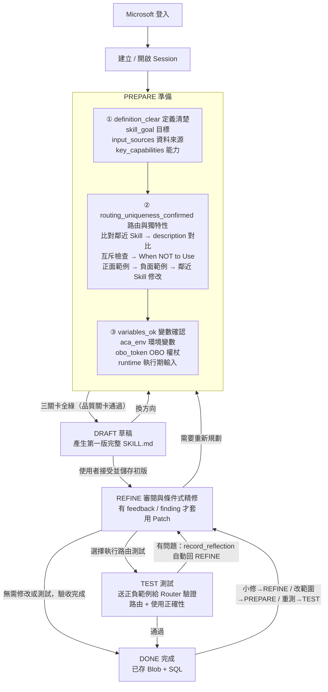
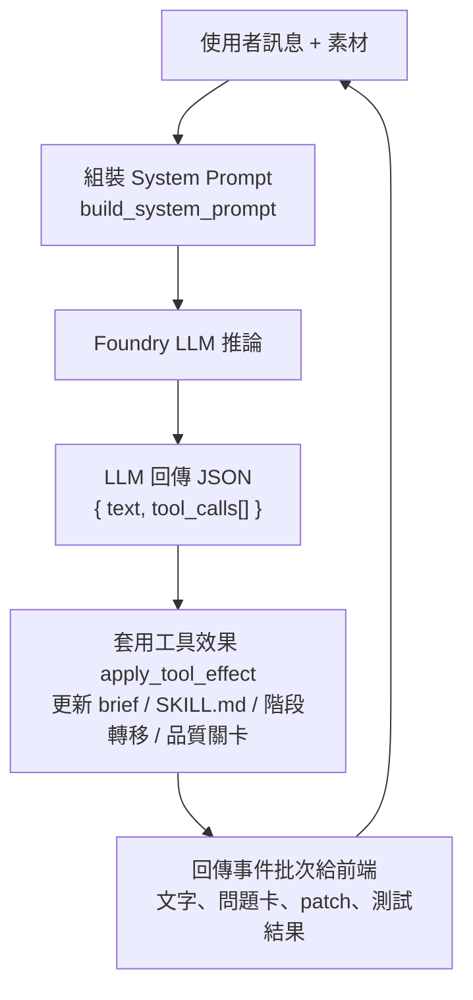

# 01 - 專案介紹（功能與使用者）

> 本文件說明「這個專案在做什麼」、使用者是誰、有哪些需求、核心功能，以及使用者完整流程圖。
> 啟動方式請見 [02-setup.md](02-setup.md)；程式碼與架構請見 [03-architecture.md](03-architecture.md)。

---

## 一句話定位

**Foundry Skill Generator** 是一套「對話式 Skill 產生器」：使用者透過聊天，與 AI 一步步把一個想法淬煉成一份**可被 AI Router 正確路由、可被 Agent 正確執行的 `SKILL.md`**，並在過程中即時測試與修正，最後存進共用的 Skill 知識庫（Azure SQL + Azure Blob）。

技術上是一個在**本機執行**的 Web 應用：

- 後端：Python + FastAPI（單一程序，`uvicorn` 啟動）
- 前端：原生 HTML / CSS / JavaScript（無框架）
- AI 大腦：Microsoft Foundry Agent
- 儲存：Azure Blob（放 `SKILL.md` 全文）、Azure SQL（放 metadata 與權限）
- 登入：Microsoft Entra ID（OAuth2 授權碼 + PKCE）

---

## 使用者是誰（Persona）

| 角色 | 說明 | 主要關心 |
| --- | --- | --- |
| **Skill 作者 / 領域專家** | 想把自己的工作知識（查資料、呼叫某個 API、操作某個系統）包裝成一個可重複使用的 Skill | 「我講得清楚，AI 就能產出正確的 SKILL.md，而且我能馬上測試對不對」 |
| **平台 / Agent 維運者** | 管理整個 Skill 知識庫，確保新 Skill 不會和既有 Skill 路由衝突 | 「新 Skill 的 description 要夠精準，不要搶到別人的流量，也不要漏接」 |
| **被授權的使用者** | 透過 `dbo.user_skill_grants` 被授權，或者該 Skill 被標為公開（`is_public`），才看得到與編輯它 | 「我只看得到我該看的 Skill（資料列級隔離 RLS）」 |

---

## 使用者的需求 / 痛點

1. **手寫 `SKILL.md` 很難**：要同時顧到 YAML frontmatter、router 用的 `description`、執行用的內文、環境變數、OBO Token scope，門檻高。
2. **不知道會不會路由錯**：寫好的 Skill 到底會不會被 Router 在對的問題上選中？會不會搶到鄰近 Skill 的流量？沒有地方測。
3. **與既有 Skill 重複**：知識庫裡可能已有相似的 Skill，作者不知道該新增還是改既有的。
4. **權限與隔離**：每個人只能動自己被授權的 Skill。

本專案把以上痛點，收斂成一條「對話式、分階段、可測試」的流程。

---

## 核心功能

- **對話式產生 SKILL.md**：使用者用自然語言描述需求，AI 透過工具呼叫（tool calls）逐步產出與修改 `SKILL.md`。
- **五階段工作流**（見下方流程圖）：PREPARE → DRAFT → REFINE → TEST → DONE，每個階段有明確產出與品質關卡（quality gate）。
- **既有 Skill 重複偵測**：PREPARE 階段比對知識庫（SQL + Blob），協助判斷該「新增」還是「修改既有 Skill」。
- **鄰近 Skill 差異化（Peer Skills）**：載入使用者有權限的其他 Skill，協助把 `description` 的路由邊界寫清楚（何時用、何時不要用）。
- **路由測試（TEST）**：把正面/負面範例查詢送到設定的 Router runtime endpoint，驗證「該選中時有選中、不該選中時沒選中」，並把結果回饋給 AI 自動修正。端點只需實作 `/run` 契約，可直接連到 runtime，也可選擇經由 APIM 等閘道對外提供；APIM 不是必要元件。請求以 `mode="route_only"` 送出：Router 照常路由並回傳它「本來會執行」的腳本，但**不執行、不寫入任何外部系統**，因此負面樣本不會誤觸有寫入行為的 skill。
- **Patch 審閱與版本**：AI 以 V4A patch 形式提出修改，使用者可接受/還原；接受後即時雙寫 Blob + SQL。
- **登入與資料列級隔離（RLS）**：以 Entra 登入後的 email 作為身分，依 `dbo.user_skill_grants` 決定可存取的 Skill。
- **公開 Skill（`is_public`）**：將一個全域 Skill 標為公開，所有登入者即可使用，**不需逐人授權**。前端在「Skill access」彈窗切換，並以 `public` 標記顯示於 Skill 清單與綁定狀態列。

---

## 使用者流程圖

### 高階流程（五階段工作流）

> REFINE 是條件式修正階段，不要求至少套用一個 Patch。若使用者沒有修改意見，且沒有待處理的 lint finding 或 Open Fix List，接受 DRAFT 後可從 REFINE 直接進入 TEST；若不需要路由測試，也可直接進入 DONE。

> 每個 state 的 Input / Prompt / Output、工具清單與轉換細節，請見 [04-agent-mechanism.md](04-agent-mechanism.md)。

> 階段轉移規則（實作於 `backend/state_machine.py`）：
> PREPARE 只能往 DRAFT；DRAFT 可往 REFINE 或退回 PREPARE；REFINE/TEST 可互轉、可退回 PREPARE、可前進 DONE；DONE 仍可退回 REFINE/TEST/PREPARE 再調整。

### 一次對話回合（Turn）的互動

詳細請看 [03-architecture.md](03-architecture.md)

---

## 名詞速查

| 名詞 | 意義 |
| --- | --- |
| **SKILL.md** | 本專案的最終產出物；含 YAML frontmatter（`name` / `description` / `tags`）與內文。 |
| **Router（路由器）** | 依 Skill 的 frontmatter `description` 決定某個查詢要交給哪個 Skill。 |
| **正面 / 負面範例** | 正面＝這個查詢「應該」選到本 Skill；負面＝相近但「不應該」選到本 Skill。 |
| **Peer Skills（鄰近 Skill）** | 與本 Skill 容易混淆的其他 Skill，用來界定路由邊界。 |
| **素材 Tier（Materials fidelity tier）** | 使用者附加素材的可信度層級，由上傳時選的 kind 決定：Tier 1 `code`（必須原樣沿用）、Tier 2 `api_spec`（識別字權威）、Tier 3 `text`（僅背景，不得作為 API/程式碼細節來源）。詳見 [04-agent-mechanism.md 第 7 節](04-agent-mechanism.md#7-素材materials的三層可信度合約)。 |
| **OBO Token** | On-Behalf-Of 權杖；Skill 執行時代表使用者去呼叫下游系統所需的權杖。 |
| **RLS** | Row-Level Security，資料列級隔離；以使用者 email 比對 `dbo.user_skill_grants`。 |
| **Patch（V4A）** | AI 對 `SKILL.md` 的差異修改格式，可預覽、接受、還原。 |