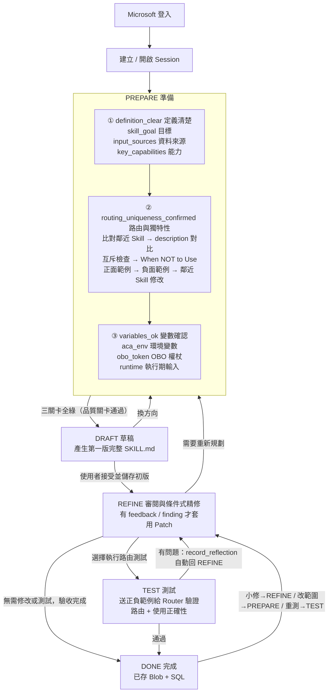
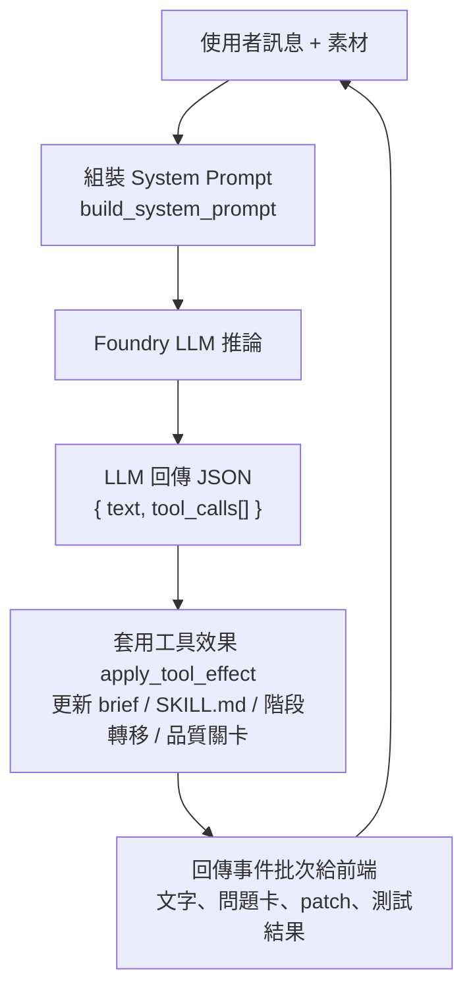

# 01 - 專案介紹（功能與使用者）

> 本文件說明「這個專案在做什麼」、使用者是誰、有哪些需求、核心功能，以及使用者完整流程圖。
> 啟動方式請見 [02-setup.md](02-setup.md)；程式碼與架構請見 [03-architecture.md](03-architecture.md)。

---

## 一句話定位

**Foundry Skill Generator** 是一套「對話式 Skill 產生器」：使用者透過聊天，與 AI 一步步把一個想法淬煉成一份**可被 AI Router 正確路由、可被 Agent 正確執行的 `SKILL.md`**，並在過程中即時測試與修正，最後存進共用的 Skill 知識庫（Azure SQL + Azure Blob）。

技術上是一個在**本機執行**的 Web 應用：

- 後端：Python + FastAPI（單一程序，`uvicorn` 啟動）
- 前端：原生 HTML / CSS / JavaScript（無框架）
- AI 大腦：Microsoft Foundry Agent
- 儲存：Azure Blob（放 `SKILL.md` 全文）、Azure SQL（放 metadata 與權限）
- 登入：Microsoft Entra ID（OAuth2 授權碼 + PKCE）

---

## 使用者是誰（Persona）

| 角色 | 說明 | 主要關心 |
| --- | --- | --- |
| **Skill 作者 / 領域專家** | 想把自己的工作知識（查資料、呼叫某個 API、操作某個系統）包裝成一個可重複使用的 Skill | 「我講得清楚，AI 就能產出正確的 SKILL.md，而且我能馬上測試對不對」 |
| **平台 / Agent 維運者** | 管理整個 Skill 知識庫，確保新 Skill 不會和既有 Skill 路由衝突 | 「新 Skill 的 description 要夠精準，不要搶到別人的流量，也不要漏接」 |
| **被授權的使用者** | 透過 `dbo.user_skill_grants` 被授權，或者該 Skill 被標為公開（`is_public`），才看得到與編輯它 | 「我只看得到我該看的 Skill（資料列級隔離 RLS）」 |

---

## 使用者的需求 / 痛點

1. **手寫 `SKILL.md` 很難**：要同時顧到 YAML frontmatter、router 用的 `description`、執行用的內文、環境變數、OBO Token scope，門檻高。
2. **不知道會不會路由錯**：寫好的 Skill 到底會不會被 Router 在對的問題上選中？會不會搶到鄰近 Skill 的流量？沒有地方測。
3. **與既有 Skill 重複**：知識庫裡可能已有相似的 Skill，作者不知道該新增還是改既有的。
4. **權限與隔離**：每個人只能動自己被授權的 Skill。

本專案把以上痛點，收斂成一條「對話式、分階段、可測試」的流程。

---

## 核心功能

- **對話式產生 SKILL.md**：使用者用自然語言描述需求，AI 透過工具呼叫（tool calls）逐步產出與修改 `SKILL.md`。
- **五階段工作流**（見下方流程圖）：PREPARE → DRAFT → REFINE → TEST → DONE，每個階段有明確產出與品質關卡（quality gate）。
- **既有 Skill 重複偵測**：PREPARE 階段比對知識庫（SQL + Blob），協助判斷該「新增」還是「修改既有 Skill」。
- **鄰近 Skill 差異化（Peer Skills）**：載入使用者有權限的其他 Skill，協助把 `description` 的路由邊界寫清楚（何時用、何時不要用）。
- **路由測試（TEST）**：把正面/負面範例查詢送到設定的 Router runtime endpoint，驗證「該選中時有選中、不該選中時沒選中」，並把結果回饋給 AI 自動修正。端點只需實作 `/run` 契約，可直接連到 runtime，也可選擇經由 APIM 等閘道對外提供；APIM 不是必要元件。請求以 `mode="route_only"` 送出：Router 照常路由並回傳它「本來會執行」的腳本，但**不執行、不寫入任何外部系統**，因此負面樣本不會誤觸有寫入行為的 skill。
- **Patch 審閱與版本**：AI 以 V4A patch 形式提出修改，使用者可接受/還原；接受後即時雙寫 Blob + SQL。
- **登入與資料列級隔離（RLS）**：以 Entra 登入後的 email 作為身分，依 `dbo.user_skill_grants` 決定可存取的 Skill。
- **公開 Skill（`is_public`）**：將一個全域 Skill 標為公開，所有登入者即可使用，**不需逐人授權**。前端在「Skill access」彈窗切換，並以 `public` 標記顯示於 Skill 清單與綁定狀態列。
- **Script 型 Skill**：使用者附上**唯一一份** `code` 素材、確認它涵蓋本 skill 的所有操作，且 EAA 有開啟 script 執行時，產出物會是 `SKILL.md` 加上一支 `scripts/<name>.py`（該素材**原樣**出貨）；否則維持原本的 inline 形式（sample code 寫在 `SKILL.md` 裡）。使用者也可以在 Checklist 的 Output form 直接選擇 inline。素材還不符合 script 的規則時，AI 可以在 PREPARE 提出只動「邊界」的修改（`propose_material_patch`），使用者接受才會生效；進 DRAFT 之後 script 就不再被修改。形式在 PREPARE 決定、進 DRAFT 時鎖定；UI 會在 Materials、Checklist（Output form）、Files 分頁（`SKILL.md | scripts/<name>.py` 切換）與 Skill 清單的 `[script]` 標記顯示目前的形式與尚未滿足的條件。見下方〈Script 型 skill 的限制〉與 [04-agent-mechanism.md 第 7.5 節](04-agent-mechanism.md#75-code-素材與-script-形式)。

### Script 型 skill 的限制

**為什麼一般 agent 平台的 script skill 不能直接放上 EAA**：一般平台的 agent 直接跟使用者對話，跑在使用者自己的環境；AI 讀完 `SKILL.md` 自己組指令、看輸出，出錯就臨場改寫，缺資料就直接問使用者。EAA 不同：

1. **EAA 是宿主 agent 呼叫的 tool（宿主契約）。** 它不能直接問使用者，只能把「需補資料」以 `[NEEDS_INFO]` 回給宿主；成功或失敗由程式判定後交給宿主，沒有人在旁邊判讀 log；一次呼叫就要交出結果。
2. **EAA 在伺服器端帶使用者身分執行（共用執行環境）。** 多人共用同一套服務，每次執行都在隔離的行程與工作目錄，拿不到平台 secret，不能在執行時裝套件，Managed Identity 只依 skill 宣告的 `mi_scopes` 放行。
3. **script skill 不能在執行時自我修正。** 這一點只有 script skill 才有，說明見下段。

前兩點對 inline skill 和 script skill 都成立：inline skill 的程式一樣跑在同一個 sandbox、exit 0 的輸出一樣會被掃描錯誤樣式；EAA 的 lint 也會對 `SKILL.md` 裡的程式碼區塊套用同一套規則（secret 讀取、`pip install`、`mi_scopes`），script 專屬的 lint 只有檔案佈局一項。差別在出錯時誰來修：inline skill 的程式由 AI 每次現寫，被判失敗時，EAA 會把錯誤交回給 AI 修正後重跑；script skill 的程式則是發佈時就寫好的 `scripts/<skill 名稱>.py`，每次原封不動執行，AI 只能透過 `run_skill_script` 以字串陣列傳參數，只看到截斷後的 stdout 預覽，失敗時只回報、不改寫或繞過（只有參數造成的 `[NEEDS_INFO]` 可以修正參數重跑）。script skill 放棄了執行時的自我修正，換來可重現、可審查，所以邊界行為（參數、stdout 格式、exit code、`[NEEDS_INFO]`）必須在發佈前就正確。直接放上 EAA 通常不會當場報錯，而是跑不起來，或結果被判錯：

| 一般 agent 平台的假設 | EAA 的做法 | 直接放上去的結果 | 原因 |
| --- | --- | --- | --- |
| 可以有多支 script、shell 檔、helper 模組，檔名隨意 | 每個 skill 只能執行一支 Python script，路徑固定為 `scripts/<skill 名稱>.py` | script 不會被執行（`not_found` / `unsupported`） | EAA 的 script 規格：單一控管入口，`route_only`、稽核、`mi_scopes` 都靠它 |
| AI 自己組 shell 指令：pipe、轉址、stdin、位置參數 | 只能透過 `run_skill_script` 傳入一串字串參數；沒有 shell，也沒有 stdin | `python x.py file \| jq` 這類用法做不到；需要互動輸入的 script 會因讀不到 stdin 而失敗 | 共用執行環境；tool 是一次性呼叫，沒有互動 |
| 在使用者的電腦上跑：有本機檔案、CLI 登入狀態、已裝好的套件，也能臨時裝套件 | 在獨立行程與工作目錄執行；環境變數先濾掉平台 secret，帶容器部署設定與呼叫端傳入的 credentials（如 OBO token），Managed Identity 依 skill 宣告的 `mi_scopes` 放行 | 找不到檔案、登入狀態或套件；就算捕捉 `ModuleNotFoundError` 後印到 stdout 再 exit 0，仍會被判成失敗 | 共用執行環境 |
| 輸出給 AI 看，進度訊息、表格、log 可以混在 stdout | exit 非 0 即失敗；exit 0 時掃描 stdout 的錯誤樣式（部分樣式只在 stdout 不是單一 JSON 時才掃），命中就改判失敗 | stdout 不是單一 JSON 時，印一行「0 failed」，成功也被判成失敗；錯誤只印到 stderr 再 exit 0，失敗反被當成成功（stderr 不會被掃描） | 宿主契約：成敗由程式判定 |
| exit code 與「缺資料」怎麼回報沒有約定，由 AI 臨場理解 | exit 0 = 成功；exit 0 且 stdout 有 `[NEEDS_INFO]` 行 = 需補資料；非 0 = 失敗（平台不區分非 0 的值）。只回報需補資料的執行不算成功執行，Gatekeeper 不會因此 refine 該 skill | argparse 參數錯誤只會得到籠統的失敗；`--help` 印到 stdout 並 exit 0，會被當成成功回給使用者 | 宿主契約：EAA 不能自己問使用者 |
| 路由對不對，實際跑一次就知道 | 路由測試（`route_only`）不執行 script，只記錄 AI 本來要傳的參數 | script 沒有宣告 `--flag`，人工或外部測試就無法比對 AI 傳的參數對不對（平台本身不驗證參數） | 宿主契約：宿主驗證路由時不能產生副作用 |
| skill 的檔案怎麼放沒有規定，放上去跑跑看就知道 | EAA 本身不強制 lint，`lint_skill_package` 可在發佈前檢查 script 佈局、frontmatter、secret 讀取與 `mi_scopes`；執行時須開啟 `DYNAMIC_SKILLS_ENABLED`（預設開）與 `SKILL_SCRIPTS_ENABLED` | 佈局不符時，`load_skill` 回 Error，script 不會執行。本 Generator 存檔時強制執行這個 lint，未通過就不能存進知識庫 | EAA 的發佈與執行設定 |

下表是 Generator 在素材變成 script **之前**檢查的具體規則，讓這些問題在 Generator 裡就被擋下，而不是部署後才發現。這些規則中，錯誤樣式掃描、`[NEEDS_INFO]` 契約、執行環境，inline skill 同樣要遵守，只是 inline 的程式由 AI 現寫，違反時可以在執行時修正：

| 檢核 | 不檢查會發生什麼 | 原因 |
| --- | --- | --- |
| stdout 只能是一個 `json.dumps(...)` 物件，或 `[NEEDS_INFO]` 那一行加一個 JSON（S4、S6） | `eaa_runs.result()` 會先拿掉**開頭**的 `[NEEDS_INFO]` 行，再把其餘 stdout 當成**一個** JSON 解析，所以 `[NEEDS_INFO]` 必須是第一行。多一行進度訊息，結果就只剩一串無法解析的文字；訊息裡若有 `failed`、`Error:` 之類的字，成功的執行還可能被判成失敗。診斷訊息請印到 stderr。 | 宿主契約：成敗由程式判定 |
| exit-0 的輸出不能含 EAA 的錯誤樣式（S11） | EAA 會掃描 exit 0 的輸出，命中錯誤樣式就把這次執行改判為失敗。就算 stdout 是單一 JSON，只要有 `"error":` 這個 key（值是 `null` 也一樣），或 `status` 的值以 `error` 結尾，仍會被判成失敗。 | 宿主契約：成敗由程式判定 |
| 失敗要放進結果 JSON，並以非 0 exit 結束 | exit 0 時 EAA 不以 stderr 判定失敗；只把「刪除失敗」印到 stderr 再 exit 0，失敗就被當成成功。 | 宿主契約：成敗由程式判定 |
| 使用者請求的值只能用 `--flag` 參數傳入（S3、S13、`inputs`） | script 是獨立行程：`globals()` 裡沒有 host 注入的變數，環境變數只帶部署設定、憑證，以及呼叫端在請求裡帶的變數（經過濾）；對話中使用者給的值只能由 AI 組成參數傳入。用其他方式讀使用者的值，skill 就會永遠回 `[NEEDS_INFO]`。 | 共用執行環境 |
| argparse 要 `add_help=False`，`parse_args()` 要包在 `try` / `except SystemExit`（S10、S10b） | 參數錯誤時 argparse 會 exit 2，EAA 只記成籠統的執行失敗；`--help` 則會把用法說明印到 stdout 並 exit 0，被當成成功回給使用者。改成回 `[NEEDS_INFO]` 並 exit 0，host 才能修正參數或詢問使用者。 | 宿主契約：EAA 不能自己問使用者 |
| exit code 只能是 0 / 1 / 3（S5） | EAA 只分 0 與非 0。0 / 1 / 3 是 Generator 的慣例（0 成功或需要補資料、1 部署設定有誤、3 下游系統失敗），讓 `SKILL.md` 的 exit-code 表能一致地說明每種結果。 | Generator 的慣例 |
| token 從環境變數讀，不能當參數（S7） | 命令列參數會出現在執行紀錄、Gatekeeper log、DEBUG 檔，以及 `route_only` 回給呼叫端的 `requested_scripts`，最後這處會直接傳到 EAA 外部。 | 共用執行環境 |
| `SKILL.md` 要照 script 的實際行為寫（每個 `--flag`、exit-code 表含 needs_info 列、每個輸出欄位） | host 是依 `SKILL.md` 組出參數、判讀結果；文件寫錯，host 就會傳錯參數或看不懂結果。 | script skill 不能在執行時自我修正 |

**AI 修改素材為什麼有這麼多限制**：script skill 不能在執行時自我修正，邊界問題只能在 Generator 裡一次修好。使用者的程式碼通常已經驗證過業務邏輯，Generator 只調整「邊界」（輸入、stdout / stderr、exit code），不碰外部呼叫與業務邏輯；外部呼叫一個都不能少，邊界以外的改動超過一半就視為改寫而拒絕。patch 必須一次修完所有問題（修一半還是當不成 script），同一份素材最多被拒 3 次，避免無限重試；接受後素材會標示「edited by agent · not run」，使用者要實際跑過一次才能確認涵蓋所有操作，因為上線後沒有 AI 會幫它修。實際的 patch 長什麼樣子，見 [04-agent-mechanism.md 第 7.5 節的範例](04-agent-mechanism.md#75-code-素材與-script-形式)。

---

## 使用者流程圖

### 高階流程（五階段工作流）

```mermaid
flowchart TD
    L[Microsoft 登入] --> N[建立 / 開啟 Session]
    N --> P

    subgraph P[PREPARE 準備]
        direction TB
        P1["① definition_clear 定義清楚<br/>skill_goal 目標<br/>input_sources 資料來源<br/>key_capabilities 能力"]
        P2["② routing_uniqueness_confirmed 路由與獨特性<br/>比對鄰近 Skill → description 對比<br/>互斥檢查 → When NOT to Use<br/>正面範例 → 負面範例 → 鄰近 Skill 修改"]
        P3["③ variables_ok 變數確認<br/>aca_env 環境變數<br/>obo_token OBO 權杖<br/>runtime 執行期輸入"]
        P1 --> P2 --> P3
    end

    P -->|三關卡全綠（品質關卡通過）| D[DRAFT 草稿<br/>產生第一版完整 SKILL.md]
    D -->|使用者接受並儲存初版| R[REFINE 審閱與條件式精修<br/>有 feedback / finding 才套用 Patch]
    R -->|選擇執行路由測試| T[TEST 測試<br/>送正負範例給 Router 驗證路由 + 使用正確性]
    R -->|無需修改或測試，驗收完成| DONE
    T -->|有問題：record_reflection 自動回 REFINE| R
    T -->|通過| DONE[DONE 完成<br/>已存 Blob + SQL]
    D -->|換方向| P
    R -->|需要重新規劃| P
    DONE -->|小修→REFINE / 改範圍→PREPARE / 重測→TEST| R
```

> REFINE 是條件式修正階段，不要求至少套用一個 Patch。若使用者沒有修改意見，且沒有待處理的 lint finding 或 Open Fix List，接受 DRAFT 後可從 REFINE 直接進入 TEST；若不需要路由測試，也可直接進入 DONE。

> 每個 state 的 Input / Prompt / Output、工具清單與轉換細節，請見 [04-agent-mechanism.md](04-agent-mechanism.md)。

> 階段轉移規則（實作於 `backend/state_machine.py`）：
> PREPARE 只能往 DRAFT；DRAFT 可往 REFINE 或退回 PREPARE；REFINE/TEST 可互轉、可退回 PREPARE、可前進 DONE；DONE 仍可退回 REFINE/TEST/PREPARE 再調整。

### 一次對話回合（Turn）的互動

詳細請看 [03-architecture.md](03-architecture.md)

```mermaid
flowchart TD
    U[使用者訊息 + 素材] --> A[組裝 System Prompt<br/>build_system_prompt]
    A --> B[Foundry LLM 推論]
    B --> C["LLM 回傳 JSON<br/>{ text, tool_calls[] }"]
    C --> D[套用工具效果 apply_tool_effect<br/>更新 brief / SKILL.md / 階段轉移 / 品質關卡]
    D --> E[回傳事件批次給前端<br/>文字、問題卡、patch、測試結果]
    E --> U
```

---

## 名詞速查

| 名詞 | 意義 |
| --- | --- |
| **SKILL.md** | 本專案的最終產出物；含 YAML frontmatter（`name` / `description` / `tags`）與內文。 |
| **Router（路由器）** | 依 Skill 的 frontmatter `description` 決定某個查詢要交給哪個 Skill。 |
| **正面 / 負面範例** | 正面＝這個查詢「應該」選到本 Skill；負面＝相近但「不應該」選到本 Skill。 |
| **Peer Skills（鄰近 Skill）** | 與本 Skill 容易混淆的其他 Skill，用來界定路由邊界。 |
| **素材 Tier（Materials fidelity tier）** | 使用者附加素材的可信度層級，由上傳時選的 kind 決定：Tier 1 `code`（必須原樣沿用）、Tier 2 `api_spec`（識別字權威）、Tier 3 `text`（僅背景，不得作為 API/程式碼細節來源）。詳見 [04-agent-mechanism.md 第 7 節](04-agent-mechanism.md#7-素材materials的三層可信度合約)。 |
| **OBO Token** | On-Behalf-Of 權杖；Skill 執行時代表使用者去呼叫下游系統所需的權杖。 |
| **RLS** | Row-Level Security，資料列級隔離；以使用者 email 比對 `dbo.user_skill_grants`。 |
| **Patch（V4A）** | AI 對 `SKILL.md` 的差異修改格式，可預覽、接受、還原。 |
| **Skill 形式（inline / script）** | inline：程式碼以 sample code 寫在 `SKILL.md` 裡；script：`SKILL.md` 加上原樣出貨的 `scripts/<name>.py`。一個 skill 的形式進 DRAFT 後就固定，不支援互轉。 |
| **EAA script 旗標** | ACA `architectural_config` 的 `DYNAMIC_SKILLS_ENABLED` 與 `SKILL_SCRIPTS_ENABLED`；兩者皆為 `true` 才能產出與儲存 script 型 skill。見 [02-setup.md](02-setup.md#script-型-skill-的-eaa-旗標)。 |