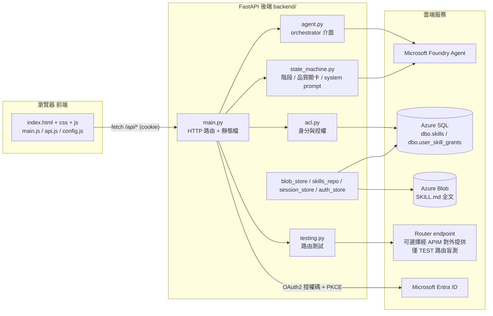
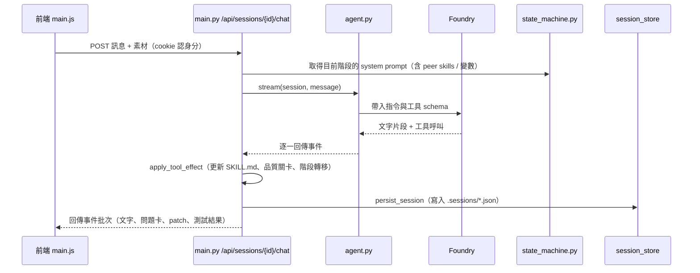
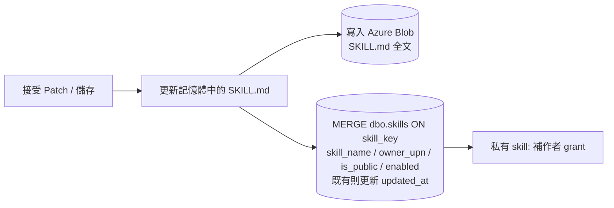

# 03 - 程式碼與系統架構

> 本文件給開發者：從大架構到單一檔案，快速了解前端、後端、資料庫、雲端如何串接，資料如何流動，以及**登入與 Token 的完整流程**。
> 專案在做什麼請見 [01-overview.md](01-overview.md)；啟動與設定請見 [02-setup.md](02-setup.md)；Agent 狀態機與工具請見 [04-agent-mechanism.md](04-agent-mechanism.md)。

---

## 1. 整體架構

單一 FastAPI 程序（`uvicorn`）同時提供前端靜態檔與 `/api/*`，對外串接 Foundry（AI）、Azure SQL、Azure Blob、Router endpoint 與 MCP 等服務。Router endpoint 可經 APIM 對外提供，也可直接使用任何實作相同 `/run` HTTP 契約的 runtime。

### 串接方式摘要

| 介面 | 協定 / 方式 | 說明 |
| --- | --- | --- |
| 前端 ↔ 後端 | `fetch` + 同源 cookie | 前端打 `/api/*`，帶 `credentials: include`；後端用 `sgv2_auth` cookie 認身分 |
| 後端 ↔ Foundry | Azure AI Projects SDK + Entra service principal | orchestrator 對話與研究 agent |
| 後端 ↔ Azure SQL | `mssql-python`（純 Python，AAD） | Skill metadata 與權限授權 |
| 後端 ↔ Azure Blob | `azure-storage-blob`（AAD，不支援連線字串） | `SKILL.md` 全文讀寫 |
| 後端 ↔ Router endpoint | `urllib`（HTTP） | 僅用於 TEST 路由測試；不限定 APIM，任何實作 `/run` 契約的 runtime 均可。body 頂層帶 `mode`，**一律 `route_only`**（scenario L3 改為對 L2 的回應做斷言，不發自己的請求），回應必須回顯同一個 `mode`；**儲存後不再呼叫任何 sync 端點** |
| 後端 ↔ Entra | OAuth2 授權碼 + PKCE（`urllib`） | 使用者登入與發 token |

### 雲端存取身分

| 服務 | 實際呼叫身分 | 選擇方式 |
| --- | --- | --- |
| **Microsoft Foundry Project** | `.env` 中 `AZURE_CLIENT_ID` 對應的 service principal | `DefaultAzureCredential()` 優先採用完整的 `AZURE_TENANT_ID` / `AZURE_CLIENT_ID` / `AZURE_CLIENT_SECRET`；需另授予 Foundry project 或 agent data-plane 權限 |
| **Azure SQL Database** | 與 Foundry 相同，即 `.env` 中 `AZURE_CLIENT_ID` 對應的 service principal | `ActiveDirectoryServicePrincipal`；沒有 Managed Identity 或 `az login` fallback |
| **Azure Blob Storage** | 本機為 `az login` 使用者；Azure 上為應用程式 Managed Identity | Blob credential 刻意排除 EnvironmentCredential，因此不使用上述 service principal |

瀏覽器經 OAuth2 登入的使用者只負責網頁身分、Skill ACL 與 delegated/OBO token。這個使用者身分不會成為 Foundry、SQL 或 Blob 的連線身分。完整設定與角色需求見 [02-setup.md](02-setup.md)。

---

## 2. 資料流

### 2.1 一次對話回合的資料流

### 2.2 儲存（接受 patch / 按下儲存）

接受 patch 後在記憶體更新 `SKILL.md`，並在綁定遠端 Skill 時**雙寫 Blob + SQL**。雙寫完成即生效，**沒有額外的 publish / sync 步驟**：runtime 每次請求都直接從 SQL + Blob 動態解析 skill（Mode B）。

實際寫入時機與流程：【建立 / 修改內容 -> 整理 skill data -> upsert 到 dbo.skills -> 若為既有 skill 修改，更新 updated_at -> 回傳最新資料給系統渲染】。

- **寫入時機**：REFINE 每個被接受的 patch、以及按下「儲存」都會雙寫 Blob + SQL（`save_skill_dual_write`）；DRAFT 被接受也雙寫。
- **new vs modify**：new skill 首次儲存是 INSERT（同時寫 created_at / updated_at）；modify 既有 skill 是覆寫內容的 UPDATE。
- **upsert 行為**：`upsert_skill` 是 `MERGE dbo.skills`，比對鍵是 `skill_key`：不存在 -> INSERT `(skill_name, owner_upn, is_public, enabled)`；已存在 -> UPDATE `is_public` / `enabled`，並**設 `updated_at = SYSUTCDATETIME()`**。
- **絕不寫入計算欄位**：`skill_key` / `blob_path` / `blob_prefix` 都是 PERSISTED computed column，由 SQL 自行產生；應用程式若嘗試寫入會直接被 SQL Server 拒絕。
- **儲存不改可見性**：儲存是「內容」動作。`save_skill_dual_write` 一律**沿用** DB 現有的 `is_public`（新 skill 一律建為私有），因此接受 SKILL.md / 接受 patch / 接受改名都不會動到可見性。改可見性的**唯一寫入路徑**是 `PATCH /api/skills/{name}/visibility`。
- **授權**：私有 skill 儲存後會補一筆作者自己的 grant；`is_public = 1` 的 skill 不需要任何 grant。
- **updated_at 規則**：只要已存在 DB 的 skill 被再次修改並覆寫，`updated_at` 就更新為最新時間。

#### 可見性（is_public）

可見性與內容分開處理，只由 `PATCH /api/skills/{name}/visibility` 寫入：

- **前端兩段式**：draft 卡片上的「Public」勾選框不會隨儲存送出。使用者勾選並在確認對話框按下確定後，前端先以**私有**接受 draft，成功後才另外呼叫 PATCH 公開。順序是 fail-safe 的——PATCH 失敗時 skill 仍是私有，前端會提示可從 Skill access 重試。
- **降回私有時補 grant**：改成 `is_public = 0` 會同時補一筆呼叫者的 grant，否則作者會失去自己 skill 的存取權。
- **internal children 跟隨 parent**：PATCH 會讀取 Blob 上該 skill 的 `children`，只對**不在 host catalog 的 internal child** 套用同一個可見性（公開時一起公開、降回私有時一起降並補 grant）。已在 catalog 的 child 屬於所有人，不由這支 parent 重新界定範圍。單一 child 失敗不會中斷其他 child，結果會回在 `children` / `failed_children`。

---

## 3. 前端細節（frontend/）

純原生網頁，無建置框架；由後端 `main.py` 直接提供。

| 檔案 | 職責 |
| --- | --- |
| `frontend/index.html` | 單頁應用骨架：聊天區、工作流 stepper、素材 / 測試 / 檔案分頁、各種卡片與 modal |
| `frontend/css/style.css` | 全部樣式（卡片、表格、面板、disclosure 區塊等） |
| `frontend/js/config.js` | 設定 `window.SG_API_BASE = ""`（同源，`/api/*` 走相對路徑） |
| `frontend/js/api.js` | 所有後端 API 呼叫的封裝：`apiFetch`（帶 cookie）、建立 session、聊天、工具結果、測試、儲存、授權管理等 |
| `frontend/js/main.js` | 前端主控：渲染對話事件、問題卡、patch 預覽、測試結果、peer skills 面板；處理 tool 接受 / 還原、自動續轉（auto-continue）等 |

> 對話採「非串流」設計：後端把整回合事件收集成批次回傳，前端用同一套 `onEvent` 分派器重播。

---

## 4. 後端細節（backend/）

| 檔案 | 職責 |
| --- | --- |
| `main.py` | FastAPI 進入點：所有 `/api/*` 路由、靜態檔掛載、CORS、登入 / 回呼 / 登出、session CRUD、聊天、工具結果、儲存與雙寫、rename 流程 |
| `agent.py` | orchestrator 介面：工具 schema（`TOOL_SCHEMAS`）、從 `prompts/11_output_rules.md` 載入 AI 規則（`_load_output_rules`）、把 Foundry 的串流轉成事件 |
| `state_machine.py` | 五階段轉移表、品質關卡（quality gate）、組裝各階段 system prompt（含 peer skills、變數、研究結果） |
| `models.py` | Pydantic 資料模型：`Session`、`ChatMessage`、`SkillDraft`、`ResearchBrief`、`PatchRecord`、`TestResult` 等 |
| `acl.py` | 身分與授權：從請求取出 UPN（email）、`AclCache` 快取使用者的 Skill 授權、FastAPI 相依 `require_upn` |
| `auth_store.py` | 登入狀態保存：`LocalAuthStore`（記憶體）與選用的 `AzureBlobAuthStore`（共用 / 多實例） |
| `session_store.py` | 撰寫 session 的 JSON 持久化（本機檔案，或 `SGV2_SESSION_STORE=blob` 改存 Blob） |
| `blob_store.py` | Azure Blob 版 Skill 儲存與 `SKILL.md` frontmatter 解析（含含冒號 description 的容錯） |
| `skills_repo.py` | Azure SQL 的 DAO：`dbo.skills` 與 `dbo.user_skill_grants` 的查詢 / upsert / 授權 / 可見性 / 刪除（一律以 `skill_key` 為鍵） |
| `skills_index.py` | 以 DB + Blob 組「既有 Skill 索引」，供 PREPARE 階段做重複偵測 |
| `testing.py` | 路由測試：把正負範例送到 Router endpoint，評估是否路由到本 Skill。端點可經 APIM 對外提供，也可直接連到相容 runtime；以 `mode=route_only` 送出（不執行腳本），驗證 runtime 的 `mode` 回顯（不符即中止整批），並在持久化前遮蔽機密形狀 |
| `patch.py` | 小型 V4A patch 解析與套用 |
| `mcp_jsonrpc.py` | MCP JSON-RPC client（讀取 ACA 環境變數等）。以 `MICROSOFT_*` App Registration 對自己做 client credentials 取得 app-only token（audience 預設從 `MICROSOFT_OBO_SCOPE` 推導），並快取至過期前 60 秒；audience 推導不出來則退回匿名呼叫 |
| `db.py` | Azure SQL 連線輔助（`mssql-python`，AAD 驗證策略） |
| `diagnostics.py` | 結構化記錄輔助（`log_event` / `log_exception`），會把疑似機密的值遮罩成 `***` |
| `e2e.py` | 本機 E2E 測試掛鉤（搭配 `E2E_MODE`） |

---

## 5. 資料庫細節（Azure SQL — Skill RBAC schema v2.2）

| 資料表 / View | 欄位 | 用途 |
| --- | --- | --- |
| `dbo.skills` | `skill_name`, `owner_upn`(NULL=全域), `is_public`, `is_internal`, `enabled`, `created_at`, `updated_at`；**計算欄位** `skill_key`(PK), `blob_path`, `blob_prefix` | Skill 的 metadata 與可見性 |
| `dbo.user_skill_grants` | `user_upn`, `skill_key`(FK CASCADE), `granted_at`, `granted_by`, `expires_at`；PK = (user_upn, skill_key) | 每位使用者可存取哪些 Skill |
| `dbo.v_my_skills` | 上述兩者的 join | 「目前登入者看得到的 skill」的官方語意定義 |

計算欄位公式（PERSISTED，**不可寫入**）：

| 欄位 | 全域 skill（`owner_upn IS NULL`） | 私有 skill |
| --- | --- | --- |
| `skill_key` | `skill_name` | `skill_name + '_' + owner_upn` |
| `blob_prefix` | `skills/<skill_name>/` | `skills/_private/<owner_upn>/<skill_name>/` |
| `blob_path` | `skills/<skill_name>/SKILL.md` | `skills/_private/<owner_upn>/<skill_name>/SKILL.md` |

約束：

- `CK_skill_name_format`：`skill_name` 只能是 `[a-z0-9-]`，不可用連字號開頭或結尾，長度 <= 64。
- `CK_skills_is_public_scope`：`is_public = 0 OR owner_upn IS NULL`——只有全域 skill 可以公開。

要點：

- `SKILL.md` **全文存在 Blob**，SQL 只存可查詢的 metadata 與權限。**schema v2 已移除 `description` 與 `version` 欄位**，description 的唯一真實來源是 Blob 上 `SKILL.md` 的 frontmatter。
- 可見性語意 = `enabled = 1 AND (有未過期的 grant OR is_public = 1)`。
- **為什麼應用程式不直接查 `v_my_skills`**：本應用以**單一 service principal**（`ActiveDirectoryServicePrincipal`）連線 SQL，所有使用者共用同一個 DB 身分，因此 `SUSER_SNAME()` 命中 RLS 的 bypass 分支，RLS 不會替我們做逐人過濾；而 `v_my_skills` 也沒有 `user_upn` 欄位可供外部帶入條件。`skills_repo` 因此在 base table 上**複刻**該 view 的 WHERE 條件，並顯式帶入 `g.user_upn = ?`。改動 view 的語意時，`skills_repo.list_skills_for_user` 必須同步跟著改。
- **`skills/` 這個前綴被寫死在計算欄位公式裡**。應用程式的 `blob_store.BLOB_ROOT` 必須與其一致，否則 SQL 的 `blob_path` 會指向應用程式從未寫入的位置，而且**不會有任何錯誤**。因此 `AZURE_BLOB_PREFIX` 若設成 `skills` 以外的值，服務會在啟動時直接拋錯。
- `is_internal` 是**可發現性**（是否投影給宿主的 `list_skills`），**不是權限**；權限一律看 grant 與 `is_public`。存 scenario skill 時，`save_skill_dual_write()` **只會**把 `PrepareBrief.delegation` 宣告的 child（真正被委派工作的能力層技能）以 `upsert_skill(child, is_internal=True)` 標為內部。`metadata.children` 本身是**依賴白名單**，還包含 `html-ppt` 這類通用技能；把它們標成內部會讓它們從**所有人**的 `list_skills` 消失，因此不在標記範圍內。孤兒提示只在「該 child 離開白名單**且**目前 `is_internal = 1`」時觸發；選 `make_capability` 會改回 `is_internal=False`。`upsert_skill(is_internal=None)` 代表「不動既有值」，新列則取 schema 預設 `0`。
- 刪除 `dbo.skills` 的一列時，`user_skill_grants` 的相關授權因 FK CASCADE 一併清除。

---

## 6. 登入與 Token 流程

本系統採 **OAuth2 授權碼流程 + PKCE** 登入。本節只說明**流程**；App Registration 與環境變數的**設定**請見 [02-setup.md](02-setup.md) 的「3.3 Entra App Registration 設定」。

### 流程概觀

`GET /api/auth/login` 產生 state + PKCE 後把使用者導去 Entra 登入 → 使用者授權後帶授權碼回 `GET /api/auth/callback` → 後端用授權碼（加 PKCE 與 client secret）跟 Entra 換到 `access_token` → 解析出使用者 email 當身分，並把 token 記錄留在後端、只發一個 cookie 給瀏覽器。

### 如何拿到 email

`/api/auth/callback` 用授權碼換到 `access_token` 後，後端 `decode_jwt_claims()` 解出 JWT claims，再用 `profile_from_claims()` 取 `email`（依序 `email` → `preferred_username` → `upn`，統一轉小寫）。這個 **email 就是使用者身分（UPN）**，也是權限的唯一真實來源（對應 `dbo.user_skill_grants.user_upn`）。之後每個請求由 `require_upn`（`acl.py`）讀 cookie → 取回 token 記錄 → 拿 `profile.email` 當 UPN。

### Token 存放在哪裡

- 換到的 `access_token`（連同 `expires_at` / `scope` / `profile`）存成一筆記錄，放在後端 **`auth_store`**，以一個隨機 `auth_id` 當 key（本機＝程序記憶體；可選 `SGV2_AUTH_STORE=blob` 改存 Azure Blob）。
- 瀏覽器只拿到一個 **httponly cookie `sgv2_auth=auth_id`**——**cookie 內只有不可猜的 `auth_id`，真正的 access token 不會外流到前端**。
- 後端要對下游系統做 OBO 委派呼叫時，用 `get_delegated_token()` 從這筆記錄取出 `access_token`。
- 登出 `POST /api/auth/logout` 會刪除該 token 記錄並清掉 cookie。

---

## 7. 重要慣例（給維護者）

- HTTP 請求一律用 `urllib`（`UrlRequest` / `urlopen` / `HTTPError`），不用 `requests`。
- 記錄用 `from .diagnostics import log_event, log_exception, now_ms, elapsed_ms`。
- `main.py` 頂端 `load_dotenv(override=True)`，`.env` 會覆蓋既有環境變數。
- **`prompts/*.md` 是 AI 規則的唯一真實來源**，包含每回合注入的行為守則（`prompts/11_output_rules.md`）。`agent.py` 的 `FOUNDRY_OUTPUT_RULES` / `FOUNDRY_OUTPUT_SHAPE` 由 `_load_output_rules()` 於載入時解析該檔而來，**不再內嵌任何規則字串**。改規則請改 `.md`。
- 驗證語法：`uv run python -c "import ast; ast.parse(open('backend/<f>.py',encoding='utf-8').read())"`；匯入測試：`uv run python -c "import backend.main"`。