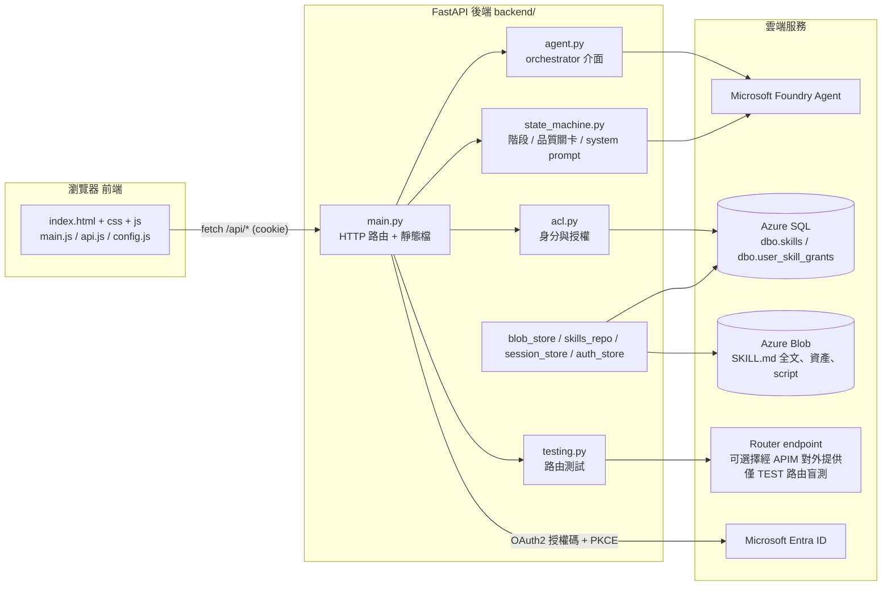
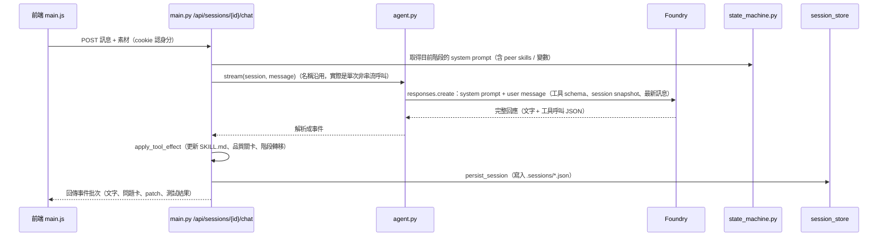
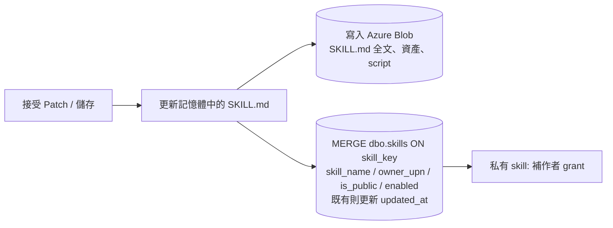

# 03 - 程式碼與系統架構

> 本文件給開發者：從大架構到單一檔案，快速了解前端、後端、資料庫、雲端如何串接，資料如何流動，以及**登入與 Token 的完整流程**。
> 專案在做什麼請見 [01-overview.md](01-overview.md)；啟動與設定請見 [02-setup.md](02-setup.md)；Agent 狀態機與工具請見 [04-agent-mechanism.md](04-agent-mechanism.md)。

---

## 1. 整體架構

單一 FastAPI 程序（`uvicorn`）同時提供前端靜態檔與 `/api/*`，對外串接 Foundry（AI）、Azure SQL、Azure Blob、Router endpoint 與 MCP 等服務。Router endpoint 可經 APIM 對外提供，也可直接使用任何實作相同 `/run` HTTP 契約的 runtime。

```mermaid
flowchart LR
    subgraph Browser[瀏覽器 前端]
        UI[index.html + css + js<br/>main.js / api.js / config.js]
    end

    subgraph Backend[FastAPI 後端 backend/]
        API[main.py<br/>HTTP 路由 + 靜態檔]
        AG[agent.py<br/>orchestrator 介面]
        SM[state_machine.py<br/>階段 / 品質關卡 / system prompt]
        TS[testing.py<br/>路由測試]
        ACL[acl.py<br/>身分與授權]
        STORES[blob_store / skills_repo / session_store / auth_store]
    end

    subgraph Cloud[雲端服務]
        FND[Microsoft Foundry Agent]
        SQL[(Azure SQL<br/>dbo.skills / dbo.user_skill_grants)]
        BLOB[(Azure Blob<br/>SKILL.md 全文、資產、script)]
        ROUTER[Router endpoint<br/>可選擇經 APIM 對外提供<br/>僅 TEST 路由盲測]
        ENTRA[Microsoft Entra ID]
    end

    UI -- fetch /api/* (cookie) --> API
    API --> AG --> FND
    API --> SM --> FND
    API --> TS --> ROUTER
    API --> ACL --> SQL
    STORES --> SQL
    STORES --> BLOB
    API -- OAuth2 授權碼 + PKCE --> ENTRA
```

### 串接方式摘要

| 介面 | 協定 / 方式 | 說明 |
| --- | --- | --- |
| 前端 ↔ 後端 | `fetch` + 同源 cookie | 前端打 `/api/*`，帶 `credentials: include`；後端用 `sgv2_auth` cookie 認身分 |
| 後端 ↔ Foundry | Azure AI Projects SDK + Entra service principal | orchestrator 對話與研究 agent |
| 後端 ↔ Azure SQL | `mssql-python`（純 Python，AAD） | Skill metadata 與權限授權 |
| 後端 ↔ Azure Blob | `azure-storage-blob`（AAD，不支援連線字串） | `SKILL.md` 全文讀寫 |
| 後端 ↔ Router endpoint | `urllib`（HTTP） | 僅用於 TEST 路由測試；不限定 APIM，任何實作 `/run` 契約的 runtime 均可。body 頂層帶 `mode`，**一律 `route_only`**（scenario L3 改為對 L2 的回應做斷言，不發自己的請求），回應必須回顯同一個 `mode`；body 頂層另帶 `scenario`（scenario 測試送該 scenario 名稱以收斂 skill 池，capability 送空字串）；使用者委派 token **只放在 `Authorization: Bearer` header**，body 的 `credentials` 永遠是空物件（EAA 會把 credentials 變成 skill 的環境變數）；HTTP 401 中止整批回 502；**儲存後不再呼叫任何 sync 端點** |
| 後端 ↔ EAA MCP | JSON-RPC over HTTPS（app-only token） | 儲存前呼叫 `lint_skill_package`；`valid == false` 或 `status == "failed"` 擋下儲存，warnings 不擋，取不到判定則 fail-closed |
| 後端 ↔ Entra | OAuth2 授權碼 + PKCE（`urllib`） | 使用者登入與發 token |

### 雲端存取身分

| 服務 | 實際呼叫身分 | 選擇方式 |
| --- | --- | --- |
| **Microsoft Foundry Project** | `.env` 中 `AZURE_CLIENT_ID` 對應的 service principal | `DefaultAzureCredential()` 優先採用完整的 `AZURE_TENANT_ID` / `AZURE_CLIENT_ID` / `AZURE_CLIENT_SECRET`；需另授予 Foundry project 或 agent data-plane 權限 |
| **Azure SQL Database** | 與 Foundry 相同，即 `.env` 中 `AZURE_CLIENT_ID` 對應的 service principal | `ActiveDirectoryServicePrincipal`；沒有 Managed Identity 或 `az login` fallback |
| **Azure Blob Storage（skill）** | 本機為 `az login` 使用者；雲端未實測，見 [02-setup.md 附錄 A](02-setup.md#附錄-a改寫為雲端版本本-repo-未實測) | `DefaultAzureCredential(exclude_environment_credential=True)`：刻意排除 EnvironmentCredential，因此不使用上述 service principal |
| **Azure Blob Storage（session / auth，選用）** | 本機為 `az login` 使用者 | `ChainedTokenCredential(ManagedIdentityCredential(), AzureCliCredential())`；只在 `SGV2_SESSION_STORE` / `SGV2_AUTH_STORE=blob` 時使用，尚未實際測試（見 [02-setup.md 5.3](02-setup.md#53-多實例部署)） |
| **EAA MCP** | `MICROSOFT_*` App Registration 的 app-only token | client credentials 對自己換 `api://<app-id>/.default`；見 [2.4](#24-呼叫-eaa-mcp-的身分) |
| **Router runtime endpoint** | 網頁登入者的委派 token | 取自 `auth_store`，只放在 `Authorization: Bearer` header |

瀏覽器經 OAuth2 登入的使用者只負責網頁身分、Skill ACL 與 delegated/OBO token。這個使用者身分不會成為 Foundry、SQL 或 Blob 的連線身分。完整設定與角色需求見 [02-setup.md](02-setup.md#2-準備雲端資源)。

---

## 2. 資料流

### 2.1 一次對話回合的資料流

```mermaid
sequenceDiagram
    participant UI as 前端 main.js
    participant API as main.py /api/sessions/{id}/chat
    participant AG as agent.py
    participant FND as Foundry
    participant SM as state_machine.py
    participant ST as session_store

    UI->>API: POST 訊息 + 素材（cookie 認身分）
    API->>SM: 取得目前階段的 system prompt（含 peer skills / 變數）
    API->>AG: stream(session, message)（名稱沿用，實際是單次非串流呼叫）
    AG->>FND: responses.create：system prompt + user message（工具 schema、session snapshot、最新訊息）
    FND-->>AG: 完整回應（文字 + 工具呼叫 JSON）
    AG-->>API: 解析成事件
    API->>API: apply_tool_effect（更新 SKILL.md、品質關卡、階段轉移）
    API->>ST: persist_session（寫入 .sessions/*.json）
    API-->>UI: 回傳事件批次（文字、問題卡、patch、測試結果）
```

### 2.2 儲存（接受 patch / 按下儲存）

接受 patch 後在記憶體更新 `SKILL.md`，並在綁定遠端 Skill 時**雙寫 Blob + SQL**。雙寫完成即生效，**沒有額外的 publish / sync 步驟**：runtime 每次請求都直接從 SQL + Blob 動態解析 skill（Mode B）。

實際寫入時機與流程：【建立 / 修改內容 -> 整理 skill data -> upsert 到 dbo.skills -> 若為既有 skill 修改，更新 updated_at -> 回傳最新資料給系統渲染】。

- **寫入時機**：REFINE 每個被接受的 patch、以及按下「儲存」都會雙寫 Blob + SQL（`save_skill_dual_write`）；DRAFT 被接受也雙寫。
- **寫入前的關卡**（依序，任一失敗就不寫）：topology 驗證 → skill 資產檢查（見 [04-agent-mechanism.md 第 7.6 節](04-agent-mechanism.md#76-skill-資產assetsreferences)）→ `input_contract_errors`（含 EAA 會丟棄的 credentials 鍵名與平台 secret）→ 本專案 skill lint 的 error（script 型含 S 規則；有資產時含 F2/F3）→ script 型才有：重新查 ACA 的 EAA script 旗標，關閉就回 409 `script_flags_off`（見 [04-agent-mechanism.md](04-agent-mechanism.md#eaa-script-旗標)）→ EAA MCP `lint_skill_package`（見 [2.3](#23-eaa-skill-lint)）。
- **寫入順序**：`SKILL.md`（覆寫本 session 載入的 skill 時帶 `If-Match: remote_version_hash`，不符回 409 `version_conflict`）→ skill 資產（把 session 的完整集合寫到 `skills/<name>/assets/`、`references/`，並移除該資料夾內不在集合裡的檔案）→ script 型才有 `skills/<name>/scripts/<name>.py` → `upsert_skill`（bump `updated_at`）。四個名字一致：SQL `skill_name` = Blob 資料夾 = frontmatter `name` = script 檔名，都來自 `safe_skill_name(frontmatter name)`。script 由 server 端持有，`PUT /draft` 帶來的 script 會被忽略。
- **new vs modify**：new skill 首次儲存是 INSERT（同時寫 created_at / updated_at）；modify 既有 skill 是覆寫內容的 UPDATE。
- **upsert 行為**：`upsert_skill` 是 `MERGE dbo.skills`，比對鍵是 `skill_key`：不存在 -> INSERT `(skill_name, owner_upn, is_public, enabled)`；已存在 -> UPDATE `is_public` / `enabled`，並**設 `updated_at = SYSUTCDATETIME()`**。
- **絕不寫入計算欄位**：`skill_key` / `blob_path` / `blob_prefix` 都是 PERSISTED computed column，由 SQL 自行產生；應用程式若嘗試寫入會直接被 SQL Server 拒絕。
- **儲存不改可見性**：儲存是「內容」動作。`save_skill_dual_write` 一律**沿用** DB 現有的 `is_public`（新 skill 一律建為私有），因此接受 SKILL.md / 接受 patch / 接受改名都不會動到可見性。改可見性的**唯一寫入路徑**是 `PATCH /api/skills/{name}/visibility`。
- **授權**：私有 skill 儲存後會補一筆作者自己的 grant；`is_public = 1` 的 skill 不需要任何 grant。
- **updated_at 規則**：只要已存在 DB 的 skill 被再次修改並覆寫，`updated_at` 就更新為最新時間。

```mermaid
flowchart LR
    P[接受 Patch / 儲存] --> MEM[更新記憶體中的 SKILL.md]
    MEM --> BLOB[(寫入 Azure Blob<br/>SKILL.md 全文、資產、script)]
    MEM --> SQL[(MERGE dbo.skills ON skill_key<br/>skill_name / owner_upn / is_public / enabled<br/>既有則更新 updated_at)]
    SQL --> GRANT[私有 skill: 補作者 grant]
```

#### 可見性（is_public）

可見性與內容分開處理，只由 `PATCH /api/skills/{name}/visibility` 寫入：

- **前端兩段式**：draft 卡片上的「Public」勾選框不會隨儲存送出。使用者勾選並在確認對話框按下確定後，前端先以**私有**接受 draft，成功後才另外呼叫 PATCH 公開。順序是 fail-safe 的——PATCH 失敗時 skill 仍是私有，前端會提示可從 Skill access 重試。
- **降回私有時補 grant**：改成 `is_public = 0` 會同時補一筆呼叫者的 grant，否則作者會失去自己 skill 的存取權。
- **internal children 跟隨 parent**：PATCH 會讀取 Blob 上該 skill 的 `children`，只對**不在 host catalog 的 internal child** 套用同一個可見性（公開時一起公開、降回私有時一起降並補 grant）。已在 catalog 的 child 屬於所有人，不由這支 parent 重新界定範圍。單一 child 失敗不會中斷其他 child，結果會回在 `children` / `failed_children`。

### 2.3 EAA skill lint

儲存（`save_skill_dual_write()`）在寫入 Blob 前，先跑本專案的 skill lint，再透過 `MCP_ENDPOINT` 呼叫 EAA 的 MCP tool `lint_skill_package`，用 EAA 自己的規則檢核整個 skill package（實作：`backend/eaa_platform.py`、`backend/mcp_jsonrpc.py`）。本機不需要 EAA repo。

- Script 型 skill 在同一次呼叫一起送 `SKILL.md` 與 `scripts/<name>.py`，MI scope 等跨檔檢核才準。有 script 但 EAA 回報的 `ruleset_version` 低於 `1.1`（還沒有 script 檢核）時回 **HTTP 503** 拒絕儲存，因為無法驗證。
- **fail-closed**：未設 `MCP_ENDPOINT`、token 取不到、連線失敗或回應解析不出判定，都回 **HTTP 503** 並擋下儲存。
- `status == "failed"`（request 或 package 不合法）回 **HTTP 400**，訊息列出 EAA 的 `error`。
- 本機 skill lint 或 EAA lint 有 ERROR 時回 **HTTP 400**，`detail` 為 `{kind: "skill_lint_failed" | "eaa_lint_failed", recoverable: true, message, issues}`。前端不顯示原始規則文字，而是告知使用者「未儲存、已請 Agent 修正」，並把 `issues` 送回 Agent：DRAFT 尚未儲存時重送完整 `propose_skill_draft`，之後則用 `propose_patch`。
- `warnings` 不擋儲存，儲存後寫成一則 system message 交給 Agent 轉述。其中 `metadata.mi_scopes: <資源> is not in MI_SCOPE_ALLOWLIST` 會改寫成部署說明（見 [04-agent-mechanism.md](04-agent-mechanism.md#eaa-平台規則d4d8a15)）。本機 lint 的 D7 INFO 只比對平台預設白名單；ACA 上的實際值由 EAA lint 在儲存時檢核。
- `ruleset_version` 記在 session 的 `eaa_ruleset_version` 與 `skill.save.done` / `mcp.lint.done` log。
- 本機 lint 的 **denylist 檢查刻意掃全文**，包含說明文字，因為 EAA 的模型也會照著說明文字做；這不是誤報，不要放寬。
- pytest 的 `backend_main` fixture 把 `lint_skill_package` 改成永遠通過；Playwright 設 `SGV2_E2E_FAKE_LINT=1`（需搭配 `SGV2_E2E_MODE`），不會呼叫真的 MCP。
- 鄰居 skill 編輯（`/neighbor-edits/{skill}/save`）不走 `save_skill_dual_write()`，目前不跑此 lint。

### 2.4 呼叫 EAA MCP 的身分

呼叫 `list_aca_environment_variables` 與 `lint_skill_package` 時帶的都是 **app-only token**，由 `MICROSOFT_CLIENT_ID` / `MICROSOFT_CLIENT_SECRET`（也就是負責網頁登入的那支 App Registration）以 **client credentials** 對**自己**換取，scope 為 `api://<app-id>/.default`。

- **為什麼不是使用者委派身分**：PREPARE 進入時的查詢跑在背景執行緒，只拿得到 session，沒有 HTTP request 也沒有使用者 token，等同無人值守。手動重新整理（`POST /api/sessions/{id}/aca-env`）雖然有登入者，仍刻意沿用同一個 app-only 身分，避免兩條路徑結果不一致。
- **audience 從哪來**：預設把 `MICROSOFT_OBO_SCOPE` 去掉 `/user_impersonation` 得到 `api://<app-id>`。MCP 伺服器驗證的正是這個值。若兩者不同支 app，才需要另外設 `MCP_OAUTH_AUDIENCE` 覆寫。
- **token 內容**：app 對自己做 client credentials，取得的 token **沒有 `scp` 也沒有 `roles`**。MCP 伺服器的 token 驗證不檢查這兩者，因此可以通過。
- **未設定時**：若 `MICROSOFT_OBO_SCOPE` 與 `MCP_OAUTH_AUDIENCE` 皆為空，就退回匿名呼叫（相容於不要求驗證的 MCP 部署）。這只在 MCP server 設 `MCP_AUTH_ENFORCE=off` 時可用；`challenge` / `validate` 下會收到 HTTP 401。
- **與路由測試無關**：TEST 階段呼叫 Router runtime endpoint 時送的是**使用者委派 token**，供 runtime 做 OBO 交換；app-only token 沒有使用者身分，不能用在那條路徑上。
- **平台 secret 不會交給 Agent**：ACA 查詢到的變數清單會先濾掉 `OBO_CLIENT_SECRET`、`TEAMS_NOTIFY_WEBHOOK_URL`、`LOGIC_APP_SKILL_REVIEW_URL` 再放進 prompt。它們存在於 ACA app 上，但 EAA 已從 skill 執行環境移除，列出來只會誘導 Agent 把它們當成可重用的 `aca_env`。`OBO_SCOPE_REGISTRY` 的值是公開的架構設定，其 key 同時用來判斷 caller 的 `credentials` 鍵名是否會被 EAA 丟棄（lint A15）；取不到時退回 `AZURE_SQL_ACCESS_TOKEN`、`GRAPH_ACCESS_TOKEN`。

---

## 3. 前端細節（frontend/）

純原生網頁，無建置框架；由後端 `main.py` 直接提供。

| 檔案 | 職責 |
| --- | --- |
| `frontend/index.html` | 單頁應用骨架：聊天區、工作流 stepper、素材 / 測試 / 檔案分頁、各種卡片與 modal |
| `frontend/css/style.css` | 全部樣式（卡片、表格、面板、disclosure 區塊等） |
| `frontend/js/config.js` | 設定 `window.SG_API_BASE = ""`（同源，`/api/*` 走相對路徑） |
| `frontend/js/api.js` | 所有後端 API 呼叫的封裝：`apiFetch`（帶 cookie）、建立 session、聊天、工具結果、測試、儲存、授權管理、`fetchSkillForm`（`GET /api/sessions/{id}/skill-form`）、`fetchMaterialViews`（`GET /api/sessions/{id}/material-views`）等 |
| `frontend/js/main.js` | 前端主控：渲染對話事件、問題卡、patch 預覽、測試結果、peer skills 面板；處理 tool 接受 / 還原、自動續轉（auto-continue）等 |

> 對話採「非串流」設計：後端把整回合事件收集成批次回傳，前端用同一套 `onEvent` 分派器重播。

**Script 型 skill 在前端的呈現**（形式規則見 [04-agent-mechanism.md 第 7.5 節](04-agent-mechanism.md#75-code-素材與-script-形式)）：

- `GET /skill-form` 只在 capability session 有 `code` 素材或已鎖定為 script 時才呼叫，以 `session.updated_at` 快取；回應含 `form` / `locked` / `failures`（未滿足的條件）/ `replacement_problems`（新 code 素材為何沒取代已鎖定的 script）。
- Materials：code 素材列標出 `script` / `inline` / `not the script`，表格下列出未滿足條件或取代失敗的原因（旗標關閉時只列旗標）。被 Agent 改過（`origin=agent_patch`）的素材另標 `edited by agent · not run`，點標示開啟素材檢視視窗，可 Copy / Download（code 素材下載為 `.py`）；使用者自己再編輯，或確認 `script_covers_operations` 後消失。超出 prompt 預算的素材標 `agent sees N / M chars`（`GET /material-views`，同樣以 `session.updated_at` 快取）。
- 對話中的 `propose_material_patch` 以 `material-patch-card` 呈現 diff，接受 / 拒絕走同一個 `tool-result`。`stdout_fix=true` 的卡片顯示後端算出的 diff（寫在 `args.patch`），前端不分別處理。
- Checklist 的 `variables_ok`：「Output form」列顯示形式與是否鎖定，提供 inline / script 選擇（隨 Save variables 送出 `prefer_inline`）與「code 素材涵蓋所有操作」勾選框（送出 `script_covers_operations`）；兩者在 DRAFT 後停用。MODIFY session 另有「Convert form」列，按鈕呼叫 `POST /convert-form`；session 已有 patch 時停用。
- Files：有 script 時出現 `SKILL.md | scripts/<name>.py` 切換，script 為唯讀。
- Draft 卡片註記會一併儲存 script；綁定狀態列與 modify 選單（`GET /api/skills` 的 `has_script`）標 `script` / `[script]`。
- Tests：每筆結果列出 `requested_scripts`（script 路徑、args、valid / invalid 與 problems）。
- 儲存收到 409 `script_flags_off` 時顯示後端訊息，不提供改成 inline 的選項。

**Skill 資產在前端的呈現**（規則見 [04-agent-mechanism.md 第 7.6 節](04-agent-mechanism.md#76-skill-資產assetsreferences)）：Materials 分頁下方的 Skill assets 區塊（`renderSkillAssets()`）。選目錄（`assets/` / `references/`）後按「Upload files…」逐檔上傳；每列顯示路徑、字元數、sha256 前 8 碼與 Replace / Delete。被拒收的檔案逐檔列出原因，可個別關閉，同批其他檔案照常上傳。scenario 或已鎖定為 script 的 session 停用此區塊並說明原因。Tests 分頁的每筆結果列出 runtime 回報的 Loaded resources 與 Failed resource reads，整批結果下方的 Resource reads 區塊列出 F4–F6。

---

## 4. 後端細節（backend/）

| 檔案 | 職責 |
| --- | --- |
| `main.py` | FastAPI 進入點：所有 `/api/*` 路由、靜態檔掛載、CORS、登入 / 回呼 / 登出、session CRUD、聊天、工具結果、儲存與雙寫、rename 流程 |
| `agent.py` | orchestrator 介面：工具 schema（`TOOL_SCHEMAS`）、從 `prompts/11_output_rules.md` 載入 AI 規則（`_load_output_rules`）、把 Foundry 的串流轉成事件 |
| `state_machine.py` | 五階段轉移表、品質關卡（quality gate）、組裝各階段 system prompt（含 peer skills、變數、研究結果） |
| `models.py` | Pydantic 資料模型：`Session`、`ChatMessage`、`SkillDraft`、`ResearchBrief`、`PatchRecord`、`TestResult` 等 |
| `acl.py` | 身分與授權：從請求取出 UPN（email）、`AclCache` 快取使用者的 Skill 授權、FastAPI 相依 `require_upn` |
| `auth_store.py` | 登入狀態保存：`LocalAuthStore`（記憶體）與選用的 `AzureBlobAuthStore`（共用 / 多實例） |
| `session_store.py` | 撰寫 session 的 JSON 持久化（本機檔案，或 `SGV2_SESSION_STORE=blob` 改存 Blob）；以 `PERSIST_CONTEXT` 序列化，skill 資產全文只在這裡寫出 |
| `blob_store.py` | Azure Blob 版 Skill 儲存與 `SKILL.md` frontmatter 解析（含含冒號 description 的容錯）；script 型 skill 另存 `scripts/<name>.py`，列表以 `has_script` 標示，`SkillFiles.remove_script` 會刪除既有 script；skill 資產的寫入、清掃、讀取（`load_assets`），刪除 skill 時刪整個 prefix |
| `form_conversion.py` | MODIFY session 的 inline ↔ script 機械轉換（`convert_session_form`）：只搬程式碼，不改寫 `SKILL.md` |
| `skill_assets.py` | Skill 資產的檢查（`check_asset`、`check_asset_set`、`assets_blocked_reason`）：只接受或拒收，不轉換 |
| `skills_repo.py` | Azure SQL 的 DAO：`dbo.skills` 與 `dbo.user_skill_grants` 的查詢 / upsert / 授權 / 可見性 / 刪除（一律以 `skill_key` 為鍵） |
| `skills_index.py` | 以 DB + Blob 組「既有 Skill 索引」，供 PREPARE 階段做重複偵測 |
| `testing.py` | 路由測試：把正負範例送到 Router endpoint，評估是否路由到本 Skill。端點可經 APIM 對外提供，也可直接連到相容 runtime；以 `mode=route_only` 送出（不執行腳本），驗證 runtime 的 `mode` 回顯（不符即中止整批），使用者 token 只送在 header、HTTP 401 中止整批（`RunAuthError`），並在持久化前遮蔽機密形狀；帶資產的 skill 另比對資源標示與 runtime 回報的讀取紀錄（`_check_resource_reads`） |
| `eaa_platform.py` | EAA runtime 對 skill 執行環境的規則：平台 secret denylist、caller `credentials` 保留鍵名、從 MCP 結果解析 `OBO_SCOPE_REGISTRY`；以及呼叫 EAA MCP `lint_skill_package` 並把結果對應成儲存判定的 fail-closed client |
| `patch.py` | 小型 V4A patch 解析與套用；`v4a_from_contents()` 從前後兩版產生供使用者審閱的 V4A diff |
| `material_patch.py` | `propose_material_patch` 的防線：以 AST 取出素材的外部呼叫（非 stdlib 或 I/O stdlib 的 import 起點 + 屬性鏈，不看變數名），patch 不得刪改任何一個，且邊界語句（import、只呼叫 print / json.dumps / argparse / exit 的語句、輸入綁定）以外的原始行改動（忽略縮排）不得超過 `MAX_CHANGED_RATIO`。patch 後仍有 script-form 問題的檢查在 `main._checked_material_patch()`；機械式 stdout 修正（`stdout_fix=true`）由 `skill_lint.stdout_to_stderr()` 計算、`main._checked_stdout_fix()` 把關 |
| `mcp_jsonrpc.py` | MCP JSON-RPC client（讀取 ACA 環境變數等）。以 `MICROSOFT_*` App Registration 對自己做 client credentials 取得 app-only token（audience 預設從 `MICROSOFT_OBO_SCOPE` 推導），並快取至過期前 60 秒；audience 推導不出來則退回匿名呼叫 |
| `db.py` | Azure SQL 連線輔助（`mssql-python`，AAD 驗證策略） |
| `diagnostics.py` | 結構化記錄輔助（`log_event` / `log_exception`），會把疑似機密的值遮罩成 `***` |
| `e2e.py` | 本機 E2E 測試掛鉤（搭配 `SGV2_E2E_MODE`）：fake agent、fake 路由測試（script 型會附上 `requested_scripts`）、fake ACA 查詢（scenario `script_flags_on` 與 `material_patch` 才開啟 script 旗標；`material_patch` 在 PREPARE 對 code 素材提出固定的 `propose_material_patch`） |

---

## 5. 資料庫細節（Azure SQL）

| 資料表 / View | 欄位 | 用途 |
| --- | --- | --- |
| `dbo.skills` | `skill_name`, `owner_upn`(NULL=全域), `is_public`, `is_internal`, `enabled`, `created_at`, `updated_at`；**計算欄位** `skill_key`(PK), `blob_path`, `blob_prefix` | Skill 的 metadata 與可見性 |
| `dbo.user_skill_grants` | `user_upn`, `skill_key`(FK CASCADE), `granted_at`, `granted_by`, `expires_at`；PK = (user_upn, skill_key) | 每位使用者可存取哪些 Skill |
| `dbo.v_my_skills` | 上述兩者的 join | 「目前登入者看得到的 skill」的官方語意定義 |

計算欄位公式（PERSISTED，**不可寫入**）：

| 欄位 | 全域 skill（`owner_upn IS NULL`） | 私有 skill |
| --- | --- | --- |
| `skill_key` | `skill_name` | `skill_name + '_' + owner_upn` |
| `blob_prefix` | `skills/<skill_name>/` | `skills/_private/<owner_upn>/<skill_name>/` |
| `blob_path` | `skills/<skill_name>/SKILL.md` | `skills/_private/<owner_upn>/<skill_name>/SKILL.md` |

約束：

- `CK_skill_name_format`：`skill_name` 只能是 `[a-z0-9-]`，不可用連字號開頭或結尾，長度 <= 64。
- `CK_skills_is_public_scope`：`is_public = 0 OR owner_upn IS NULL`——只有全域 skill 可以公開。

要點：

- `SKILL.md` **全文存在 Blob**，SQL 只存可查詢的 metadata 與權限。**schema v2 已移除 `description` 與 `version` 欄位**，description 的唯一真實來源是 Blob 上 `SKILL.md` 的 frontmatter。
- 可見性語意 = `enabled = 1 AND (有未過期的 grant OR is_public = 1)`。
- **連線身分 ≠ 寫入的使用者**：`backend/db.py` 以 `AZURE_*` service principal（`ActiveDirectoryServicePrincipal`）連線，只決定能不能讀寫資料表。`dbo.user_skill_grants` 的 `user_upn` / `granted_by` 寫的是目前登入者的 email（見 [6](#6-登入與-token-流程)），以 SQL 參數帶入；因此所有人共用同一個連線，每筆 grant 仍記成各自的 email。
- **為什麼應用程式不直接查 `v_my_skills`**：本應用以**單一 service principal**（`ActiveDirectoryServicePrincipal`）連線 SQL，所有使用者共用同一個 DB 身分，因此 `SUSER_SNAME()` 命中 RLS 的 bypass 分支，RLS 不會替我們做逐人過濾；而 `v_my_skills` 也沒有 `user_upn` 欄位可供外部帶入條件。`skills_repo` 因此在 base table 上**複刻**該 view 的 WHERE 條件，並顯式帶入 `g.user_upn = ?`。改動 view 的語意時，`skills_repo.list_skills_for_user` 必須同步跟著改。
- **`skills/` 這個前綴被寫死在計算欄位公式裡**。應用程式的 `blob_store.BLOB_ROOT` 必須與其一致，否則 SQL 的 `blob_path` 會指向應用程式從未寫入的位置，而且**不會有任何錯誤**。因此前綴不提供設定；`AZURE_BLOB_CONTAINER` 若以 `container/prefix` 形式帶入 `skills` 以外的前綴，服務會在啟動時直接拋錯。
- `is_internal` 是**可發現性**（是否投影給宿主的 `list_skills`），**不是權限**；權限一律看 grant 與 `is_public`。存 scenario skill 時，`save_skill_dual_write()` **只會**把 `PrepareBrief.delegation` 宣告的 child（真正被委派工作的能力層技能）以 `upsert_skill(child, is_internal=True)` 標為內部。`metadata.children` 本身是**依賴白名單**，還包含 `html-ppt` 這類通用技能；把它們標成內部會讓它們從**所有人**的 `list_skills` 消失，因此不在標記範圍內。孤兒提示只在「該 child 離開白名單**且**目前 `is_internal = 1`」時觸發；選 `make_capability` 會改回 `is_internal=False`。`upsert_skill(is_internal=None)` 代表「不動既有值」，新列則取 schema 預設 `0`。
- 刪除 `dbo.skills` 的一列時，`user_skill_grants` 的相關授權因 FK CASCADE 一併清除。

---

## 6. 登入與 Token 流程

本系統採 **OAuth2 授權碼流程 + PKCE** 登入。本節只說明**流程**；App Registration 與環境變數的**設定**請見 [02-setup.md](02-setup.md#21-登入用-app-registration)。

### 流程概觀

`GET /api/auth/login` 產生 state + PKCE 後把使用者導去 Entra 登入 → 使用者授權後帶授權碼回 `GET /api/auth/callback` → 後端用授權碼（加 PKCE 與 client secret）跟 Entra 換到 `access_token` → 解析出使用者 email 當身分，並把 token 記錄留在後端、只發一個 cookie 給瀏覽器。

### 如何拿到 email

`/api/auth/callback` 用授權碼換到 `access_token` 後，後端 `decode_jwt_claims()` 解出 JWT claims，再用 `profile_from_claims()` 取 `email`（依序 `email` → `preferred_username` → `upn`，統一轉小寫）。這個 **email 就是使用者身分（UPN）**，也是權限的唯一真實來源（對應 `dbo.user_skill_grants.user_upn`）。之後每個請求由 `require_upn`（`acl.py`）讀 cookie → 取回 token 記錄 → 拿 `profile.email` 當 UPN。

### Token 存放在哪裡

- 換到的 `access_token`（連同 `expires_at` / `scope` / `profile`）存成一筆記錄，放在後端 **`auth_store`**，以一個隨機 `auth_id` 當 key（本機＝程序記憶體；可選 `SGV2_AUTH_STORE=blob` 改存 Azure Blob）。
- 瀏覽器只拿到一個 **httponly cookie `sgv2_auth=auth_id`**——**cookie 內只有不可猜的 `auth_id`，真正的 access token 不會外流到前端**。
- 後端要對下游系統做 OBO 委派呼叫時，用 `get_delegated_token()` 從這筆記錄取出 `access_token`。
- 登出 `POST /api/auth/logout` 會刪除該 token 記錄並清掉 cookie。

---

## 7. 重要慣例（給維護者）

- HTTP 請求一律用 `urllib`（`UrlRequest` / `urlopen` / `HTTPError`），不用 `requests`。
- 記錄用 `from .diagnostics import log_event, log_exception, now_ms, elapsed_ms`。
- `main.py` 頂端 `load_dotenv(override=True)`，`.env` 會覆蓋既有環境變數。
- **`prompts/*.md` 是 AI 規則的唯一真實來源**，包含每回合注入的行為守則（`prompts/11_output_rules.md`）。`agent.py` 的 `FOUNDRY_OUTPUT_RULES` / `FOUNDRY_OUTPUT_SHAPE` 由 `_load_output_rules()` 於載入時解析該檔而來，**不再內嵌任何規則字串**。改規則請改 `.md`。
- 驗證語法：`uv run python -c "import ast; ast.parse(open('backend/<f>.py',encoding='utf-8').read())"`；匯入測試：`uv run python -c "import backend.main"`。