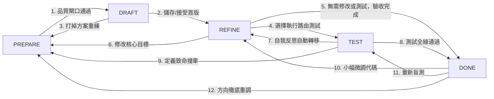

# 04 - Agent 運作機制與狀態機設計（State / Input / Prompt / Output / Tools）

> 本文件供系統架構師與進階開發者閱讀：詳細解析對話式 Skill 產生器後方的 **Agent 狀態機 (State Machine)** 架構，說明各階段的輸入資料 (Input)、決策提示 (Prompt)、工具產出 (Output / Tools) 以及狀態轉移規則。
> 高階流程圖請見 [01-overview.md](01-overview.md)；整體系統代碼層次請見 [03-architecture.md](03-architecture.md)。

---

## 0. 狀態機總覽

本系統的 Agent 採用 **單一協調器 (Orchestrator)** 架構，維護一個具備 **五個核心階段** 的有限狀態機 (PREPARE → DRAFT → REFINE → TEST → DONE)。
Agent 每一回合僅吐出單一 JSON 結構，其中包裹對話文字與一組 **工具呼叫 (Tool Calls)**，藉此更新 session 資料、驅動前端 UI 並推動階段轉移。

- **工具定義**：[backend/agent.py](../backend/agent.py) (`TOOL_SCHEMAS`)
- **行為規則**：[prompts/11_output_rules.md](../prompts/11_output_rules.md)（由 `agent.py` 的 `_load_output_rules()` 載入）
- **狀態轉移守衛與提示拼裝**：[backend/state_machine.py](../backend/state_machine.py) (`TRANSITION_TABLE` 與 `build_system_prompt`)
- **魔法提示樣板**：[prompts/](../prompts) 目錄下各階段 Markdown 檔

---

## 1. 核心循環架構

Agent 的執行為事件驅動的單向閉環，每一回合遵循固定的管道 (Pipeline) 運行：

```text
目前 Stage ➔ 拼裝注入 Input ➔ Agent 決策 (JSON) ➔ Tool 呼叫 ➔ 後端套用 (Apply Tool Effect) ➔ 前端重行渲染 (onEvent)
```

| Pipeline 節點 | 職責與動作描述 | 實作模組與位置 |
| --- | --- | --- |
| **Stage / State** | 由會話狀態決定目前身處哪一階段 (如 PREPARE、DRAFT)，藉此鎖定僅可發動的工具範圍與對應 prompt。 | `session.current_stage` (在 [state_machine.py](../backend/state_machine.py)) |
| **Inject Input** | 系統根據目前 Stage，調取對應的關卡上下文、peer skills 清單、變數狀態、測試快照等，動態拼裝進 prompt。 | `build_system_prompt(session)` (在 [state_machine.py](../backend/state_machine.py)) |
| **Agent Decision** | Agent 消化 Input 後，輸出符合 JSON 綱要的決策（含前端 Markdown `text` 與多個 API `tool_calls`）。 | [prompts/11_output_rules.md](../prompts/11_output_rules.md) |
| **Tool Call** | 觸發 LLM JSON-RPC 指令，調用狀態機規定的合法工具群。不合法的呼叫會在後端被攔截或拒絕。 | `TOOL_SCHEMAS` (在 [agent.py](../backend/agent.py)) |
| **Tool Result** | 後端 `apply_tool_effect()` 攔截工具結果，就地更新 draft、brief 或 checklists 並自動持久化 session 至磁碟。 | [main.py](../backend/main.py) + [state_machine.py](../backend/state_machine.py) |
| **System Render** | 套用工具影響後產生一組事件序列 (SSE batch)，前端接收後依事件分派刷新對話框、問題卡或 Patch 面板。 | 前端 [main.js](../frontend/js/main.js) 的 `onEvent` 處理器 |

- **規則一：** 注入大腦的系統上下文 (Input) 依 Stage 實施 **按需載入 (Pay-as-you-go)**，避免干擾 Agent 判斷。
- **規則二：** 工具調用設有 Stage 白名單防護，杜絕越權或跨階段調用。

---

## 2. 工具清單 (Agent Tools)

系統共載有 17 個工具合約（完整綱要見 [backend/agent.py](../backend/agent.py) 中的 `TOOL_SCHEMAS`）：

| 工具名稱 | 可適用關卡 | 功能說明 |
| --- | --- | --- |
| `ask_user_input` | 全部 | 向使用者索取多選或單選確認（由前端渲染按鈕卡片）。 |
| `request_materials` | PREPARE | 請使用者附加更多系統說明、API Spec 或範例代碼到工作區。 |
| `request_positive_samples` | PREPARE | 在前端彈出空表單，要求使用者手工輸入預期的正面路由 Query。 |
| `record_understanding` | PREPARE | 持久化 definition_clear 產生的關鍵定義（遠景、資料源、核心能力）。 |
| `record_research` | PREPARE | 歸檔 Agent 上網查詢的研究資料（API 設計、周邊 skill 規避、坑點）。 |
| `update_test_samples` | PREPARE | 寫入測試用例庫（正面為使用者填寫，負面由系統依 Peer 互斥自動推導）。 |
| `record_variables` | PREPARE | 寫入三類歸口變數（現有 ACA 變數、OBO registry scopes、執行期 Runtime）。 |
| `update_prepare_checklist` | PREPARE | 更新準備期 Checklist 子項 (definition_clear 等)，附帶實質佐證文字。 |
| `propose_neighbor_edit` | PREPARE / REFINE | 對鄰近 Peer Skill 提交 V4A 補丁，修剪 description 或補 When NOT to Use。 |
| `propose_skill_draft` | DRAFT | 生成首版完整的 `SKILL.md`（含 YAML frontmatter，每 session 僅限一次）。 |
| `propose_patch` | REFINE / TEST | 提交極小區間 of V4A git-like Patch（依 Anchor 替換代碼或內文）。 |
| `rename_skill` | REFINE / TEST | 改名。後端直接改寫 frontmatter `name`，並把 Blob 資料夾、SQL 列與所有授權搬到新名稱，舊名刪除。frontmatter `name` 不得用 `propose_patch` 修改。 |
| `request_test_run` | TEST | 異步提交正面、負面測試用例集合給設定的 Router runtime endpoint 跑路由盲測（`mode=route_only`，只路由不執行；端點可直連，也可選擇經由 APIM 等閘道）。 |
| ... | TEST | 內部占位 |
| `show_test_results` | TEST | 引導前端渲染並呈現路由測試的實測結果（包含覆蓋與誤判日誌）。 |
| `record_reflection` | TEST | 寫入路由檢試後的 Agent 自我反思與下一步行動計畫（**觸發後自動回推至 REFINE**）。 |
| `update_verify_checklist` | PREPARE / TEST | 更新品質覆驗 Checklist 的進度與勾選。 |
| `request_stage_transition` | 全部 | 自助提出轉入下一階段（須安全放行名單 intersect 門檻檢查）。 |
| `stage_transition` | 內部/Legacy | 內部狀態轉移專用（不建議 Agent 直接透過 system prompt 呼叫）。 |

---

## 3. 五個核心階段 (States) 解剖

### 狀態移行圖 (State Transition)



---

### 3.1 PREPARE（準備準備與意圖對齊）

- **提示燃料**：[prompts/01_prepare.md](../prompts/01_prepare.md)
- **目標**：逐步收全需求素材，填充基礎 Prepare Brief，保證品質關卡 100% 過關。

PREPARE 採取**單題追問**機制，杜絕一次塞給使用者一整條填表單。
它包含 **「背景初始化載入」** 與 **「三道品質關卡」**，並存在細部的依賴順序，某些依賴項（如既有重疊）在關鍵意圖未確立前是完全不跑的：

| 順序 | 執行子步驟 | 注入 Input (來源) | 主要 Output 寫入 | 子步意義與前後依賴關係說明 |
| --- | --- | --- | --- | --- |
| **0a** | 載入 ACA 變數 (異步背景) | MCP 端點 / 環境配置 | `aca_env_result` (OBO registry) | 進入 PREPARE 即觸發，載入既有容器環境。不依賴意圖。 |
| **0b** | 讀取 Peer Skills (異步背景) | Azure SQL 權限過濾名單 | `research.peer_skills` | 進入 PREPARE 即觸發，載入當前使用者所有可及 Skill 清單。不依賴意圖。渲染時依候選集分成競爭者／跨層兩區，見 [3.1.4](#314-peer-skills-的候選集分層)。 |
| **1** | **definition_clear** (關卡 1) | 使用者最初意圖、附加素材 | `skill_goal` / `input_sources` / `key_capabilities` | **最核心：問清定義**。Agent 逐一確認三者並不斷 `record_understanding`。此步未完，後續 2、3 步直接掛起。 |
| **2** | 運算既有重疊 (背景觸發) | 第一步確認的 `skill_goal` 等 | `existing_skills_overlap` | **依賴第 1 步**。定義填入後，背景執行緒會自動拿目標和能力比對索引 (Top N)，比出撞車的既有 Skill。一開始是空的。 |
| **3** | 背景網路研究 (Agent 異步) | 第一步確立的 `skill_goal` | `ResearchBrief` (`record_research`) | **依賴第 1 步**。大腦會實施 Search 並總結坑點與 APIs。 |
| **4** | **routing_uniqueness_confirmed** (關卡 2) | Peer Skills ＋ 重疊 Skill 及 ②③ 資料 | `neighbor_skills` / `description` / `test_samples` | **依靠第 2、3 步結果**。確保路由描述具有排他性。經歷選相近鄰居➔對比描述➔互斥修正➔When NOT to Use➔路由正面用例➔系統推導負面用例➔向鄰近 Skill 提交 V4A 補丁的全套流程。 |
| **5** | **variables_ok** (關卡 3) | ACA 變數 + OBO scopes | `record_variables` (aca_env/obo_token/runtime) | 分辨重用 vs 新增 |

> 🧩 **依賴機制備註：** 如上表，`existing_skills_overlap` 與 `ResearchBrief` 均需在 `definition_clear` 確認意圖後才有運算基石。三大關卡全數確認（Checklist 轉 True 且資訊齊全）方可移行至 DRAFT 階段。

#### 3.1.1 definition_clear 細部子任務

Agent 透過 `record_understanding` 將定義寫入 Brief：

- **`skill_goal`**：Skill 目標（應以「未來呼叫此 Skill 的其他 Coding Agent」角度出發，說明能力而非個人願望）。
- **`input_sources`**：資料庫或 Graph 固定系統來源。
- **`key_capabilities`**：核心提供的具體功能。

> 🌟 **推進**： definition 好了之後，背景才會拿它在 local 去比對所有 Skill，算出「既有重疊技能配對」。

#### 3.1.2 routing_uniqueness_confirmed 細部子任務

以相似鄰居 `neighbor_skills` 為軸心，採 Strict Mode：

1. **選鄰居 (與使用者互動)**：藉 `ask_user_input` 讓使用者自 heavy overlaps 中挑選 1-3 個最像的，確認後寫入 `neighbor_skills`。
2. **描述對比 (Agent 自行推理)**：將「我是 X，不是 Y」的 centrifugal 對稱邊界寫進 `description` frontmatter。
3. **互斥檢視 (Agent 自行推理)**：將自薦 description 與鄰居 metadata 做交叉干擾診斷，視需要調整文字精度。
4. **When NOT to Use (Agent 自行推理)**：在內文為各鄰近 Skill 匹配 `व्हे情境 ➔ 推薦轉移至鄰居`。
5. **備置範例 (與使用者互動)**：使用者藉 `request_positive_samples` 開箱正面用例，存檔後系統自動推理出負面盲測 Query，共同更新成 `test_samples`。
6. **鄰近編輯 (兩者合作)**：Agent 開發 Patch 送給鄰近 Skill 寫入 When NOT to Use 反向指標，以達雙向保護。

#### 3.1.3 variables_ok 細部子任務

Agent 行使 `record_variables` 比照 0a 的 ACA 現有狀態分類歸檔：

- **`aca_env`**：判斷哪些現存 ACA 變數可直接 `Reuse`，哪些需透過 Patch 設計新增 `Add`。
- **`obo_token`**：註冊 OBO Token 授權範圍。
- **`runtime`**：非固定系統變數。如未傳入，需生成 `[NEEDS_INFO]` 的 stderr 引流保護（Exit 0 契約）。

#### 3.1.4 Peer Skills 的候選集分層

「相鄰」不是一個全域概念：scenario 與 capability 各自在**不同的候選集**裡競爭，跨層的兩支 skill 永遠不會互相搶。EAA runtime 有兩道方向相反的過濾：

| 候選集 | 誰被排除 | runtime 機制 |
| --- | --- | --- |
| **宿主目錄**（host agent 選誰） | `is_internal = 1` 的 child | `core_handler._project_scenario_skills()` |
| **後端候選集**（coding agent 路由） | 宣告 `metadata.children` 的 parent | `skills_provider_factory._materialize_skills()` |

因此：

- **scenario 的競爭者** = 其他 scenario **＋ 非 internal 的獨立 capability**（兩者同在宿主目錄，是真競爭，不可一併排除）。
- **capability 的競爭者** = 其他未宣告 `children` 的 skill（**包含別人的 internal child**——`is_internal` 只擋宿主目錄投影，不擋後端）。

這個分層在兩處各自實作：

- `skills_index.keyword_topn()`（[skills_index.py](../backend/skills_index.py)）依 `kind` 過濾 `existing_skills_overlap` 的候選。
- `_partition_peers_by_layer()`（[state_machine.py](../backend/state_machine.py)）把 `## Peer Skills` 拆成「競爭者」與 `## Cross-layer skills (NOT routing rivals)` 兩區。**跨層項目仍然印出來**（scenario 作者需要看得到候選 child），只是明令不得拿來比對邊界、也不得寫成 `use <skill> instead` 的目標。兩區共用 30 筆的渲染上限。

> ⚠️ **`is_internal` 是延遲設定的**：只有當某支 scenario 存檔並宣告它時才變 `1`。所以判斷 scenario 的跨層項目時，除了 `is_internal`，還要看**該名字是否出現在任一 peer 的 `children` 裡**——後者直讀 frontmatter，在 child 被認領之前就已經正確。`children` 的解析一律走 `topology.declared_children()`（只接受非空 list of str），不另立第四份 parser。

---

### 3.2 DRAFT（首版草稿生成）

- **提示燃料**：[prompts/02_draft.md](../prompts/02_draft.md)
- **目標**：一次性產出結構極為嚴整、語法完全滿足 10_format_spec.md 規格的首版 `SKILL.md`。

| 屬性 | 規格說明 |
| --- | --- |
| **Input (上下文)** | 完整的 Prepare Brief（定義、研究、三類變數、測試用例）、Peer Skills 名錄、`10_format_spec.md`。 |
| **決策邏輯** | 唯有在草稿為空時，方可發動一次 `propose_skill_draft`。大腦必須全力保證 YAML 格式合法（多國與 `:` 符號等引號包覆處理，避免 SQL 剖析 YAMLError）。 |
| **Output** | `propose_skill_draft` 工具調用（單 session 限一次）。 |
| **解鎖下一關條件** | 使用者在 UI 端予以接受（Accept Draft / 點選「儲存」），系統會儲存初版、執行 material fidelity 與 skill lint，隨即將 DRAFT 進展到 REFINE 狀態。 |

> 📜 **代碼段落排列規範：**
> 首版 `SKILL.md` 的 Markdown 架構必須死首以下次序：
> `## Overview` ➔ `## When NOT to Use` ➔ `## Required Inputs` ➔ `## Environment Variables` ➔ `## OBO Token Scopes` ➔ `## API Reference / Sample Code`。
> *注意：代碼區塊中的變數與前面的宣告必須 100% 保持一致（無一項遺漏或多餘）。*

---

### 3.3 REFINE（打磨精修與局部修正）

- **提示燃料**：[prompts/03_refine.md](../prompts/03_refine.md)
- **目標**：審閱已接受的初版；僅在使用者 feedback、skill lint 或測試結果指出問題時，採 **V4A Git-like Patch** 實施不影響他處的超窄區段迭代。

| 屬性 | 規格說明 |
| --- | --- |
| **Input (上下文)** | 當前 Cloud / Azure Blob 的 `SKILL.md` 快照、修補日誌 (Iteration patch records)、(來自 TEST) 的測試盲測明細。 |
| **決策邏輯** | 有修正需求時對症下藥：**Discoverability（路由誤選/漏選）**屬於 metadata 描述範疇，僅對 frontmatter 的 `description` 進行局部 V4A 補丁，不改變任何 Tags；**Usage（選中但解答錯誤/不全）**屬於 body 範疇，僅對 Ground Rules 或 Sample Code 實施補丁。若初版沒有問題，則不製造無意義的 Patch。 |
| **Output** | 有修正需求時發動局部補丁工具 `propose_patch`（依靠 Anchor 精準定位）；無修正需求時直接提出進入 TEST 或 DONE 的階段轉移。 |
| **解鎖下一關條件** | REFINE 不要求至少套用一個 Patch。若沒有使用者 feedback、待處理的 lint finding 或 Open Fix List，可直接進 TEST；若也不需要路由測試，可直接進 DONE。若核心目標改變則返回 PREPARE。 |

> **零修改路徑：** PREPARE 的資訊完整、DRAFT 初版正確且接受後檢查沒有待辦時，REFINE 只負責確認下一步，不會重寫 `SKILL.md`。正常路徑可以是 `PREPARE → DRAFT → REFINE → TEST`，也可以是 `PREPARE → DRAFT → REFINE → DONE`。

> 💾 **接受即雙寫機制：**
> 在 REFINE 階段，使用者每一個被接受的 Patch 或手動點擊的存檔，後端均會直接自動觸發 **雙寫 (Dual-Write)** 機制：將變更推入 Azure Blob ＋ 寫入 Microsoft Azure SQL 的 metadata (`updated_at` 自動刷新、同步 ACL)。雙寫完成即生效，**不需要任何 sync / publish 步驟**——runtime 每次請求都直接從 SQL + Blob 動態解析 skill。

> 📋 **Open Fix List（一次反思、連續修完）：**
>
> 一次 TEST 反思常同時吐出多個 finding。若每接受一個 Patch 就回頭重跑一次盲測，N 個 finding 就要付 N 趟 router round-trip，使用者還得重複核准同一個方向。因此 `record_reflection` 的 `what_to_change` 被視為**一份有狀態的待辦清單**：
>
> - `open_fix_items()`（[state_machine.py](../backend/state_machine.py)）取最新一次反思的清單，扣掉**該反思之後**被接受、且 `addresses` 有指名該項的 Patch，得出「已完成／未完成」。
> - 未完成項會以 `## Open Fix List` 注入 REFINE / TEST 的 System Prompt，清單非空時明令**不得** `request_test_run` 或轉場 TEST。
> - 每次 Patch 被接受，後端 `_note_open_fixes()`（[main.py](../backend/main.py)）另外寫一則 system 訊息報告「還剩 N 項 / 全部完成」，作法與 `_note_skill_lint` 相同。
> - `propose_patch` 因此新增選填的 `addresses` 欄位：逐字複製它所關閉的那一項。沒帶 `addresses` 的 Patch 不會關掉任何一項。
> - 對使用者端的意義：Agent 在 TEST 徵求同意時，必須主動給出「一次修完全部 N 項（建議）」這類**可點選**的批次選項；使用者不需要、也不應該知道要自己打字要求連續出 Patch。

---

### 3.4 TEST（Router endpoint 路由盲測）

- **提示燃料**：[prompts/04_test.md](../prompts/04_test.md)
- **目標**：呼叫設定的 Router runtime endpoint 執行用例校對，並在大腦中走完客觀分流的自我反省。端點只需符合 `/run` 契約，可直接連到 runtime，也可選擇經由 APIM 等閘道；APIM 不是必要元件。

| 屬性 | 規格說明 |
| --- | --- |
| **Input (上下文)** | 預先在準備期備妥的 6+6 組測試範例、已儲存於 Blob 的 Skill 正式版本。 |
| **決策邏輯** | 呼叫 `request_test_run` 後，在該回合強制 **「不准發布 propose_patch」**。大腦必須在對話中提出完整反思（包含路由與使用精度），並必須寫入 `record_reflection` 才能重返 REFINE。`what_to_change` 的每一個元素必須是**單一、可用一個 Patch 關閉的原子修正項**，因為它就是 REFINE 的 Open Fix List。 |
| **Output** | `request_test_run` ➔ `show_test_results` ➔ `record_reflection` |
| **解鎖下一關條件** | `record_reflection` 觸編後系統**自動將狀態轉移回 REFINE**，若測試全數亮綠燈安全，使用者亦可點擊 DONE 完成。 |

> 🔒 **執行模式（`mode`）：**
>
> - 選擇測試一律以 `mode="route_only"` 送出：capability 的正負樣本與 scenario 的每一層都是，**沒有任何一層會執行技能**。Router 照常路由、回傳它本來會執行的腳本，但不執行、不寫入，因此負面樣本不會誤觸有寫入行為的 skill，也不會因為缺 runtime 變數而只拿到 `[NEEDS_INFO]`。
> - scenario 的 **L3（Child reachability）不發自己的請求**，改為對 L2 的回應做斷言。要證明 payload 契約成立確實得真的跑一次，但路由測試不得有副作用，因此這裡只驗證樣本是否路由到已宣告的 child。
> - scenario 的 L2 探針會在 body 頂層額外送 `scenario`（該 scenario 自己的名稱）。runtime 收到後只會把該 skill `metadata.children` 指名的 skill 交給 model，其餘的即使使用者有權限也看不到——這重現了正式環境的條件。不送的話 runtime 不過濾、整池都給，`metadata.children` 漏寫或打錯字的 skill 照樣被路由到，L3 會假性通過。前提是該 skill 已存回 Blob，否則 runtime 查不到這個名字，一樣退回不過濾。capability 測試送空字串，因為能力層 skill 是跨情境共用的。
> - runtime 必須在回應頂層回顯同一個 `mode`。缺漏或不符會**中止整批**並回 HTTP 502，沒有降級開關。

> 🔍 **Prepared code 的靜態檢核（機械層與語意層分工）：**
>
> - runtime 回傳的腳本是**從 body 散文重新生成的另一份產物**，與 SKILL.md 內嵌的 sample code 並不相同；過去只有 sample code 被 lint 看過，那份真正代表 runtime 理解的腳本從來沒有被檢查。
> - `run_selection_tests()`（[testing.py](../backend/testing.py)）在組裝 `TestRun` 前，以 `lint_skill(..., code_override=result.apim_response)` 對每一份 prepared code 跑同一套規則，結果存在 `TestResult.prepared_code_lint`。`apim_response` 是沿用至今的資料欄位名稱，不代表端點必須部署在 APIM。檢核會**在測試當下算完並存起來**：之後若已套用 Patch，重算會拿新的 SKILL.md 去對舊腳本，結論會失真。
> - `_format_prepared_code()`（[state_machine.py](../backend/state_machine.py)）把每份腳本底下附上它自己的 findings，[prompts/04_test.md](../prompts/04_test.md) 則明令大腦**不得重新推導**已印出的結論，只需照抄成 `what_to_change` 項目。
> - 因此 TEST 的使用軸只剩四項真正需要語意判斷的檢核：外部識別名是否回溯得到 body、body 已宣告的安全形狀（僅在 body 提及 RLS／OBO／使用者身分連線時才觸發）、身分規範的 R3 與 R4 推理面，以及「程式碼宣稱發生的事它是否真的知道」。變數名比對、進入點形狀、`[NEEDS_INFO]` 代碼、部署設定（D1–D3）、身分讀取形狀（I1–I4）與未檢查回傳碼（A12）全數下放給 lint。
> - 實測成本（2026-09-01）：每個樣本 input 約 22K tokens、output 約 3.7K，耗時 30–40 秒。樣本是**循序**送的，所以 10 個樣本約 6 分鐘、約 220K input tokens。

> ⚖️ **雙軸診斷學：**
>
> - **Discoverability 軸 (路由能力測試)**：正面漏接 ➔ description 寬容度或別名不足；負面誤中 ➔ 鄰近邊界沒切好。➔ 退回 REFINE 僅微調 `description`。
> - **Usage Correctness 裝載**：若代碼、參數或步驟寫錯，➔ 退回 REFINE 改 body 內容。如果是主觀喜好或依賴未開放權限 ➔ 嚴禁大腦自行修代碼，大腦必須在 text 處明確要求 **「HUMAN REVIEW (人工審核建議)」**。

---

### 3.5 DONE（封存出關）

- **提示燃料**：[prompts/05_done.md](../prompts/05_done.md)
- **目標**：會話順暢作結。當使用者再度傳送字句，先分流意圖移轉狀態，避免隨意打亂產出。

| 屬性 | 規格說明 |
| --- | --- |
| **Input (上下文)** | 使用者提出的新請求（於會話結束後）。 |
| **決策邏輯** | 實施 Re-entry 四向分流決策判定。首先若是**分類 A**，即微詞、別名等局部修繕，將自動移轉至 **REFINE**。其次若是**分類 B**，即結構或目標的深度轉向，將清空代碼並返回 **PREPARE**。其三若是**分類 C**，即需重新跑檢測試，將導流至 **TEST** 階段。若都不符（如提問或無關訊息），意即**分類 D**，則透過 `ask_user_input` 展開一般互動。 |
| **Output** | `request_stage_transition` 狀態重排 ➔ 開始新循環。 |

---

## 4. 有限狀態機轉移矩陣 (Transitions)

狀態機利用硬性矩陣 `TRANSITION_TABLE`（[state_machine.py](../backend/state_machine.py)）進行邊界過濾，禁止非法跨關卡：

### 移行核心約束

1. **PREPARE ➔ DRAFT 是嚴格單向通道**，必須通過 `check_quality_gates` 計算。凡不符指標均拋出 `QualityGateError` (非致命) 攔截。
2. **任何時候返回 PREPARE 階段時**，系統為了保證複檢嚴謹性，會**無條件清磁碟機**上的暫存草稿代碼 (`current_skill.skill_md = ""`)。但會完整留下已做好的 Prepare Brief（definition、變數等），並為 session 拍上 `prepare_brief.revisit = True` 標記避免重複確認。
3. **非法階段躍遷保護：** 倘若 Agent 發出不合規的轉移事件，主執行緒不會 Crash，會拋出 ValueError 並啟動後端補救。系統會推送一條非致命事件 `tool_effect_rejected` 附帶合法出口 guidance 引導 Agent，Agent 有且僅能在下一回合自動下修判斷。

---

## 5. 品質守衛閘口 (Checklist Gates)

當調用轉移欲進入 DRAFT 時，後端 `check_quality_gates` 逐項進行品管攔截，只有核檢單完全「無短缺項目」方釋放門禁：

- ✅ `understanding.skill_goal` 欄位不得為空白。
- ✅ `understanding.input_sources` 的容器列表至少要申報 1 項。
- ✅ `understanding.key_capabilities` 的清單長度至少要申報 1 項。
- ✅ `understanding.differentiation` 辨異說明欄不得為空白。
- ✅ `research.adjacent_skills` 至少有 1 個，或滿足 `research.summary` 文字深度。
- ✅ 上網研究完備性：`research.web_status` 絕對不可以標記為 `"skipped"`（在進 DRAFT 前大腦必須跑過搜尋）。
- ✅ 自檢清單完備度：三項 check_list（`definition_clear`、`routing_uniqueness_confirmed`、`variables_ok`）必須皆在後端被設為 `True`。
- ✅ **（重中之重）相似防撞防護**：若本地分析得出你的 Skill 與你具存權限的既有 Skill 相似度分數 **> 0.8**，大腦在 `differentiation` (辨異文字) 中**必須直接寫出那個 Skill 的全名**並表明功能區隔，否則直接拒絕移行。

---

## 6. Prompt 大腦小抄拼裝網格

每逢 Agent 發話，`build_system_prompt(session)` 會依照 A、B、C、D 類合約，極致謹慎的組裝 System Prompt 本體。

- **A 類：** 無條件裝配（每回合皆在）
- **B 類：** 隨 Stage 機制按需調配
- **C 類：** 隨 Mode (Modify/Import) 增補合約
- **D 類：** 隨實體 Data 內容有無動態掛載

| Core Prompt Section | 類別 | PREPARE | DRAFT | REFINE | TEST | DONE | 來源與裝載細節說明 |
| --- | :-: | :-: | :-: | :-: | :-: | :-: | --- |
| **Global System Prompt** | **A** | ✓ | ✓ | ✓ | ✓ | ✓ | 本體骨幹：[00_global_system.md](../prompts/00_global_system.md)（內嵌 09/10 本機最佳實務與規範） |
| **State Prompt** | **A** | ✓ | ✓ | ✓ | ✓ | ✓ | 根據 `session.current_stage` 自 `prompts/` 抓取對應關卡提示詞 |
| **Runtime State** | **A** | ✓ | ✓ | ✓ | ✓ | ✓ | 當前運行狀態：`import` (匯入舊代碼) / `modify` (修改既有) / `create` (新增) |
| **Blob Skill Binding** | **A** | ✓ | ✓ | ✓ | ✓ | ✓ | 呼叫 `_format_remote_skill_state`，載入與雲端儲存體 (Blob/SQL) 關聯狀態 |
| **Allowed Stage Transitions** | **A** | ✓ | ✓ | ✓ | ✓ | ✓ | 呼叫 `_format_allowed_exits`。限縮當前合法的轉移出口，防堵隨意跳關 |
| **DONE Re-entry Guidance** | **B** | | | | | ✓ | 僅在 DONE 階段裝配。引導使用者採取不同意圖重新開啟會話 |
| **Peer Skills** | **B** | ✓ | ✓ | ✓ | | | 呼叫 `_format_peer_skills`。載入使用者具權限的現有技能名冊，並依候選集分成「競爭者」與「跨層」兩區。詳見[第 3.1.4 節](#314-peer-skills-的候選集分層) |
| **Selected Neighbor Skills** | **B** | ✓ | ✓ | ✓ | | | 呼叫 `_format_selected_neighbor_skills`。欲編輯鄰近技能時，載入鄰居全文代碼 |
| **ACA Environment** | **B** | ✓ | ✓ | ✓ | ✓ | ✓ | 自 MCP 實體讀取之現有 ACA 變數快照，供 Reuse 比對參考 |
| **Latest Test Run** | **B** | | | ✓ | ✓ | ✓ | 盲測所得的實測報表日誌，為精修 (Patch) 調整的科學依據 |
| **Import Mode Addendum** | **C** | ✓ | ✓ | ✓ | ✓ | ✓ | 當前的 mode 為 `import` 代碼入庫。 |
| **Modify Mode Addendum** | **C** | ✓ | ✓ | ✓ | ✓ | ✓ | 當前正在修改已經在 DB 掛號使用者現有 Skill。 |
| **Materials** | **D** | ✓ | ✓ | ✓ | ✓ | ✓ | 呼叫 `_format_materials`，把使用者附加的素材**全文**依可信度分層（Tier 1/2/3）注入，並附上各層的引用邊界。詳見[第 7 節](#7-素材materials的三層可信度合約) |
| **Prepare Brief** | **D** | ✓ | ✓ | ✓ | ✓ | ✓ | 準備期已確認的 Goal / Sources / Capabilities 等 Brief 歸檔結構 |
| **Iteration Log** | **D** | ✓ | ✓ | ✓ | ✓ | ✓ | 局部 Patch 補丁歷史、以及 TEST 回合所保存的反思資訊 |
| **Open Fix List** | **D** | | | ✓ | ✓ | | 呼叫 `_format_open_fixes`。把最新一次 `record_reflection` 的 `what_to_change` 逐項列成 `[x]`/`[ ]` 待辦清單，未清空前禁止重跑 TEST。詳見 [3.3 節](#33-refine打磨精修與局部修正) |
| **Research Summary** | **D** | ✓ | ✓ | ✓ | ✓ | ✓ | 經 Agent 查證好的網路研究結論。 |
| **Current Draft** | **D** | ✓ | ✓ | ✓ | ✓ | ✓ | 當前已被接受的 `SKILL.md` 快照本體 |

---

## 7. 素材（Materials）的三層可信度合約

使用者附加的每一份素材都帶有一個 **kind**，後端據此把它歸入三個 **fidelity tier** 之一，並在 System Prompt 的 `## Materials` 區塊裡明確告訴模型「這一層可以怎麼用、不可以怎麼用」。

> **Tier 由使用者選的 kind 決定，不由內容推斷。** 一份完整的 OpenAPI 文件若被標成 `text`，模型仍必須把它當背景資料，不得據以撰寫 sample code。這是刻意的設計：可信度是人為聲明的責任歸屬，不是猜出來的。

- 分層定義：[backend/material_fidelity.py](../backend/material_fidelity.py)（`VERBATIM_KINDS` / `NO_INVENTION_KINDS` / `CONTEXT_ONLY_KINDS`）
- 注入文案：[backend/state_machine.py](../backend/state_machine.py)（`_MATERIAL_TIERS`、`_format_materials`）
- 行為規則：[prompts/11_output_rules.md](../prompts/11_output_rules.md)、[prompts/02_draft.md](../prompts/02_draft.md)（Material fidelity 段）
- UI 選項與提示：[frontend/js/main.js](../frontend/js/main.js)（`MATERIAL_KINDS`）

### 7.1 三層的引用邊界

| Tier | UI 選項（kind） | 定位 | **模型可以做** | **模型不可以做** |
| :-: | --- | --- | --- | --- |
| **Tier 1** | Code（`code`） | 使用者自己可運作的實作，具權威性 | 當 Tier 1 素材涵蓋本 skill 的某個操作時，`## API Reference / Sample Code` **必須**由該檔案衍生：保留其 guard clause、**安全閘的順序**、錯誤分類、helper function 與輸出語言。僅允許 (a) 改識別字以對齊已宣告的變數、(b) 刪除與本 skill 無關的程式碼、(c) 補上缺少的 `[NEEDS_INFO]` 合約 | 改寫成「等價」的自製版本；憑空新增任何未出現在該檔案的 SQL 物件、stored procedure、資料表、欄位、endpoint 或 payload 欄位。上述三項以外的任何偏離，都必須在 `text` 欄位明講並說明理由 |
| **Tier 2** | API spec / doc（`api_spec`；舊值 `file`、`existing_skill`） | 規格文件，**識別字**具權威性 | 逐字沿用其 endpoint 路徑、方法名、參數名、回傳欄位名；周邊程式碼可自行撰寫 | 發明文件中不存在的識別字 |
| **Tier 3** | Text / notes（`text`；舊值 `url`） | 純背景敘述 | 用於界定範圍、prose 與 routing description | **永遠不得**作為 API 或程式碼細節的來源；其字句也不得被抄進 skill 內文 |

跨層的共同硬規則（見 `11_output_rules.md`）：

> 產出的程式碼中，每一個 SQL 物件、stored procedure、資料表、欄位、endpoint 與 payload 欄位，都必須出現在某一份素材裡 —— **一個看起來很合理的名字，仍然是發明出來的**。

因此常見情境是：使用者貼了一份寫得很完整、但把回傳欄位寫成「概念說明」（例如「使用者識別碼」「預算清單」）而沒有真實 JSON key 的文件。即使把它升到 Tier 2，模型仍會要求補一段**真實輸出樣本**，因為 sample code 需要的 key 根本不存在於素材中。

### 7.2 注入時的預算與截斷

`materials_for_prompt()` 在注入前套用預算：單份上限 `MATERIAL_PROMPT_MAX_CHARS = 40,000` 字元，全部素材合計上限 `MATERIALS_PROMPT_TOTAL_MAX_CHARS = 120,000` 字元。超出的部分會被截斷並附上明確標記，要求模型**不要補完**缺少的部分，而是回報並請使用者拆分素材。素材全文以 `<<<BEGIN MATERIAL ...>>>` / `<<<END MATERIAL ...>>>` 包夾且**不加程式碼圍欄**（素材本身可能含程式碼區塊）。

注意 `## Materials` 明確覆寫了另一條規則：「不得逐字複製」只適用於**路由測試樣本**，絕不適用於素材。

### 7.3 產出後的忠實度掃描（僅警告，不阻擋）

草稿產生後，`scan_material_fidelity()` 會比對 sample code 與素材。它**只掃 Tier 1 與 Tier 2**（Tier 3 被刻意排除，掃背景散文只會製造假陽性），而且**永遠只發警告、不會擋下草稿** —— 偏離與否是人的判斷。

| 規則 | 嚴重度 | 觸發條件 |
| --- | :-: | --- |
| `material_truncated` | info | 該素材因預算被截斷，以下發現只涵蓋模型實際看到的部分 |
| `dropped_from_material` | warning | Tier 1 素材中定義的 `def` / `class` 未出現在草稿的 sample code |
| `invented_sql_object` | warning | sample code 參照的 SQL 物件（`EXEC`、`FROM/JOIN/INTO/UPDATE` 的 schema-qualified 名稱）不在任何素材中 |
| `invented_payload_field` | warning | sample code 讀取的欄位（`.get("x")` / `["x"]`）不在任何素材中 |
| `undocumented_enum` | warning | 素材宣告了封閉值集（SQL `CHECK ... IN`、`ENUM`、JSON/YAML `enum`），但 `## Required Inputs` 沒有列出全部合法值 |

警告的呈現位置：草稿工具執行後由 `_note_material_fidelity()` 寫入一則 system 訊息提示數量；完整清單在 **Topology 分頁**（`/api/sessions/{id}/topology` 回應的 `fidelity` 欄位，每次呼叫即時計算）。

---

## 8. Agent Graph（流程視覺化輔助工具）

Agent Graph 是開發與理解 Agent 流程時使用的**唯讀視覺化工具**。它把目前的五階段狀態機 `PREPARE → DRAFT → REFINE → TEST → DONE` 畫成節點與連線，方便快速確認每個 Stage 的 Prompt、允許的轉移方向，以及目前 Session 所在的位置。它不會直接執行工具、修改 Session 或強制切換 Stage；實際流程仍由 Agent tool call、後端 `TRANSITION_TABLE` 與品質閘門控制。

### 可以查看什麼

- **Stage 節點**：顯示 `PREPARE`、`DRAFT`、`REFINE`、`TEST`、`DONE`；粗框節點是目前所在 Stage。
- **Per-turn Message Assembly**：右側最先呈現每次問答送給 Foundry Agent 的兩則 message。每一個步驟都可點開查看對應內容；固定 Prompt 顯示原文，Dynamic Context 與 transitions 顯示該 Stage 的組裝預覽，user message 則可查看 output shape、tools、rules、session snapshot 與最新訊息。
  1. `role="system"`：Global System → Current Stage Prompt → Writing Best Practices → Skill Format Spec → Eligible Dynamic Context → Outgoing Allowed Stage Transitions。
  2. `role="user"`：Turn instruction → JSON output shape → Available tools → Output and orchestration rules → Current session snapshot → Latest user message。
- **Data Lineage（Explanation only）**：預設收合；只說明資料從哪一個前序 Stage 延續而來，不會注入 Agent。
- **Transition Logic**：用簡短說明區分橘色 outgoing edges 與藍色 incoming edges。後端從 `TRANSITION_TABLE` 自動挑出 outgoing edges，由 `_format_allowed_exits(stage)` 格式化後附加在 `role="system"` message 最後；incoming edges 僅供讀圖。

### 如何操作與解讀

1. 開啟右側工作區的 **Agent Graph** 分頁。
2. 點選任一 Stage 節點，從 Per-turn Message Assembly 逐步展開內容；需要理解資料來源時再展開 Data Lineage，最後用 Transition Logic 理解進出關係。
3. 點選箭頭或右側的 Transition 項目，聚焦該次狀態轉移；橘色表示從選定 Stage 離開，藍紫色表示進入選定 Stage。
4. 按 **Fit graph** 將完整流程縮放至可視範圍。
5. 拖拉 Graph 與右側詳細資訊之間的分隔線，可放大或縮小兩側；分隔比例會保存在瀏覽器。分隔線聚焦後也可用方向鍵微調，`Home` / `End` 跳到最小 / 最大範圍。
6. 按 **Fullscreen** 全螢幕展開；按 `Esc` 回到一般畫面。

### 資料來源與維護注意事項

Agent Graph 的 Stage 與連線來自後端 `/api/inspect`，其中轉移規則直接取自 `TRANSITION_TABLE`；圖形由前端 Cytoscape 繪製。首次啟動須先執行 `npm ci` 安裝前端執行期套件。

舊版本曾因狀態流程與 Prompt 檔案已調整，但 Inspect 索引仍指向不存在的 `01_intake.md`、`02_research.md`、`03_verify.md` 等舊檔名，導致右側顯示 `Missing`，且前端無法把舊八階段資料正確對應至新的五階段流程。現在已改為實際檔案 `01_prepare.md`、`02_draft.md`、`03_refine.md`、`04_test.md`、`05_done.md`，並統一 Stage 名稱與 transition 對應。

---

## 9. 重要決策優先級：規則以 prompts/ 為準，強制力以程式碼為準

這兩件事要分開看：

- **Agent 的行為規則（該問什麼、何時發工具、文案風格）的唯一真實來源是 `prompts/`。**
  `agent.py` 的 `FOUNDRY_OUTPUT_RULES` 是 `_load_output_rules()` 從
  [prompts/11_output_rules.md](../prompts/11_output_rules.md) 解析出來的衍生值，
  Python 側已不再內嵌任何規則字串。改規則請改 `.md`，不要改 `.py`。
- **但規則只是建議，強制力在程式碼。** 階段轉移由 `TRANSITION_TABLE` 把關、
  品質闘由 `check_quality_gates()` 把關、工具合法性由 `apply_tool_effect()` 把關。
  Prompt 寫什麼都不會讓 Agent 繞過這些閃電儀。

實務上的判斷方式：「**Agent 應該怎麼做**」看 `prompts/`；
「**Agent 能不能這麼做**」看 `state_machine.py` 與 `main.py`。
