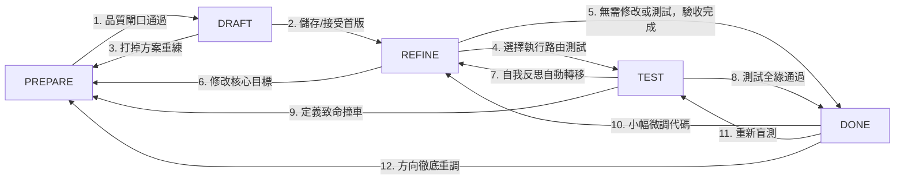

# 04 - Agent 運作機制與狀態機設計（State / Input / Prompt / Output / Tools）

> 本文件供系統架構師與進階開發者閱讀：詳細解析對話式 Skill 產生器後方的 **Agent 狀態機 (State Machine)** 架構，說明各階段的輸入資料 (Input)、決策提示 (Prompt)、工具產出 (Output / Tools) 以及狀態轉移規則。
> 高階流程圖請見 [01-overview.md](01-overview.md)；整體系統代碼層次請見 [03-architecture.md](03-architecture.md)。

---

## 0. 狀態機總覽

本系統的 Agent 採用 **單一協調器 (Orchestrator)** 架構，維護一個具備 **五個核心階段** 的有限狀態機 (PREPARE → DRAFT → REFINE → TEST → DONE)。
Agent 每一回合僅吐出單一 JSON 結構，其中包裹對話文字與一組 **工具呼叫 (Tool Calls)**，藉此更新 session 資料、驅動前端 UI 並推動階段轉移。

- **工具定義**：[backend/agent.py](../backend/agent.py) (`TOOL_SCHEMAS`)
- **行為規則**：[prompts/11_output_rules.md](../prompts/11_output_rules.md)（由 `agent.py` 的 `_load_output_rules()` 載入）
- **狀態轉移守衛與提示拼裝**：[backend/state_machine.py](../backend/state_machine.py) (`TRANSITION_TABLE` 與 `build_system_prompt`)
- **魔法提示樣板**：[prompts/](../prompts) 目錄下各階段 Markdown 檔

---

## 1. 核心循環架構

Agent 的執行為事件驅動的單向閉環，每一回合遵循固定的管道 (Pipeline) 運行：

```text
目前 Stage ➔ 拼裝注入 Input ➔ Agent 決策 (JSON) ➔ Tool 呼叫 ➔ 後端套用 (Apply Tool Effect) ➔ 前端重行渲染 (onEvent)
```

| Pipeline 節點 | 職責與動作描述 | 實作模組與位置 |
| --- | --- | --- |
| **Stage / State** | 由會話狀態決定目前身處哪一階段 (如 PREPARE、DRAFT)，藉此鎖定僅可發動的工具範圍與對應 prompt。 | `session.current_stage` (在 [state_machine.py](../backend/state_machine.py)) |
| **Inject Input** | 系統根據目前 Stage，調取對應的關卡上下文、peer skills 清單、變數狀態、測試快照等，動態拼裝進 prompt。 | `build_system_prompt(session)` (在 [state_machine.py](../backend/state_machine.py)) |
| **Agent Decision** | Agent 消化 Input 後，輸出符合 JSON 綱要的決策（含前端 Markdown `text` 與多個 API `tool_calls`）。 | [prompts/11_output_rules.md](../prompts/11_output_rules.md) |
| **Tool Call** | 觸發 LLM JSON-RPC 指令，調用狀態機規定的合法工具群。不合法的呼叫會在後端被攔截或拒絕。 | `TOOL_SCHEMAS` (在 [agent.py](../backend/agent.py)) |
| **Tool Result** | 後端 `apply_tool_effect()` 攔截工具結果，就地更新 draft、brief 或 checklists 並自動持久化 session 至磁碟。 | [main.py](../backend/main.py) + [state_machine.py](../backend/state_machine.py) |
| **System Render** | 套用工具影響後產生一組事件序列 (SSE batch)，前端接收後依事件分派刷新對話框、問題卡或 Patch 面板。 | 前端 [main.js](../frontend/js/main.js) 的 `onEvent` 處理器 |

- **規則一：** 注入大腦的系統上下文 (Input) 依 Stage 實施 **按需載入 (Pay-as-you-go)**，避免干擾 Agent 判斷。
- **規則二：** 工具調用設有 Stage 白名單防護，杜絕越權或跨階段調用。

### 業務輸入來源：credentials / request

Skill 執行時需要的業務資料（例如要做哪個操作、哪一筆單號、一段說明文字）有兩種傳入方式。
PREPARE 階段 Agent 會列出每個欄位與建議的方式請你確認；可以全部用同一種，也可以逐欄位混用。

| | `credentials` | `request` |
| --- | --- | --- |
| **怎麼傳** | 呼叫方把值放進具名的 key/value，程式直接讀取，值原封不動。 | 呼叫方用自然語言把值寫在任務內容裡，由 Agent 讀出後交給程式；不保證一字不差。 |
| **適合** | 抄錯一個字就會讀錯或改錯資料的值：操作類型、各種 ID、選項代碼、日期、金額、是／否，以及清單等結構化資料。 | 給人看的自由文字，措辭略有差異仍可接受：說明、事由、摘要、搜尋關鍵字。長文或含引號、換行的文字也比較好傳。 |
| **例子** | `operation: UPDATE`、`ticket_id: INC0012345`、`amount: 1200` | 「說明：客戶反映登入後畫面空白，已清除快取仍無效」 |

**怎麼選：** 問自己「這個值抄錯一個字，後果嚴不嚴重？」嚴重就選 credentials，只是內容措辭就選
request。拿不準時選 credentials，這也是預設值。

- 名稱叫 credentials，但不代表是機密，它只是一種傳值管道。
- 每個欄位只有一個來源。缺值時不會從另一邊補，而是由 skill 回報缺少哪個欄位。
- token、部署設定、登入身分不是業務資料，不在這個選擇範圍內。

實作細節：SKILL.md 的 `input-bindings` 宣告與 request 欄位的程式樣板見
[prompts/12_input_sources.md](../prompts/12_input_sources.md)；對應的 lint 規則 `A13` / `A14` 在
[skill_lint.py](../backend/skill_lint.py)。

#### EAA 平台規則（D4–D8、A15）

EAA 從 skill 執行環境拿掉平台 secret、丟棄特定 caller 鍵名，且不再預設使用 Managed Identity；S3 的 MI 閘門（`MI_GATE_ENABLED`）只替「本輪已載入、且在 frontmatter 宣告 `metadata.mi_scopes`」的 skill 發 MI token，而且只限宣告過的資源。除特別註明者外，以下規則都是 **error**，會擋下儲存（實作：[skill_lint.py](../backend/skill_lint.py)、[eaa_platform.py](../backend/eaa_platform.py)；規則文字在 [10_format_spec.md](../prompts/10_format_spec.md) 的 The Managed Identity Contract 與 Platform-Reserved Names）：

| 規則 | 檢查 |
| --- | --- |
| `D4` | 讀取或宣告 `OBO_CLIENT_SECRET`、`TEAMS_NOTIFY_WEBHOOK_URL`、`LOGIC_APP_SKILL_REVIEW_URL`。讀取檢查與 EAA lint 同一個 regex，**掃全文含說明文字**；scenario skill 也適用。 |
| `D5` | 程式碼區塊出現 `credential=...` / `credential=None` / `credential=<...>` 佔位。 |
| `D6` | 程式使用 `DefaultAzureCredential` / `ManagedIdentityCredential`，或 `## OBO Token Scopes` 提到 `DefaultAzureCredential` 時：必須 `from azure.identity import DefaultAzureCredential`、把 `credential=DefaultAzureCredential()`（或指定給變數後的該變數）傳給 client、不得用 `ManagedIdentityCredential`，且 `## OBO Token Scopes` 要有「Authenticate（或「驗證」）… `DefaultAzureCredential()` … Managed Identity」的說明句。 |
| `D7` | `metadata.mi_scopes`。程式出現 `DefaultAzureCredential(` / `ManagedIdentityCredential(` 就必填（訊息含 EAA 的 `uses Managed Identity but declares no metadata.mi_scopes`）；沒用 MI 卻宣告、項目不是 `https://<host>`（可帶 `/.default`）、宣告 Key Vault、程式裡明寫的 scope（`…/.default` 字串或 `get_token(...)` 引數）不在宣告內，或 `## OBO Token Scopes` 沒寫出 `mi_scopes` 與每個資源，都是 error。資源不在 `MI_SCOPE_ALLOWLIST` 是 **info**，訊息即部署說明（見下）。 |
| `D8` | 只掃程式碼：引用 `IDENTITY_ENDPOINT` / `IDENTITY_HEADER` / `MSI_ENDPOINT` / `MSI_SECRET` 等 MI 端點變數、直接呼叫 `169.254.169.254` 或 `/msi/token`、對 `DefaultAzureCredential` / `ManagedIdentityCredential` 傳 `managed_identity_client_id=` / `client_id=` / `object_id=` / `mi_res_id=` 等選擇器，或 MI skill 同時用 `ChainedTokenCredential`、`ClientSecretCredential`、`AzureKeyCredential` 等備援憑證。 |
| `A15` | caller 的 `credentials` 鍵名（`input-bindings` 的 `credentials_key`，或 legacy 的 Required Inputs 與 runtime 讀取）是 `PATH`、`PYTHON*`、`LD_*`、`EAA_VERIFIED_*` 或 `OBO_SCOPE_REGISTRY` 的 key。registry 以 MCP 查到的為準，取不到時退回 `AZURE_SQL_ACCESS_TOKEN`、`GRAPH_ACCESS_TOKEN`。 |

Managed Identity 不是變數種類，結構化資訊只有 frontmatter 的 `metadata.mi_scopes`，判斷靠 prompt 與 D6–D8 從程式碼偵測，不動 `models.py` 與 UI。`save_skill_dual_write()` 另外會呼叫 EAA 的 MCP tool `lint_skill_package`（見 [03-architecture.md](03-architecture.md#23-eaa-skill-lint)）。

平台另有全域白名單 `MI_SCOPE_ALLOWLIST`，預設只有 `https://storage.azure.com,https://ai.azure.com`。宣告白名單以外的資源不擋儲存：本機 D7 顯示 INFO，EAA `lint_skill_package` 回傳的 `is not in MI_SCOPE_ALLOWLIST` 是 warning，儲存後與其他 warnings 一起寫成一則 system message，要 Agent 在回覆中附上「部署前需把 `<資源>` 加入 ACA 環境變數 `MI_SCOPE_ALLOWLIST`，並替平台 MI 指派 `<最小 RBAC 角色>`」（角色對照表：`MI_RESOURCE_ROLES`）。`database.windows.net` / `management.azure.com` 會加註「取得平台 MI 在該資源的全部權限，優先改用 OBO」。執行測試（`mode: "execute"`）時同一輪必須載入該 skill 才拿得到 MI token，這是預期行為；本產生器只送 `route_only`，不受影響。

#### EAA 執行環境規則（E1–E4）

EAA 的 `SUBPROCESS_UID_SANDBOX` 開啟後，腳本以一次性、沒有 `/etc/passwd` 項目的非 root uid 在 session work_dir 執行，結束時所有行程都會被殺掉。規則不論旗標開關都相容，因此無條件套用。`E1` 是 **warning**（EAA 只列為 INFO）；`E2`–`E4` 是 **error**，會擋下儲存。只掃程式碼區塊（或 TEST 的 prepared code），不掃說明文字，scenario skill 也適用（實作：[skill_lint.py](../backend/skill_lint.py)；規則文字 E1–E5 在 [10_format_spec.md](../prompts/10_format_spec.md) 的 The Execution Environment Contract）：

| 規則 | 檢查 |
| --- | --- |
| `E1` | 引號字串以 `/app`、`/tmp`、`/home`、`/root` 開頭。 |
| `E2` | `pip install`、`-m pip`，以及 subprocess list 形式的 `"-m", "pip"`、`"pip", "install"`。 |
| `E3` | `getpwuid`、`getlogin`。 |
| `E4` | `nohup`、`setsid`、`os.fork`、`start_new_session=True`、`daemon=True`。 |

E5（產出檔必須是 work_dir 第一層的一般檔案）無法靜態判斷，只寫在產生規範。

---

## 2. 工具清單 (Agent Tools)

系統共載有 17 個工具合約（完整綱要見 [backend/agent.py](../backend/agent.py) 中的 `TOOL_SCHEMAS`）：

| 工具名稱 | 可適用關卡 | 功能說明 |
| --- | --- | --- |
| `ask_user_input` | 全部 | 向使用者索取多選或單選確認（由前端渲染按鈕卡片）。 |
| `request_materials` | PREPARE | 請使用者附加更多系統說明、API Spec 或範例代碼到工作區。 |
| `request_positive_samples` | PREPARE | 在前端彈出空表單，要求使用者手工輸入預期的正面路由 Query。 |
| `record_understanding` | PREPARE | 持久化 definition_clear 產生的關鍵定義（遠景、資料源、核心能力）。 |
| `record_research` | PREPARE | 歸檔 Agent 上網查詢的研究資料（API 設計、周邊 skill 規避、坑點）。 |
| `update_test_samples` | PREPARE | 寫入測試用例庫（正面為使用者填寫，負面由系統依 Peer 互斥自動推導）。 |
| `record_variables` | PREPARE | 寫入三類歸口變數（現有 ACA 變數、OBO registry scopes、執行期 Runtime）。 |
| `update_prepare_checklist` | PREPARE | 更新準備期 Checklist 子項 (definition_clear 等)，附帶實質佐證文字。 |
| `propose_neighbor_edit` | PREPARE / REFINE | 對鄰近 Peer Skill 提交 V4A 補丁，修剪 description 或補 When NOT to Use。 |
| `propose_material_patch` | PREPARE（`script_candidate`） | 對唯一一份 `code` 素材提交 V4A patch，只調整邊界（argparse 輸入、stdout JSON / `[NEEDS_INFO]`、stderr、exit code），讓它能原樣成為 script；`stdout_fix=true` 時由後端計算機械式 stdout 修正。見 7.5 節。 |
| `propose_skill_draft` | DRAFT | 生成首版完整的 `SKILL.md`（含 YAML frontmatter）。儲存前被 lint 擋下時可再送一次完整修正版；儲存後不可再用。 |
| `propose_patch` | REFINE / TEST | 提交極小區間 of V4A git-like Patch（依 Anchor 替換代碼或內文）。 |
| `rename_skill` | REFINE / TEST | 改名。後端直接改寫 frontmatter `name`，並把 Blob 資料夾、SQL 列與所有授權搬到新名稱，舊名刪除。frontmatter `name` 不得用 `propose_patch` 修改。 |
| `request_test_run` | TEST | 異步提交正面、負面測試用例集合給設定的 Router runtime endpoint 跑路由盲測（`mode=route_only`，只路由不執行；端點可直連，也可選擇經由 APIM 等閘道）。 |
| ... | TEST | 內部占位 |
| `show_test_results` | TEST | 引導前端渲染並呈現路由測試的實測結果（包含覆蓋與誤判日誌）。 |
| `record_reflection` | TEST | 寫入路由檢試後的 Agent 自我反思與下一步行動計畫（**觸發後自動回推至 REFINE**）。 |
| `update_verify_checklist` | PREPARE / TEST | 更新品質覆驗 Checklist 的進度與勾選。 |
| `request_stage_transition` | 全部 | 自助提出轉入下一階段（須安全放行名單 intersect 門檻檢查）。 |
| `stage_transition` | 內部/Legacy | 內部狀態轉移專用（不建議 Agent 直接透過 system prompt 呼叫）。 |

---

## 3. 五個核心階段 (States) 解剖

### 狀態移行圖 (State Transition)


```mermaid
flowchart LR
    PREPARE -->|1. 品質閘口通過| DRAFT
    DRAFT -->|2. 儲存/接受首版| REFINE
    DRAFT -->|3. 打掉方案重練| PREPARE
    REFINE -->|4. 選擇執行路由測試| TEST
    REFINE -->|5. 無需修改或測試，驗收完成| DONE
    REFINE -->|6. 修改核心目標| PREPARE
    TEST -->|7. 自我反思自動轉移| REFINE
    TEST -->|8. 測試全綠通過| DONE
    TEST -->|9. 定義致命撞車| PREPARE
    DONE -->|10. 小幅微調代碼| REFINE
    DONE -->|11. 重新盲測| TEST
    DONE -->|12. 方向徹底重調| PREPARE
```

---

### 3.1 PREPARE（準備準備與意圖對齊）

- **提示燃料**：[prompts/01_prepare.md](../prompts/01_prepare.md)
- **目標**：逐步收全需求素材，填充基礎 Prepare Brief，保證品質關卡 100% 過關。

PREPARE 採取**單題追問**機制，杜絕一次塞給使用者一整條填表單。
它包含 **「背景初始化載入」** 與 **「三道品質關卡」**，並存在細部的依賴順序，某些依賴項（如既有重疊）在關鍵意圖未確立前是完全不跑的：

| 順序 | 執行子步驟 | 注入 Input (來源) | 主要 Output 寫入 | 子步意義與前後依賴關係說明 |
| --- | --- | --- | --- | --- |
| **0a** | 載入 ACA 變數 (異步背景) | MCP 端點 / 環境配置 | `aca_env_result` (OBO registry) | 進入 PREPARE 即觸發，載入既有容器環境。不依賴意圖。 |
| **0b** | 讀取 Peer Skills (異步背景) | Azure SQL 權限過濾名單 | `research.peer_skills` | 進入 PREPARE 即觸發，載入當前使用者所有可及 Skill 清單。不依賴意圖。渲染時依候選集分成競爭者／跨層兩區，見 [3.1.4](#314-peer-skills-的候選集分層)。 |
| **1** | **definition_clear** (關卡 1) | 使用者最初意圖、附加素材 | `skill_goal` / `input_sources` / `key_capabilities` | **最核心：問清定義**。Agent 逐一確認三者並不斷 `record_understanding`。此步未完，後續 2、3 步直接掛起。 |
| **2** | 運算既有重疊 (背景觸發) | 第一步確認的 `skill_goal` 等 | `existing_skills_overlap` | **依賴第 1 步**。定義填入後，背景執行緒會自動拿目標和能力比對索引 (Top N)，比出撞車的既有 Skill。一開始是空的。 |
| **3** | 背景網路研究 (Agent 異步) | 第一步確立的 `skill_goal` | `ResearchBrief` (`record_research`) | **依賴第 1 步**。大腦會實施 Search 並總結坑點與 APIs。 |
| **4** | **routing_uniqueness_confirmed** (關卡 2) | Peer Skills ＋ 重疊 Skill 及 ②③ 資料 | `neighbor_skills` / `description` / `test_samples` | **依靠第 2、3 步結果**。確保路由描述具有排他性。經歷選相近鄰居➔對比描述➔互斥修正➔When NOT to Use➔路由正面用例➔系統推導負面用例➔向鄰近 Skill 提交 V4A 補丁的全套流程。 |
| **5** | **variables_ok** (關卡 3) | ACA 變數 + OBO scopes | `record_variables` (aca_env/obo_token/runtime) | 分辨重用 vs 新增 |

> 🧩 **依賴機制備註：** 如上表，`existing_skills_overlap` 與 `ResearchBrief` 均需在 `definition_clear` 確認意圖後才有運算基石。三大關卡全數確認（Checklist 轉 True 且資訊齊全）方可移行至 DRAFT 階段。

#### 3.1.1 definition_clear 細部子任務

Agent 透過 `record_understanding` 將定義寫入 Brief：

- **`skill_goal`**：Skill 目標（應以「未來呼叫此 Skill 的其他 Coding Agent」角度出發，說明能力而非個人願望）。
- **`input_sources`**：資料庫或 Graph 固定系統來源。
- **`key_capabilities`**：核心提供的具體功能。

> 🌟 **推進**： definition 好了之後，背景才會拿它在 local 去比對所有 Skill，算出「既有重疊技能配對」。

#### 3.1.2 routing_uniqueness_confirmed 細部子任務

以相似鄰居 `neighbor_skills` 為軸心，採 Strict Mode：

1. **選鄰居 (與使用者互動)**：藉 `ask_user_input` 讓使用者自 heavy overlaps 中挑選 1-3 個最像的，確認後寫入 `neighbor_skills`。
2. **描述對比 (Agent 自行推理)**：將「我是 X，不是 Y」的 centrifugal 對稱邊界寫進 `description` frontmatter。
3. **互斥檢視 (Agent 自行推理)**：將自薦 description 與鄰居 metadata 做交叉干擾診斷，視需要調整文字精度。
4. **When NOT to Use (Agent 自行推理)**：在內文為各鄰近 Skill 匹配 `व्हे情境 ➔ 推薦轉移至鄰居`。
5. **備置範例 (與使用者互動)**：使用者藉 `request_positive_samples` 開箱正面用例，存檔後系統自動推理出負面盲測 Query，共同更新成 `test_samples`。
6. **鄰近編輯 (兩者合作)**：Agent 開發 Patch 送給鄰近 Skill 寫入 When NOT to Use 反向指標，以達雙向保護。

#### 3.1.3 variables_ok 細部子任務

Agent 行使 `record_variables` 比照 0a 的 ACA 現有狀態分類歸檔：

- **`aca_env`**：判斷哪些現存 ACA 變數可直接 `Reuse`，哪些需透過 Patch 設計新增 `Add`。
- **`obo_token`**：註冊 OBO Token 授權範圍。
- **`runtime`**：非固定系統變數。如未傳入，需生成 `[NEEDS_INFO]` 的 stderr 引流保護（Exit 0 契約）。

#### 3.1.4 Peer Skills 的候選集分層

「相鄰」不是一個全域概念：scenario 與 capability 各自在**不同的候選集**裡競爭，跨層的兩支 skill 永遠不會互相搶。EAA runtime 有兩道方向相反的過濾：

| 候選集 | 誰被排除 | runtime 機制 |
| --- | --- | --- |
| **宿主目錄**（host agent 選誰） | `is_internal = 1` 的 child | `core_handler._project_scenario_skills()` |
| **後端候選集**（coding agent 路由） | 宣告 `metadata.children` 的 parent | `skills_provider_factory._materialize_skills()` |

因此：

- **scenario 的競爭者** = 其他 scenario **＋ 非 internal 的獨立 capability**（兩者同在宿主目錄，是真競爭，不可一併排除）。
- **capability 的競爭者** = 其他未宣告 `children` 的 skill（**包含別人的 internal child**——`is_internal` 只擋宿主目錄投影，不擋後端）。

這個分層在兩處各自實作：

- `skills_index.keyword_topn()`（[skills_index.py](../backend/skills_index.py)）依 `kind` 過濾 `existing_skills_overlap` 的候選。
- `_partition_peers_by_layer()`（[state_machine.py](../backend/state_machine.py)）把 `## Peer Skills` 拆成「競爭者」與 `## Cross-layer skills (NOT routing rivals)` 兩區。**跨層項目仍然印出來**（scenario 作者需要看得到候選 child），只是明令不得拿來比對邊界、也不得寫成 `use <skill> instead` 的目標。兩區共用 30 筆的渲染上限。

> ⚠️ **`is_internal` 是延遲設定的**：只有當某支 scenario 存檔並宣告它時才變 `1`。所以判斷 scenario 的跨層項目時，除了 `is_internal`，還要看**該名字是否出現在任一 peer 的 `children` 裡**——後者直讀 frontmatter，在 child 被認領之前就已經正確。`children` 的解析一律走 `topology.declared_children()`（只接受非空 list of str），不另立第四份 parser。

---

### 3.2 DRAFT（首版草稿生成）

- **提示燃料**：[prompts/02_draft.md](../prompts/02_draft.md)
- **目標**：一次性產出結構極為嚴整、語法完全滿足 10_format_spec.md 規格的首版 `SKILL.md`。

| 屬性 | 規格說明 |
| --- | --- |
| **Input (上下文)** | 完整的 Prepare Brief（定義、研究、三類變數、測試用例）、Peer Skills 名錄、`10_format_spec.md`。 |
| **決策邏輯** | 草稿為空時發動 `propose_skill_draft`；若接受時被儲存 lint 擋下，前端會把 findings 交回 Agent，由它再送一次完整修正版（新卡片取代舊卡片）。大腦必須全力保證 YAML 格式合法（多國與 `:` 符號等引號包覆處理，避免 SQL 剖析 YAMLError）。 |
| **Output** | `propose_skill_draft` 工具調用（儲存成功前可重送修正版，`remote_skill_id` 存在後一律拒絕）。 |
| **解鎖下一關條件** | 使用者在 UI 端予以接受（Accept Draft / 點選「儲存」），系統會儲存初版、執行 material fidelity 與 skill lint，隨即將 DRAFT 進展到 REFINE 狀態。 |

> 📜 **代碼段落排列規範：**
> 首版 `SKILL.md` 的 Markdown 架構必須死首以下次序：
> `## Overview` ➔ `## When NOT to Use` ➔ `## Required Inputs` ➔ `## Environment Variables` ➔ `## OBO Token Scopes` ➔ `## API Reference / Sample Code`。
> *注意：代碼區塊中的變數與前面的宣告必須 100% 保持一致（無一項遺漏或多餘）。*

---

### 3.3 REFINE（打磨精修與局部修正）

- **提示燃料**：[prompts/03_refine.md](../prompts/03_refine.md)
- **目標**：審閱已接受的初版；僅在使用者 feedback、skill lint 或測試結果指出問題時，採 **V4A Git-like Patch** 實施不影響他處的超窄區段迭代。

| 屬性 | 規格說明 |
| --- | --- |
| **Input (上下文)** | 當前 Cloud / Azure Blob 的 `SKILL.md` 快照、修補日誌 (Iteration patch records)、(來自 TEST) 的測試盲測明細。 |
| **決策邏輯** | 有修正需求時對症下藥：**Discoverability（路由誤選/漏選）**屬於 metadata 描述範疇，僅對 frontmatter 的 `description` 進行局部 V4A 補丁，不改變任何 Tags；**Usage（選中但解答錯誤/不全）**屬於 body 範疇，僅對 Ground Rules 或 Sample Code 實施補丁。若初版沒有問題，則不製造無意義的 Patch。 |
| **Output** | 有修正需求時發動局部補丁工具 `propose_patch`（依靠 Anchor 精準定位）；無修正需求時直接提出進入 TEST 或 DONE 的階段轉移。 |
| **解鎖下一關條件** | REFINE 不要求至少套用一個 Patch。若沒有使用者 feedback、待處理的 lint finding 或 Open Fix List，可直接進 TEST；若也不需要路由測試，可直接進 DONE。若核心目標改變則返回 PREPARE。 |

> **零修改路徑：** PREPARE 的資訊完整、DRAFT 初版正確且接受後檢查沒有待辦時，REFINE 只負責確認下一步，不會重寫 `SKILL.md`。正常路徑可以是 `PREPARE → DRAFT → REFINE → TEST`，也可以是 `PREPARE → DRAFT → REFINE → DONE`。

> 💾 **接受即雙寫機制：**
> 在 REFINE 階段，使用者每一個被接受的 Patch 或手動點擊的存檔，後端均會直接自動觸發 **雙寫 (Dual-Write)** 機制：將變更推入 Azure Blob ＋ 寫入 Microsoft Azure SQL 的 metadata (`updated_at` 自動刷新、同步 ACL)。雙寫完成即生效，**不需要任何 sync / publish 步驟**——runtime 每次請求都直接從 SQL + Blob 動態解析 skill。

> 📋 **Open Fix List（一次反思、連續修完）：**
>
> 一次 TEST 反思常同時吐出多個 finding。若每接受一個 Patch 就回頭重跑一次盲測，N 個 finding 就要付 N 趟 router round-trip，使用者還得重複核准同一個方向。因此 `record_reflection` 的 `what_to_change` 被視為**一份有狀態的待辦清單**：
>
> - `open_fix_items()`（[state_machine.py](../backend/state_machine.py)）取最新一次反思的清單，扣掉**該反思之後**被接受、且 `addresses` 有指名該項的 Patch，以及使用者略過的項目（`IterationReflection.skipped`），得出「已完成／未完成」。若最近一次 TEST 比該反思新，整份清單視為過期。
> - 未完成項會以 `## Open Fix List` 注入 REFINE / TEST 的 System Prompt。以使用者最新的決定為準：使用者接受全部時連續出 Patch、中間盡量不重跑測試；只接受部分或不修時不追著其餘項目；使用者要求測試時照做。
> - 使用者可按聊天輸入框上方的 **Skip remaining fixes**（`POST /api/sessions/{id}/fix-list/skip`），把剩下的項目標記為略過，並寫一則 system 訊息告知 Agent 不再提起。
> - 每次 Patch 被接受，後端 `_note_open_fixes()`（[main.py](../backend/main.py)）另外寫一則 system 訊息報告「還剩 N 項 / 全部完成」，作法與 `_note_skill_lint` 相同。
> - `propose_patch` 因此新增選填的 `addresses` 欄位：逐字複製它所關閉的那一項。沒帶 `addresses` 的 Patch 不會關掉任何一項。
> - 對使用者端的意義：Agent 在 TEST 徵求同意時，必須主動給出「一次修完全部 N 項（建議）」這類**可點選**的批次選項；使用者不需要、也不應該知道要自己打字要求連續出 Patch。

---

### 3.4 TEST（Router endpoint 路由盲測）

- **提示燃料**：[prompts/04_test.md](../prompts/04_test.md)
- **目標**：呼叫設定的 Router runtime endpoint 執行用例校對，並在大腦中走完客觀分流的自我反省。端點只需符合 `/run` 契約，可直接連到 runtime，也可選擇經由 APIM 等閘道；APIM 不是必要元件。

| 屬性 | 規格說明 |
| --- | --- |
| **Input (上下文)** | 預先在準備期備妥的 6+6 組測試範例、已儲存於 Blob 的 Skill 正式版本。 |
| **決策邏輯** | 呼叫 `request_test_run` 後，在該回合強制 **「不准發布 propose_patch」**。大腦必須在對話中提出完整反思（包含路由與使用精度），並必須寫入 `record_reflection` 才能重返 REFINE。`what_to_change` 的每一個元素必須是**單一、可用一個 Patch 關閉的原子修正項**，因為它就是 REFINE 的 Open Fix List。 |
| **Output** | `request_test_run` ➔ `show_test_results` ➔ `record_reflection` |
| **解鎖下一關條件** | `record_reflection` 觸編後系統**自動將狀態轉移回 REFINE**，若測試全數亮綠燈安全，使用者亦可點擊 DONE 完成。 |

> 🔒 **執行模式（`mode`）：**
>
> - 選擇測試一律以 `mode="route_only"` 送出：capability 的正負樣本與 scenario 的每一層都是，**沒有任何一層會執行技能**。Router 照常路由、回傳它本來會執行的腳本，但不執行、不寫入，因此負面樣本不會誤觸有寫入行為的 skill。若查詢缺少必要輸入，runtime 可能不產生腳本，而是依 skill 契約直接回 `[NEEDS_INFO]`；回應（去掉前導空白後）以 `[NEEDS_INFO]` 開頭即屬此類，這是**正確處理缺漏欄位的合法結果**，不是錯誤。
> - scenario 的 **L3（Child reachability）不發自己的請求**，改為對 L2 的回應做斷言。要證明 payload 契約成立確實得真的跑一次，但路由測試不得有副作用，因此這裡只驗證樣本是否路由到已宣告的 child。
> - scenario 的 L2 探針會在 body 頂層額外送 `scenario`（該 scenario 自己的名稱）。runtime 收到後只會把該 skill `metadata.children` 指名的 skill 交給 model，其餘的即使使用者有權限也看不到——這重現了正式環境的條件。不送的話 runtime 不過濾、整池都給，`metadata.children` 漏寫或打錯字的 skill 照樣被路由到，L3 會假性通過。前提是該 skill 已存回 Blob，否則 runtime 查不到這個名字，一樣退回不過濾。capability 測試送空字串，因為能力層 skill 是跨情境共用的。
> - runtime 必須在回應頂層回顯同一個 `mode`。缺漏或不符會**中止整批**並回 HTTP 502，沒有降級開關。
> - 使用者委派 token 只在 `Authorization: Bearer` header，body 的 `credentials` 是空物件。runtime 回 HTTP 401 時同樣**中止整批**並回 502，訊息提示聯絡 EAA 管理員查 `[oauth] Token rejected:` log。

> 🔌 **Runtime `/run` 契約：**
>
> - `SKILL_SELECTION_TEST_RUN_URL` 只做一般 HTTP POST，不檢查主機名稱。APIM 只是可選閘道（subscription key、rate limit、policy）；未使用時，runtime 本身要處理驗證與 token 轉換。
> - 請求：POST JSON，欄位 `request` / `session_id` / `mode` / `scenario` / `credentials`。回應：JSON 頂層要有 `response`，並原樣回顯 `mode`；需在 120 秒內回應。
> - runtime 必須能驗證 `Authorization: Bearer` 帶的使用者委派 token（登入時以 `MICROSOFT_OBO_SCOPE` 取得，`aud` 為 `api://<app-id>` 或 `<app-id>`）。EAA 在 `MCP_AUTH_ENFORCE=validate` 下驗證 `aud` / `iss` / `exp`，回給 client 的 `error_description` 刻意模糊。
> - token 不放 body 的原因：EAA 會把 `credentials` 的每個鍵原樣變成 skill 執行環境的環境變數，放進 body 等於把使用者的原始 token 交給 script。`tests/unit/test_testing_helpers.py` 鎖住這一點。
> - token 種類決定看得到哪些 skill：委派 token 讓 EAA 做 OBO，只看得到登入者被授權的 skill（儲存時會自動 grant 給儲存者）。若改用 app-only token，EAA 會改用自己的 Managed Identity 查詢，待測 skill 沒 grant 給該 MI 就會被誤判成「沒命中」。
> - `mode` 沒有降級開關：未經確認的 mode 無法與「靜默升級成 execute」區分，而那會讓一次路由測試寫進真實資料。不支援此協定的 runtime 需先升級。`scenario` 則全程 fail-open，不認得的 runtime 會直接忽略。
> - 除了 401 與 `mode` 回顯失敗，其他 HTTP 錯誤只記在單一樣本上。
> - runtime 每次請求都直接從 SQL + Blob 解析 skill，儲存（雙寫）完成即可測試，不需要 sync 步驟。

> 🔍 **Prepared code 的靜態檢核（機械層與語意層分工）：**
>
> - runtime 回傳的腳本是**從 body 散文重新生成的另一份產物**，與 SKILL.md 內嵌的 sample code 並不相同；過去只有 sample code 被 lint 看過，那份真正代表 runtime 理解的腳本從來沒有被檢查。
> - `run_selection_tests()`（[testing.py](../backend/testing.py)）在組裝 `TestRun` 前，以 `lint_skill(..., code_override=result.apim_response)` 對每一份 prepared code 跑同一套規則，結果存在 `TestResult.prepared_code_lint`。`apim_response` 是沿用至今的資料欄位名稱，不代表端點必須部署在 APIM。檢核會**在測試當下算完並存起來**：之後若已套用 Patch，重算會拿新的 SKILL.md 去對舊腳本，結論會失真。以 `[NEEDS_INFO]` 開頭的回應，以及只在最外層印出 `[NEEDS_INFO]` 就結束的腳本，都不是要審查的程式碼，判定函式為 `is_needs_info_response()`（[skill_lint.py](../backend/skill_lint.py)），會略過 lint。
> - `_format_prepared_code()`（[state_machine.py](../backend/state_machine.py)）把每份腳本底下附上它自己的 findings；`[NEEDS_INFO]` 回應則由 `_format_needs_info_responses()` 另列於 `### Needs-info responses`，只顯示 `[NEEDS_INFO]` 那一行（`needs_info_line()`），不列入審查。每項 finding 標出嚴重度，`[error]` 排在前面。對於已印出的結論，[prompts/04_test.md](../prompts/04_test.md) 明令大腦**不得重新推導**：`[error]` 照抄成 `what_to_change` 項目，`[warning]` / `[info]` 只轉述給使用者，不列入修正清單。
> - 因此 TEST 的使用軸只剩四項真正需要語意判斷的檢核：外部識別名是否回溯得到 body、body 已宣告的安全形狀（僅在 body 提及 RLS／OBO／使用者身分連線時才觸發）、身分規範的 R3 與 R4 推理面，以及「程式碼宣稱發生的事它是否真的知道」。變數名比對、進入點形狀、`[NEEDS_INFO]` 代碼、部署設定（D1–D3）、身分讀取形狀（I1–I4）、未檢查回傳碼（A12）與 EAA 平台規則（D4–D6、A15，見下方）全數下放給 lint。帶資產的 skill 另有資源讀取檢查（F4–F6，見 [7.6 節](#76-skill-資產assetsreferences)），同樣在測試當下算完、只轉述不重新推導。
> - 實測成本（2026-09-01）：每個樣本 input 約 22K tokens、output 約 3.7K，耗時 30–40 秒。樣本是**循序**送的，所以 10 個樣本約 6 分鐘、約 220K input tokens。

> ⚖️ **雙軸診斷學：**
>
> - **Discoverability 軸 (路由能力測試)**：正面漏接 ➔ description 寬容度或別名不足；負面誤中 ➔ 鄰近邊界沒切好。➔ 退回 REFINE 僅微調 `description`。
> - **Usage Correctness 裝載**：若代碼、參數或步驟寫錯，➔ 退回 REFINE 改 body 內容。如果是主觀喜好或依賴未開放權限 ➔ 嚴禁大腦自行修代碼，大腦必須在 text 處明確要求 **「HUMAN REVIEW (人工審核建議)」**。

---

### 3.5 DONE（封存出關）

- **提示燃料**：[prompts/05_done.md](../prompts/05_done.md)
- **目標**：會話順暢作結。當使用者再度傳送字句，先分流意圖移轉狀態，避免隨意打亂產出。

| 屬性 | 規格說明 |
| --- | --- |
| **Input (上下文)** | 使用者提出的新請求（於會話結束後）。 |
| **決策邏輯** | 實施 Re-entry 四向分流決策判定。首先若是**分類 A**，即微詞、別名等局部修繕，將自動移轉至 **REFINE**。其次若是**分類 B**，即結構或目標的深度轉向，將清空代碼並返回 **PREPARE**。其三若是**分類 C**，即需重新跑檢測試，將導流至 **TEST** 階段。若都不符（如提問或無關訊息），意即**分類 D**，則透過 `ask_user_input` 展開一般互動。 |
| **Output** | `request_stage_transition` 狀態重排 ➔ 開始新循環。 |

---

## 4. 有限狀態機轉移矩陣 (Transitions)

狀態機利用硬性矩陣 `TRANSITION_TABLE`（[state_machine.py](../backend/state_machine.py)）進行邊界過濾，禁止非法跨關卡：

### 移行核心約束

1. **PREPARE ➔ DRAFT 是嚴格單向通道**，必須通過 `check_quality_gates` 計算。凡不符指標均拋出 `QualityGateError` (非致命) 攔截。
2. **任何時候返回 PREPARE 階段時**，系統為了保證複檢嚴謹性，會**無條件清磁碟機**上的暫存草稿代碼 (`current_skill.skill_md = ""`)。但會完整留下已做好的 Prepare Brief（definition、變數等），並為 session 拍上 `prepare_brief.revisit = True` 標記避免重複確認。
3. **非法階段躍遷保護：** 倘若 Agent 發出不合規的轉移事件，主執行緒不會 Crash，會拋出 ValueError 並啟動後端補救。系統會推送一條非致命事件 `tool_effect_rejected` 附帶合法出口 guidance 引導 Agent，Agent 有且僅能在下一回合自動下修判斷。

---

## 5. 品質守衛閘口 (Checklist Gates)

當調用轉移欲進入 DRAFT 時，後端 `check_quality_gates` 逐項進行品管攔截，只有核檢單完全「無短缺項目」方釋放門禁：

- ✅ `understanding.skill_goal` 欄位不得為空白。
- ✅ `understanding.input_sources` 的容器列表至少要申報 1 項。
- ✅ `understanding.key_capabilities` 的清單長度至少要申報 1 項。
- ✅ `understanding.differentiation` 辨異說明欄不得為空白。
- ✅ `research.adjacent_skills` 至少有 1 個，或滿足 `research.summary` 文字深度。
- ✅ 上網研究完備性：`research.web_status` 絕對不可以標記為 `"skipped"`（在進 DRAFT 前大腦必須跑過搜尋）。
- ✅ 自檢清單完備度：三項 check_list（`definition_clear`、`routing_uniqueness_confirmed`、`variables_ok`）必須皆在後端被設為 `True`。
- ✅ **（重中之重）相似防撞防護**：若本地分析得出你的 Skill 與你具存權限的既有 Skill 相似度分數 **> 0.8**，大腦在 `differentiation` (辨異文字) 中**必須直接寫出那個 Skill 的全名**並表明功能區隔，否則直接拒絕移行。

---

## 6. Prompt 大腦小抄拼裝網格

每逢 Agent 發話，`build_system_prompt(session)` 會依照 A、B、C、D 類合約，極致謹慎的組裝 System Prompt 本體。

- **A 類：** 無條件裝配（每回合皆在）
- **B 類：** 隨 Stage 機制按需調配
- **C 類：** 隨 Mode (Modify/Import) 增補合約
- **D 類：** 隨實體 Data 內容有無動態掛載

| Core Prompt Section | 類別 | PREPARE | DRAFT | REFINE | TEST | DONE | 來源與裝載細節說明 |
| --- | :-: | :-: | :-: | :-: | :-: | :-: | --- |
| **Global System Prompt** | **A** | ✓ | ✓ | ✓ | ✓ | ✓ | 本體骨幹：[00_global_system.md](../prompts/00_global_system.md)；[09_best_practices.md](../prompts/09_best_practices.md) 與 Skill Format Spec（capability 為 `10_format_spec.md`、scenario 為 `10_format_spec_scenario.md`）由 `build_system_prompt()` 另外載入 |
| **State Prompt** | **A** | ✓ | ✓ | ✓ | ✓ | ✓ | 根據 `session.current_stage` 自 `prompts/` 抓取對應關卡提示詞 |
| **Runtime State** | **A** | ✓ | ✓ | ✓ | ✓ | ✓ | 當前運行狀態：`import` (匯入舊代碼) / `modify` (修改既有) / `create` (新增) |
| **Blob Skill Binding** | **A** | ✓ | ✓ | ✓ | ✓ | ✓ | 呼叫 `_format_remote_skill_state`，載入與雲端儲存體 (Blob/SQL) 關聯狀態 |
| **Allowed Stage Transitions** | **A** | ✓ | ✓ | ✓ | ✓ | ✓ | 呼叫 `_format_allowed_exits`。限縮當前合法的轉移出口，防堵隨意跳關 |
| **DONE Re-entry Guidance** | **B** | | | | | ✓ | 僅在 DONE 階段裝配。引導使用者採取不同意圖重新開啟會話 |
| **Peer Skills** | **B** | ✓ | ✓ | ✓ | | | 呼叫 `_format_peer_skills`。載入使用者具權限的現有技能名冊，並依候選集分成「競爭者」與「跨層」兩區。詳見[第 3.1.4 節](#314-peer-skills-的候選集分層) |
| **Selected Neighbor Skills** | **B** | ✓ | ✓ | ✓ | | | 呼叫 `_format_selected_neighbor_skills`。欲編輯鄰近技能時，載入鄰居全文代碼 |
| **ACA Environment** | **B** | ✓ | ✓ | ✓ | ✓ | ✓ | 自 MCP 實體讀取之現有 ACA 變數快照，供 Reuse 比對參考 |
| **Latest Test Run** | **B** | | | ✓ | ✓ | ✓ | 盲測所得的實測報表日誌，為精修 (Patch) 調整的科學依據 |
| **Import Mode Addendum** | **C** | ✓ | ✓ | ✓ | ✓ | ✓ | 當前的 mode 為 `import` 代碼入庫。 |
| **Modify Mode Addendum** | **C** | ✓ | ✓ | ✓ | ✓ | ✓ | 當前正在修改已經在 DB 掛號使用者現有 Skill。 |
| **Materials** | **D** | ✓ | ✓ | ✓ | ✓ | ✓ | 呼叫 `_format_materials`，把使用者附加的素材**全文**依可信度分層（Tier 1/2/3）注入，並附上各層的引用邊界。詳見[第 7 節](#7-素材materials的三層可信度合約) |
| **Prepare Brief** | **D** | ✓ | ✓ | ✓ | ✓ | ✓ | 準備期已確認的 Goal / Sources / Capabilities 等 Brief 歸檔結構 |
| **Iteration Log** | **D** | ✓ | ✓ | ✓ | ✓ | ✓ | 局部 Patch 補丁歷史、以及 TEST 回合所保存的反思資訊 |
| **Open Fix List** | **D** | | | ✓ | ✓ | | 呼叫 `_format_open_fixes`。把最新一次 `record_reflection` 的 `what_to_change` 逐項列成 `[x]`/`[-]`/`[ ]` 待辦清單（`[-]` 為使用者略過）。詳見 [3.3 節](#33-refine打磨精修與局部修正) |
| **Research Summary** | **D** | ✓ | ✓ | ✓ | ✓ | ✓ | 經 Agent 查證好的網路研究結論。 |
| **Current Draft** | **D** | ✓ | ✓ | ✓ | ✓ | ✓ | 當前已被接受的 `SKILL.md` 快照本體 |
| **Form Stage Addenda** | **B** | △ | △ | △ | △ | △ | `FORM_STAGE_ADDENDA`，接在 stage prompt（與 `KIND_STAGE_ADDENDA`）之後。依 `_form_prompt_key()` 選用，見 [6.2 節](#62-prompt-分層與-skill-形式) |
| **Skill Form** | **D** | ✓ | ✓ | ✓ | ✓ | ✓ | `_format_skill_form()`。只在 capability session 有 `code` 素材或形式已鎖定為 script 時出現；列出 form / locked / 未滿足條件 / 取代失敗原因 |
| **Bundled Script** | **D** | ✓ | ✓ | ✓ | ✓ | ✓ | `_format_bundled_script()`，只在 form = script。與某份 code 素材完全相同時只指向該素材 id，否則附上全文（例如 MODIFY）；標明唯讀 |
| **Skill Assets** | **D** | ✓ | ✓ | ✓ | ✓ | ✓ | `_format_skill_assets()`，只在 session 有資產時出現。每個資產以 `<<<BEGIN ASSET path (N chars)>>>` / `<<<END ASSET path>>>` 包夾**全文**，不截斷；標明唯讀。見 [7.6 節](#76-skill-資產assetsreferences) |
| **Asset Stage Addenda** | **B** | | △ | △ | △ | | `ASSET_STAGE_ADDENDA`（`14_skill_assets.md`），只在 session 有資產時附加 |

### 6.1 送出前的 Handlebars 跳脫

組裝完成後還有最後一道處理：`_escape_handlebars()`（[backend/agent.py](../backend/agent.py)）把 System Prompt 裡未跳脫的 `{{` 換成 `\{{`，才交給 Foundry。

**Foundry 只把 `role="system"` 訊息當 Handlebars 模板渲染**，`role="user"` 原樣通過。而上表 D 類掛載的內容全是使用者或模型產生的自由文字——子技能／鄰居的 SKILL.md、素材全文、當前草稿——裡面出現 `{{` 是家常便飯（最典型的是內嵌 HTML 原型時，為了 Python `str.format` 而把 CSS/JS 的大括號加倍）。這種 `{{...}}` 對 Handlebars 是不合法的運算式，會讓整個請求在「組 prompt」階段就被退回 `400 agent_prompt_rendering_failed`，**模型完全不會被呼叫**。實測只有約一半的後端會執行渲染，所以症狀是間歇性的，特別難追。

`\{{` 是 Handlebars 的官方跳脫，渲染後還原成字面 `{{`，模型看到的文字不變。

兩個位置上的選擇是刻意的：

- **只跳脫 system，不跳脫 user。** user 訊息不經渲染，若一併跳脫，反斜線會原樣留在模型眼前，破壞[第 7 節](#7-素材materials的三層可信度合約)的素材保真度。
- **放在 `agent.py` 的傳輸邊界，不放進 `build_system_prompt()`。** 跳脫是 Foundry 的傳輸細節而非提示詞內容；寫進組裝函式會讓反斜線滲進它的既有單元測試斷言與 Agent Graph 預覽（[第 8 節](#8-agent-graph流程視覺化輔助工具)）。

### 6.2 Prompt 分層與 skill 形式

`build_system_prompt()` 的檔案層依序是：

1. `00_global_system.md`
2. stage prompt（`STAGE_PROMPT_MAP`，可依 `SkillKind` 由 `KIND_PROMPT_OVERRIDES` 整份替換）
3. `KIND_STAGE_ADDENDA`（依 `SkillKind` 附加，例如 scenario 的 PREPARE / TEST）
4. `FORM_STAGE_ADDENDA`（依 skill 形式附加，與 `SkillKind` 正交）
5. `ASSET_STAGE_ADDENDA`（session 有資產時，於 DRAFT / REFINE / TEST 附加 `14_skill_assets.md`）
6. 共用的 `09_best_practices.md`、`10_format_spec*.md`，之後才是 runtime state 與上表的 D 類區塊；`11_output_rules.md` 由 `agent.py` 載入，`12_input_sources.md` 放在最後、allowed exits 之前

第 4 層的 key 由 `_form_prompt_key()` 決定：

| key | 條件 | PREPARE | DRAFT | REFINE | TEST | DONE |
| --- | --- | --- | --- | --- | --- | --- |
| `script_candidate` | 形式未鎖定、capability、NEW、至少一份 `code` 素材、EAA script 旗標開啟 | `01_prepare_script_addendum.md` | | | | |
| `script` | `session.skill_form == "script"` | （無） | `02_draft_script_addendum.md` + `13_script_save.md` | 同 DRAFT | `04_test_script_addendum.md` + `13_script_save.md` | `13_script_save.md` |
| （無） | 其他（含 inline、scenario、旗標關閉） | | | | | |

`13_script_save.md` 規定儲存收到 409 `script_flags_off` 時：等平台開啟旗標後再存一次，**絕不建議改成 inline**。

**旗標關閉的提示不是 addendum**。`01_prepare_script_flags_off.md` 只有一行，由 `SKILL_FORM_FLAGS_OFF_NOTE` 接在 `## Skill Form` 區塊的 `eaa_flags` 那一行後面（「除非使用者問起，否則不要提 script 形式」）。因此旗標關閉又有 `code` 素材時，prompt 只多出區塊標題、`form: inline` 與這一行旗標說明，不載入任何 addendum。ACA 查詢**失敗**（`aca_env_error` 有值、沒有結果）時改接 `01_prepare_script_lookup_failed.md`（`SKILL_FORM_LOOKUP_FAILED_NOTE`）：告知使用者形式暫時無法判定、離開 PREPARE 前會重查。

`## Skill Form` 區塊（`_format_skill_form()`）：

- 只在 capability session 有 `code` 素材，或形式已鎖定為 script 時出現。
- `eaa_flags` 未滿足時只列這一條（其他條件此時都無意義），不寫 `locked`。
- 其餘情況列 `form`、`locked`，未鎖定時列出每一項未滿足的條件（`check (rule): message`，只陳述失敗了什麼、不給修法）。
- `script_candidate` 且素材有可機械式移到 stderr 的 `print` 時，另加一行 `Mechanical stdout fix available: ...`（列行號與呼叫方式）；這是唯一指出修法的一行，因為修法由後端計算，見 7.5 節。
- 鎖定為 script 且新的 `code` 素材沒能取代 script 時，加一段「The code material did not replace the script; the previous script is kept:」與原因。

新增 prompt 檔一定要登記在上述某個 map，否則不會被載入。行為隨形式不同時，加 addendum 而不是複製整份 stage prompt。

---

## 7. 素材（Materials）的三層可信度合約

使用者附加的每一份素材都帶有一個 **kind**，後端據此把它歸入三個 **fidelity tier** 之一，並在 System Prompt 的 `## Materials` 區塊裡明確告訴模型「這一層可以怎麼用、不可以怎麼用」。

> **Tier 由使用者選的 kind 決定，不由內容推斷。** 一份完整的 OpenAPI 文件若被標成 `text`，模型仍必須把它當背景資料，不得據以撰寫 sample code。這是刻意的設計：可信度是人為聲明的責任歸屬，不是猜出來的。

- 分層定義：[backend/material_fidelity.py](../backend/material_fidelity.py)（`VERBATIM_KINDS` / `NO_INVENTION_KINDS` / `CONTEXT_ONLY_KINDS`）
- 注入文案：[backend/state_machine.py](../backend/state_machine.py)（`_MATERIAL_TIERS`、`_format_materials`）
- 行為規則：[prompts/11_output_rules.md](../prompts/11_output_rules.md)、[prompts/02_draft.md](../prompts/02_draft.md)（Material fidelity 段）
- UI 選項與提示：[frontend/js/main.js](../frontend/js/main.js)（`MATERIAL_KINDS`）

### 7.1 三層的引用邊界

| Tier | UI 選項（kind） | 定位 | **模型可以做** | **模型不可以做** |
| :-: | --- | --- | --- | --- |
| **Tier 1** | Code（`code`） | 使用者自己可運作的實作，具權威性 | 當 Tier 1 素材涵蓋本 skill 的某個操作時，`## API Reference / Sample Code` **必須**由該檔案衍生：保留其 guard clause、**安全閘的順序**、錯誤分類、helper function 與輸出語言。僅允許 (a) 改識別字以對齊已宣告的變數、(b) 刪除與本 skill 無關的程式碼、(c) 補上缺少的 `[NEEDS_INFO]` 合約 | 改寫成「等價」的自製版本；憑空新增任何未出現在該檔案的 SQL 物件、stored procedure、資料表、欄位、endpoint 或 payload 欄位。上述三項以外的任何偏離，都必須在 `text` 欄位明講並說明理由 |
| **Tier 2** | API spec / doc（`api_spec`；舊值 `file`、`existing_skill`） | 規格文件，**識別字**具權威性 | 逐字沿用其 endpoint 路徑、方法名、參數名、回傳欄位名；周邊程式碼可自行撰寫 | 發明文件中不存在的識別字 |
| **Tier 3** | Text / notes（`text`；舊值 `url`） | 純背景敘述 | 用於界定範圍、prose 與 routing description | **永遠不得**作為 API 或程式碼細節的來源；其字句也不得被抄進 skill 內文 |

跨層的共同硬規則（見 `11_output_rules.md`）：

> 產出的程式碼中，每一個 SQL 物件、stored procedure、資料表、欄位、endpoint 與 payload 欄位，都必須出現在某一份素材裡 —— **一個看起來很合理的名字，仍然是發明出來的**。

因此常見情境是：使用者貼了一份寫得很完整、但把回傳欄位寫成「概念說明」（例如「使用者識別碼」「預算清單」）而沒有真實 JSON key 的文件。即使把它升到 Tier 2，模型仍會要求補一段**真實輸出樣本**，因為 sample code 需要的 key 根本不存在於素材中。

### 7.2 注入時的預算與截斷

`materials_for_prompt()` 在注入前套用預算：單份上限 `MATERIAL_PROMPT_MAX_CHARS = 40,000` 字元，全部素材合計上限 `MATERIALS_PROMPT_TOTAL_MAX_CHARS = 120,000` 字元。例外是可能或已經成為 bundled script 的那份 `code` 素材（`script_material_id()`：`script_candidate` 時唯一的 code 素材，或內容等於已鎖定 script 的 code 素材）：它先取得預算，最多可完整顯示 120,000 字元，其餘素材再依原順序分配剩下的額度；inline 與 scenario session 不套用此例外。prompt 組裝、`propose_material_patch` 的截斷檢查與送給模型的字數記錄都經由 `session_materials_for_prompt()`，判定一致。超出的部分會被截斷並附上明確標記，說明使用者的素材完整保存、只是模型看不到全部，要求模型**不要補完**缺少的部分，也不得對使用者說檔案不完整，只能說內容太長、無法完整閱讀。Materials 面板以 `GET /api/sessions/{id}/material-views` 取得被截斷的素材，標示 `agent sees N / M chars`。素材全文以 `<<<BEGIN MATERIAL ...>>>` / `<<<END MATERIAL ...>>>` 包夾且**不加程式碼圍欄**（素材本身可能含程式碼區塊）。

注意 `## Materials` 明確覆寫了另一條規則：「不得逐字複製」只適用於**路由測試樣本**，絕不適用於素材。

### 7.3 產出後的忠實度掃描（僅警告，不阻擋）

草稿產生後，`scan_material_fidelity()` 會比對 sample code 與素材。它**只掃 Tier 1 與 Tier 2**（Tier 3 被刻意排除，掃背景散文只會製造假陽性），而且**永遠只發警告、不會擋下草稿** —— 偏離與否是人的判斷。

| 規則 | 嚴重度 | 觸發條件 |
| --- | :-: | --- |
| `material_truncated` | info | 該素材因預算被截斷，以下發現只涵蓋模型實際看到的部分 |
| `dropped_from_material` | warning | Tier 1 素材中定義的 `def` / `class` 未出現在草稿的 sample code |
| `invented_sql_object` | warning | sample code 參照的 SQL 物件（`EXEC`、`FROM/JOIN/INTO/UPDATE` 的 schema-qualified 名稱）不在任何素材中 |
| `invented_payload_field` | warning | sample code 讀取的欄位（`.get("x")` / `["x"]`）不在任何素材中 |
| `undocumented_enum` | warning | 素材宣告了封閉值集（SQL `CHECK ... IN`、`ENUM`、JSON/YAML `enum`），但 `## Required Inputs` 沒有列出全部合法值 |

警告的呈現位置：草稿工具執行後由 `_note_material_fidelity()` 寫入一則 system 訊息提示數量；完整清單在 **Topology 分頁**（`/api/sessions/{id}/topology` 回應的 `fidelity` 欄位，每次呼叫即時計算）。

### 7.4 素材與「在對話中貼上」的差異

同一段文字放進素材，或在對話中原封不動貼給 Agent，走的是兩條不同的路徑。每一回合呼叫 Foundry 都是獨立請求（`responses.create` 不帶 `previous_response_id`，見 [backend/agent.py](../backend/agent.py) 的 `_run_foundry_turn`），模型能看到的只有當回合組出來的兩則 message，因此「放在哪裡」直接決定模型之後還看不看得到。

- **素材**：存於 `session.materials`，每一回合由 `_format_materials()` 以全文放進 `role="system"` 的 `## Materials`，並標上 kind 與該 tier 的引用邊界。user message 裡的 session snapshot 由 `_redact_materials()` 把素材內容換成一行指標加前 200 字預覽，避免同一份全文送兩次。
- **對話貼上**：存於 `session.conversation`，當回合出現在 user message 的 `Latest user message`；之後只以 session snapshot 的 JSON 字串存在，而 `_session_context()` 只保留**最後 12 筆** conversation。

| 面向 | 素材 | 對話貼上 |
| --- | --- | --- |
| 可見期間 | 每一回合、每個 Stage，直到使用者刪除 | 只在最後 12 筆 conversation 內。這 12 筆也包含 assistant、tool 與後端寫入的 system 訊息（lint 提醒、修正進度等），可能數個回合就被擠出，到 DRAFT／REFINE 時已看不到 |
| 引用規則 | 依 kind 套用 Tier 1/2/3 邊界（見 [7.1](#71-三層的引用邊界)） | 無任何 tier 標記；Tier 3 的「不得當程式碼來源、不得抄入內文」與 Tier 2 的「識別字具權威性」都不適用 |
| 長度 | 受 [7.2](#72-注入時的預算與截斷) 預算限制，超出時有截斷標記 | 無預算、無截斷標記，在 12 筆範圍內整段帶上 |
| 所在 message | `role="system"`（經 [6.1](#61-送出前的-handlebars-跳脫) 跳脫） | `role="user"`（原樣通過） |
| 修改 | 素材面板可編輯或刪除 | 無法修改，只能再送新訊息 |
| 忠實度掃描 | 只掃 Tier 1/2（見 [7.3](#73-產出後的忠實度掃描僅警告不阻擋)） | 不掃 |

原則：DRAFT／REFINE 需要引用的內容（程式碼、API 規格、欄位名、業務背景）一律放素材並選對 kind；對話只用來下當回合的指示或回答問題。PREPARE 期間模型寫進 Prepare Brief 的內容會延續到後續 Stage，但原文細節不會。

### 7.5 Code 素材與 script 形式

一份 Tier 1 `code` 素材除了被重現成 inline sample code，也可以**原樣**成為 skill 附帶的 `scripts/<name>.py`（script 形式）。v1 固定為 `SKILL.md` 加上**恰好一支** script，檔名等於 frontmatter `name`。

**成為 script 的條件**（`evaluate_skill_form()`，全部成立才是 script，否則 inline 並列出每一項未滿足的 `check`）：

| check | 條件 |
| --- | --- |
| `user_choice` | 使用者沒有選擇 inline（`prepare_brief.prefer_inline` 為 `false`）。使用者在 Checklist 的 Output form 選「Inline sample code」，或在對話中明確表示要 inline、由 Agent 呼叫 `record_variables(prefer_inline=true)` 時，即使其他條件全部成立也是 inline；此時 `## Skill Form` 只列這一項，也不附加 script addendum |
| `skill_kind` | capability（scenario 沒有自己的 script） |
| `mode` | NEW（MODIFY 沿用 Blob 上的形式；IMPORT 不適用） |
| `assets` | session 沒有附加任何 skill 資產（script 型 skill 只出貨 `SKILL.md` 與 script） |
| `eaa_flags` | ACA `architectural_config` 的 `DYNAMIC_SKILLS_ENABLED` 與 `SKILL_SCRIPTS_ENABLED` 皆為 `true`（缺值視為 `false`；查詢失敗另有訊息，離開 PREPARE 前會重查，見 [EAA script 旗標](#eaa-script-旗標)） |
| `code_material` | 恰好一份 `code` 素材 |
| `parses` | 該素材可被 `ast` 解析 |
| `entry_point` | 模組頂層除了 import、函式／類別定義、賦值與 docstring 之外，至少還有一個會執行的語句（例如 `main()` 或 `if __name__ == "__main__":`）；只有定義的函式庫直接執行時什麼都不做 |
| `script_lint` | `script_only_errors()` 沒有 error（S4/S5/S6/S7/S10/S10b/S11/S12/S13；S12 擋 inline 範本：字面 `request_inputs` dict 打包成腳本後每次都用同一組值；S13 擋讀 `globals()`：bundled script 是獨立行程，沒有 host 注入的變數）。S4 訊息附上該行原始碼；`[NEEDS_INFO]` 之後的純文字另有專屬訊息（說明要放進其後的 JSON，EAA 會先去掉標記行再 `json.loads` 其餘 stdout） |
| `inputs` | `variables` 中每個 `kind=runtime`、`source=request` 的變數都有對應的 `add_argument`（`dest`，或 `--target-tables` → `TARGET_TABLES`）。`source=credentials`、`aca_env`、`obo_token` 可用環境變數 |
| `covers_operations` | 使用者在 `variables_ok` 確認「code 素材涵蓋本 skill 的所有操作」（`script_covers_operations`），**且** `variables_ok` 已確認 |

**鎖定**：PREPARE → DRAFT 通過品質關卡後，`lock_skill_form()` 把判定寫入 `session.skill_form`；NEW 且為 script 時，`current_skill.script` 取該素材全文，並寫入一則 system 訊息要 Agent 告訴使用者這是 bundled script、更正先前任何「會是 inline」的說法。之後不支援 inline ↔ script 互轉——回到 PREPARE 也保留鎖定，`record_variables` 想改 `script_covers_operations` 或 `prefer_inline` 會被拒（`/variables` 回 409）。MODIFY session 在建立時就依 Blob 是否有 script 決定形式。

`record_variables` 的 `variables` 可省略：省略時變數不變；帶入的清單會整份取代現有變數。只記錄 `script_covers_operations` 或 `prefer_inline` 時應省略它。

**Generator 不改 script**。REFINE 的 patch 只作用在 `SKILL.md`；UI 的 Files 分頁把 script 顯示為唯讀。要換 script 只能換 `code` 素材：

| 何時 | code 素材的內容有變（新增 / 修改 / 刪除 / kind 在 code 與其他之間切換 / 對話附上） | 結果 |
| --- | --- | --- |
| 未鎖定 | 任何變動 | 重置 `script_covers_operations`、`variables_ok` 與其 evidence，需要重新確認 |
| 鎖定為 inline | 任何變動 | 不影響形式 |
| 鎖定為 script | 剛好一份 `code` 素材、內容與現有 script 不同，且 `script_readiness_problems()`（可解析、`script_only_errors()` 乾淨、`entry_point`、`inputs`）為空 | **取代** `current_skill.script`，並寫入一則 system 訊息要 Agent 請使用者確認新程式碼仍涵蓋所有操作（**不**重置 `variables_ok`） |
| 鎖定為 script | 其他情況（兩份以上、無法解析、有 lint error、request 輸入沒有 flag） | 保留原本的 script；原因出現在 `## Skill Form` 與 `GET /skill-form` 的 `replacement_problems`，UI 的 Materials 分頁也會列出 |

內容完全相同的 PUT 不算變動。五個入口（`POST` / `PUT` / `DELETE /materials`、chat 附上素材、接受 `propose_material_patch`）都走 `apply_code_material_change()`。

**Agent 調整 code 素材**（`propose_material_patch`）：只在 PREPARE、`_form_prompt_key() == "script_candidate"`、恰好一份 `code` 素材且該素材在 prompt 中未被截斷時可用（依 [7.2](#72-注入時的預算與截斷)，即不超過 120,000 字元）；scenario skill 由 `KIND_ONLY_TOOLS` 擋下。提出時（`apply_tool_effect`）與接受時（`tool-result`，對**當下**的素材內容）都跑 `_checked_material_patch()`：

- patch 套不上、沒有改動、改完無法解析 → 可重送的錯誤。
- 改寫判定（[backend/material_patch.py](../backend/material_patch.py) `rewrite_reasons()`）：原素材無法解析、刪改了任何外部呼叫、或邊界以外的原始行改動超過 `MAX_CHANGED_RATIO`（0.5，忽略縮排，搬進 `main()` 不算）→ 拒絕，並要求 Agent 不要再送 patch，改請使用者選擇維持 inline 或自行撰寫 script（草稿只能出現在對話中）。
  - 邊界語句以 AST 判定，不計入比例：`import`；至少有一個呼叫、且**每個**呼叫都在白名單（`print`、`json.dumps`、argparse API、`sys.exit` / `SystemExit`）內的語句（所以 `print(json.dumps(delete_all()))` 不算邊界）；只捕捉 `SystemExit` / `ArgumentError` 的 `try` / `except`；輸入綁定賦值（讀 `parse_args()` 結果、`os.environ`、`os.getenv`、`globals()`，其餘呼叫只能是純轉換或兩版完全相同的純 helper，例如 `_to_list`）；只讀輸入的 helper（例如 `_runtime`）整段；註解行。
  - 比例只看原始的非邊界行保留多少，新增的行（例如收集失敗清單）不會拉高比例。
- 殘留判定：`script_readiness_problems()` 對 patch 後的程式碼仍有任何問題（`script_lint` 或 `inputs`）→ 拒絕，逐條列出 finding（含 patch 後行號與原始碼），要求 Agent 在**一個** patch 內全部修正。
- 重試上限：提出時被 gate 拒絕（套不上、無改動、無法解析、改寫、殘留問題）會累加 `session.material_patch_rejections`，階段或資格不符不計。每次拒絕訊息都附 `Refusal N of 3`；可重送的拒絕另外說明「素材完全沒有被修改，下一個 patch 要以原素材為基準並包含先前所有修正，且不必再問使用者」。`propose_material_patch` 的恢復指引不附加「詢問使用者」的通用尾句。第 3 次拒絕即宣告達到 `MAX_MATERIAL_PATCH_REJECTIONS`，之後的提案直接被拒，並要求 Agent 停止提案、告訴使用者維持 inline 並列出每條 finding。code 素材內容一變（含接受 patch）計數歸零。
- 重試不是後端迴圈：每次拒絕以 system 訊息交回 Agent，由 Agent 在下一輪依訊息重送；後端只負責判定、計數與停止。

**機械式 stdout 修正**（`propose_material_patch(stdout_fix=true)`，不帶 `patch`）：使用者最常問「為什麼不能 `print`」。原因是 EAA 把 exit 0 的 stdout 當成結果交給呼叫端 agent，整段能解析成一份 JSON 時只檢查少數硬性錯誤 pattern，否則連 `failed`、`Error:` 等字眼都掃，成功的執行可能被判成 `content_error`；exit 0 時 stderr 不會交給 agent（S4）。`skill_lint.stdout_to_stderr()` 以 AST 找出 S4 中「只印進度文字」的 `print`，加上 `file=sys.stderr`，必要時補 `import sys`：

- 只動語句層級、沒有 keyword 引數、每個引數都是字串或 f-string 的 `print`。
- 不動：可能就是結果的 `print(result)`、文字含失敗字眼（`error`、`fail`、`失敗`、`無法` 等）、在 `except` 內或同一區塊後面接 `raise` / 非 0 exit、在 `[NEEDS_INFO]` 之後。這些需要判斷語意，留給一般 patch。
- 有可移動的 `print` 時，`## Skill Form` 多一行 `Mechanical stdout fix available: ... lines N ...`。Agent 取得使用者同意調整素材後先提這個修正；chat 處理 tool call 時 `_fill_stdout_fix_patch()` 把算出的 V4A diff（`patch.v4a_from_contents()`）寫進 `args.patch`，卡片顯示的就是實際會套用的內容。
- 不走 `_checked_material_patch()` 的殘留判定（允許只修一部分），也不計入重試上限。接受時對當下素材重算，diff 與使用者看到的不同就回 409。套用後計數歸零，system 訊息要求 Agent 把 `## Skill Form` 剩下的問題在**一個**一般 patch 內修完，不必再問使用者。

**範例**：一支 EAA 每日用量報表腳本，單價由 `--price-input` / `--price-output` 等參數傳入。原本的 `parse_pricing()` 有三個問題：`ArgumentParser` 保留 `--help`（S10b）、`parse_args()` 沒有處理 argparse 的 exit 2（S10），以及缺值時呼叫 `p.error(...)`（同樣是 exit 2）。另外，單價格式錯誤時 `_price()` 拋出的 `ValueError` 會讓程式以 traceback 結束。Agent 提出的 patch 只改這幾處：

```diff
 def parse_pricing() -> dict:
-    p = argparse.ArgumentParser(description="EAA daily usage report (prices in USD per 1M tokens)")
+    p = argparse.ArgumentParser(
+        description="EAA daily usage report (prices in USD per 1M tokens)",
+        add_help=False,
+    )
     ...
-    args = p.parse_args()
+    try:
+        args = p.parse_args()
+    except SystemExit:
+        print("[NEEDS_INFO] missing=PRICE_INPUT,PRICE_OUTPUT")
+        print(json.dumps({
+            "reason": "Provide valid --price-input and --price-output values; optional cached-input and cache-write prices must also be valid numeric USD-per-1M-token values when supplied."
+        }, ensure_ascii=False))
+        raise SystemExit(0)
     if not args.price_input or not args.price_output:
-        p.error("必須提供 input 與 output 單價（--price-input / --price-output 或對應環境變數）")
+        print("[NEEDS_INFO] missing=PRICE_INPUT,PRICE_OUTPUT")
+        print(json.dumps({
+            "reason": "必須提供 input 與 output 單價（--price-input 與 --price-output）。"
+        }, ensure_ascii=False))
+        raise SystemExit(0)
-    return {
-        "unit": "USD per 1M tokens",
-        "input": _price(args.price_input),
-        ...
-    }
+    try:
+        return {
+            "unit": "USD per 1M tokens",
+            "input": _price(args.price_input),
+            ...
+        }
+    except ValueError:
+        print("[NEEDS_INFO] missing=PRICE_INPUT,PRICE_OUTPUT")
+        print(json.dumps({
+            "reason": "所有提供的單價必須是有效數字，單位為 USD per 1M tokens。"
+        }, ensure_ascii=False))
+        raise SystemExit(0)
```

- **改了什麼**：參數錯誤、缺值、格式錯誤三條路徑，都改成「`[NEEDS_INFO]` 一行 + 一個帶 `reason` 的 JSON + exit 0」，host 就能依 `reason` 修正參數或詢問使用者；`add_help=False` 讓 `--help` 不再把用法印到 stdout。
- **沒改什麼**：單價的欄位、`_price()` 的換算、報表計算與所有外部呼叫都原封不動。重新包成 `try` 的 `return` 區塊只改了縮排，比例計算忽略縮排，不算改動；新增的 `print` / `json.dumps` / `SystemExit` 都是邊界語句。
- **Gate 會擋下的寫法**：只加 `add_help=False`、漏掉 `try` / `except SystemExit`（殘留 S10）；`[NEEDS_INFO]` 後面再印一行純文字（S4）；把 `p.error(...)` 換成印到 stderr 後 `sys.exit(2)`（S5：exit code 只能是 0 / 1 / 3）。

Agent 端的寫法由 [prompts/01_prepare_script_addendum.md](../prompts/01_prepare_script_addendum.md) 規範：`## Skill Form` 提供機械式 stdout 修正時先提它；一般 patch 要一個修掉所有 finding（依 finding 引用的原始碼找行，不數行號）；`[NEEDS_INFO]` 後的說明放進其後的 JSON；回報失敗的診斷要進結果 JSON 並 exit 3，不能只移到 stderr；request 輸入改用 argparse，並用 `ArgumentParser(add_help=False)`、把 `parse_args()` 包在 `try` / `except SystemExit`（S10 / S10b）；被拒的 patch 不會套用，下一個要以原素材為基準；只有工具回報達到上限時才停止，不自行推斷。

提出時被拒走一般的 `tool_effect_rejected`；接受時被拒回 409 `material_patch_rejected`，素材不變。接受成功後素材 `origin="agent_patch"`，`user_content` 保留第一次被改前的使用者原文；覆蓋確認照上表重置，並寫入 system 訊息要求使用者先實際執行一次。`## Materials` 的素材標頭會加上 `origin=agent_patch, not run by the user`。使用者之後自行編輯素材（`PUT`）即回到 `origin="user"`。沒有 undo；是否已執行只靠 prompt 與 UI 標記，後端不擋 `script_covers_operations`。

**路由測試**：旗標開啟的 runtime 會在回應帶 `requested_scripts`。Generator 檢查每筆 `args` 必須是字串陣列，且本 skill 的每個 `--flag` 都是 script 宣告過的（S3 accepted set），結果以 `valid` / `problems` 存在 `TestResult.requested_scripts`，並列在 `## Latest Test Run` 與 Tests 分頁。

#### EAA script 旗標

Script 型 skill 只有在 EAA 會執行 script 時才有意義。判斷依據是 ACA 查詢結果 `architectural_config` 裡的兩個旗標，**兩個都要是 `true`**（字串比對不分大小寫；缺值視為 `false`）。ACA 查詢的設定見 [02-setup.md](02-setup.md#52-aca-環境變數查詢與-script-型-skill)；未啟用查詢時旗標一律視為關閉。

| 旗標 | 意義 |
| --- | --- |
| `DYNAMIC_SKILLS_ENABLED` | EAA 從 Blob 動態載入 skill |
| `SKILL_SCRIPTS_ENABLED` | EAA 執行 skill 附帶的 script |

- **PREPARE**：旗標關閉時，新 skill 只能是 inline；Materials 與 Checklist 只顯示這一個原因（其他條件此時都無意義）。
- **查詢失敗 ≠ 旗標關閉**：ACA 查詢失敗（例如 Container App 冷啟動時回 404「Unavailable」）時，`eaa_flags` 顯示「Could not read the EAA script flags」，Agent 會告知使用者形式暫時無法判定。離開 PREPARE 前（`request_stage_transition` 到 DRAFT）若是有 `code` 素材的新 capability skill 且尚未讀到旗標，會以 `reason="form_lock"` 重查一次：重查後旗標開啟 → 這一次轉移被擋下（`FormLockDeferred`），讓 Agent 先與使用者處理 script 形式；仍失敗 → 以 inline 鎖定，並寫入 system 訊息說明原因。
- **儲存時重新查一次**：script 型 session 每次儲存都會重新呼叫 ACA 查詢（`reason="script_save"`），旗標若已關閉就回 **HTTP 409**，`detail.kind = "script_flags_off"`、`recoverable: true`、`flags` 列出關閉的旗標，**什麼都不寫入**。處理方式是請平台把旗標打開後再按一次儲存；不能改存成 inline（形式在 DRAFT 就鎖定）。前端把 `detail.message` 顯示成「Skill was not saved: …」。inline 型儲存不會重新查旗標。script 與 `SKILL.md` 一起送 EAA `lint_skill_package`（見 [03-architecture.md](03-architecture.md#23-eaa-skill-lint)）。
- 其他 script 相關的 409：`script_form_mismatch`（inline session 想覆寫 Blob 上已有 script 的 skill，不可恢復）、`version_conflict`（Blob 上的 `SKILL.md` 在載入後被改過，例如 Gatekeeper Addendum）。
- Playwright 不會查真的 ACA：E2E 模式下查詢改由 `backend/e2e.py` 的 `fake_aca_env_result()` 回答，只有 scenario `script_flags_on` 會把旗標打開。

### 7.6 Skill 資產（assets/、references/）

使用者可以在 Materials 分頁的 Skill assets 區塊上傳檔案，存檔時**原封不動**隨 skill 寫到 Blob 的 `skills/<name>/assets/<檔名>` 或 `skills/<name>/references/<檔名>`。EAA runtime 的模型用 `read_skill_resource(skill_name="<name>", resource_name="assets/<檔名>")` 讀取，讀不讀、怎麼用依 `SKILL.md` 的資源標示決定。兩個目錄在檢查、發佈與讀取上完全相同，行為只由資源標示決定、不看目錄；慣例上要逐字放進產出的範本或樣式表放 `assets/`，讀了照做的規格或規則文件放 `references/`，與 `embed` / `reference` 標示對應。Generator 不產生、不改寫資產，只負責接收、檢查與發佈；Agent 只在 `SKILL.md` 列出資產並標示用途，無法修改資產本身，要改就請使用者重新上傳。

- 實作：[backend/skill_assets.py](../backend/skill_assets.py)（檢查）、`POST` / `DELETE /api/sessions/{id}/assets`（[main.py](../backend/main.py)）、[blob_store.py](../backend/blob_store.py)（寫入與清掃）、[skill_lint.py](../backend/skill_lint.py)（`parse_resource_labels` 與 F 規則）、[testing.py](../backend/testing.py)（`_check_resource_reads`）
- 提示詞：[14_skill_assets.md](../prompts/14_skill_assets.md)

**檢查規則**（上傳與存檔都會跑；任一不過即拒收並說明原因，不做任何轉換）：

| 項目 | 規則 |
| --- | --- |
| 內容 | 嚴格 UTF-8、不含 NUL。`xlsx`、`docx`、`pdf`、`pptx`、`png`、`jpg`、`gif`、`ico`、`woff`、`woff2`、`ttf`、`otf`、`zip` 直接以「二進位格式」拒收 |
| 路徑 | 只能是 `assets/<檔名>` 或 `references/<檔名>`；不支援子目錄，不可含 `\`、控制字元，檔名不可以 `.` 開頭，不可為 `SKILL.md`；檔名照原樣保留 |
| 數量與大小 | 最多 9 個；單檔 ≤ 20,000 字元，合計 ≤ 40,000 字元（以解碼後字元數計） |
| 唯一性 | 兩個目錄之間檔名不可重複（不分大小寫）。EAA 在完整路徑查不到時會退回用檔名比對，重名會讀錯檔 |
| 適用範圍 | scenario skill、script 型 skill、frontmatter 宣告 `metadata.children` 的 skill 不可附資產（上傳回 409） |

**資料流**：

- 上傳以 JSON 送 base64（`{path, content_base64}`），讓非 UTF-8 的位元組能被檢查到，而不是在瀏覽器端被悄悄換成 `U+FFFD`。同一路徑再上傳即覆蓋。
- 全文只存在 Session JSON（`model_dump_json(context=PERSIST_CONTEXT)`）。API 回應、`state_update` 事件與 user prompt 的 session snapshot 只帶 `path` / `size` / `sha256`。
- MODIFY session 建立時從 Blob 載入該 skill 的全部資產；有任何檔案不合規就拒絕建立（409 `asset_rejected`，`problems` 逐條列出）。
- 存檔把 session 的資產視為**完整集合**：寫入每個檔案，再刪掉 prefix 底下不在集合裡的檔案（`SKILL.md` 與 `scripts/<name>.py` 除外）。prefix 一律帶結尾 `/`，`skills/foo/` 不會碰到 `skills/foo-bar/`。
- `Session.assets_synced` 表示 `session.assets` 已是遠端 skill 的完整集合。綁定遠端 skill 但尚未同步的 session 存檔時，會先合併 Blob 上既有的資產（同路徑以 session 為準），避免被清掃掉。
- 改名時新 prefix 寫入完整集合，舊 prefix 整個刪除；刪除 skill 也是刪整個 prefix。
- 鄰居 / 子 skill 的存檔不帶資產（`SkillFiles.assets = None`），不會動到它們的資產。
- EAA `lint_skill_package` 只送 `SKILL.md`（與 script），不送資產。

**`SKILL.md` 的 `## Skill Resources`**：每個資產一個 bullet，寫成 `` - `assets/style.css` (required, embed) -- 說明 ``。段名刻意不叫 `References`：段名比對是子字串，`references` 會被 `## API Reference / Sample Code` 正規化後的 `apireferencesamplecode` 包含。

括號內是資源標示，解析規則與 EAA runtime 相同：取路徑 code span 之後的第一個括號，恰好兩個值且順序固定，不分大小寫、忽略前後空白。標示由 Agent 依資產內容與 skill 用途填寫，理由寫在 patch 的 reason 供使用者審核；沒有標示時，EAA 由模型自行決定是否讀取。

| 值 | 意義 |
| --- | --- |
| `required` / `on-demand` | 每個任務都要讀／只有部分任務要讀 |
| `embed` / `reference` | 逐字放進產出的素材（範本、樣式表）／讀了照做的參考文件（API 規格、業務規則），不貼進程式碼 |

**F 規則**（只在有資產時跑，略過 `## Gatekeeper Addendum`）：

| 規則 | 何時檢查 | 嚴重度 | 內容 |
| --- | --- | --- | --- |
| `F2` | 存檔、每次修改 | error（擋下儲存） | 每個資產的完整路徑都以反引號出現在 `SKILL.md`；只寫檔名不算 |
| `F3` | 存檔、每次修改 | error（擋下儲存） | `SKILL.md` 提到的每個 `assets/...`、`references/...` 路徑都必須是已附加的資產 |
| `F4` | 存檔、每次修改、TEST | warning | 資產在 `## Skill Resources` 沒有自己的 bullet，或標示不合法；TEST 時該資產不檢查 |
| `F5` | TEST | warning | `required` 資源沒被讀；沒有任何樣本帶讀取紀錄時改為一筆 info「未檢查」。`on-demand` 沒讀永遠不報 |
| `F6` | TEST | warning | 讀取失敗，附 EAA 回傳的錯誤 |

**TEST 的資源讀取檢查**：只看路由到本 skill、且不是 `[NEEDS_INFO]` 的正向樣本，比對 EAA 回傳的 `loaded_resources`（`[skill, requested, resolved]`）與 `failed_resources`（`[skill, requested, error]`），優先比對 resolved。EAA 沒追蹤資源讀取時（例如 Mode A）回應不帶 `loaded_resources` 這個 key，一律視為「未追蹤」而非「沒讀」。結果在測試當下算完，存在 `TestRun.resource_findings`，以 `### Resource reads` 出現在 TEST 提示詞，也顯示在 Tests 面板。F5 可能是正文指示不清，也可能是樣本沒用到該資源，只有使用者判斷得了，所以 F4–F6 都不會自動成為修正項目；Agent 讓使用者選擇修正文、改樣本、改標示或不處理。

---

## 8. Agent Graph（流程視覺化輔助工具）

Agent Graph 是開發與理解 Agent 流程時使用的**唯讀視覺化工具**。它把目前的五階段狀態機 `PREPARE → DRAFT → REFINE → TEST → DONE` 畫成節點與連線，方便快速確認每個 Stage 的 Prompt、允許的轉移方向，以及目前 Session 所在的位置。它不會直接執行工具、修改 Session 或強制切換 Stage；實際流程仍由 Agent tool call、後端 `TRANSITION_TABLE` 與品質閘門控制。

### 可以查看什麼

- **Stage 節點**：顯示 `PREPARE`、`DRAFT`、`REFINE`、`TEST`、`DONE`；粗框節點是目前所在 Stage。
- **Per-turn Message Assembly**：右側最先呈現每次問答送給 Foundry Agent 的兩則 message。每一個步驟都可點開查看對應內容；固定 Prompt 顯示原文，Dynamic Context 與 transitions 顯示該 Stage 的組裝預覽，user message 則可查看 output shape、tools、rules、session snapshot 與最新訊息。
  1. `role="system"`：Global System → Current Stage Prompt → Writing Best Practices → Skill Format Spec → Eligible Dynamic Context → Outgoing Allowed Stage Transitions。
  2. `role="user"`：Turn instruction → JSON output shape → Available tools → Output and orchestration rules → Current session snapshot → Latest user message。
- **Data Lineage（Explanation only）**：預設收合；只說明資料從哪一個前序 Stage 延續而來，不會注入 Agent。
- **Transition Logic**：用簡短說明區分橘色 outgoing edges 與藍色 incoming edges。後端從 `TRANSITION_TABLE` 自動挑出 outgoing edges，由 `_format_allowed_exits(stage)` 格式化後附加在 `role="system"` message 最後；incoming edges 僅供讀圖。

### 如何操作與解讀

1. 開啟右側工作區的 **Agent Graph** 分頁。
2. 點選任一 Stage 節點，從 Per-turn Message Assembly 逐步展開內容；需要理解資料來源時再展開 Data Lineage，最後用 Transition Logic 理解進出關係。
3. 點選箭頭或右側的 Transition 項目，聚焦該次狀態轉移；橘色表示從選定 Stage 離開，藍紫色表示進入選定 Stage。
4. 按 **Fit graph** 將完整流程縮放至可視範圍。
5. 拖拉 Graph 與右側詳細資訊之間的分隔線，可放大或縮小兩側；分隔比例會保存在瀏覽器。分隔線聚焦後也可用方向鍵微調，`Home` / `End` 跳到最小 / 最大範圍。
6. 按 **Fullscreen** 全螢幕展開；按 `Esc` 回到一般畫面。

### 資料來源與維護注意事項

Agent Graph 的 Stage 與連線來自後端 `/api/inspect`，其中轉移規則直接取自 `TRANSITION_TABLE`；圖形由前端 Cytoscape 繪製。首次啟動須先執行 `npm ci` 安裝前端執行期套件。

舊版本曾因狀態流程與 Prompt 檔案已調整，但 Inspect 索引仍指向不存在的 `01_intake.md`、`02_research.md`、`03_verify.md` 等舊檔名，導致右側顯示 `Missing`，且前端無法把舊八階段資料正確對應至新的五階段流程。現在已改為實際檔案 `01_prepare.md`、`02_draft.md`、`03_refine.md`、`04_test.md`、`05_done.md`，並統一 Stage 名稱與 transition 對應。

---

## 9. 重要決策優先級：規則以 prompts/ 為準，強制力以程式碼為準

這兩件事要分開看：

- **Agent 的行為規則（該問什麼、何時發工具、文案風格）的唯一真實來源是 `prompts/`。**
  `agent.py` 的 `FOUNDRY_OUTPUT_RULES` 是 `_load_output_rules()` 從
  [prompts/11_output_rules.md](../prompts/11_output_rules.md) 解析出來的衍生值，
  Python 側已不再內嵌任何規則字串。改規則請改 `.md`，不要改 `.py`。
- **但規則只是建議，強制力在程式碼。** 階段轉移由 `TRANSITION_TABLE` 把關、
  品質闘由 `check_quality_gates()` 把關、工具合法性由 `apply_tool_effect()` 把關。
  Prompt 寫什麼都不會讓 Agent 繞過這些閃電儀。

實務上的判斷方式：「**Agent 應該怎麼做**」看 `prompts/`；
「**Agent 能不能這麼做**」看 `state_machine.py` 與 `main.py`。
